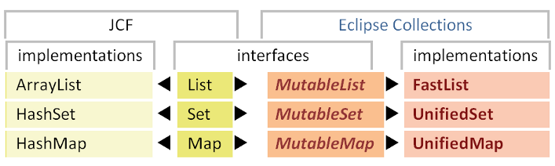

////
  Copyright (c) 2022 Goldman Sachs and others.
All rights reserved.
  This program and the accompanying materials   are made available
  under the terms of the Eclipse Public License v1.0 and
  Eclipse Distribution License v.1.0 which accompany this distribution.
  The Eclipse Public License is available at
  http://www.eclipse.org/legal/epl-v10.html.
  The Eclipse Distribution License is available at
  http://www.eclipse.org/org/documents/edl-v10.php.
////
= Collections and containers
:sectanchors:
:toc: left
:toc-title:
:toclevels: 3

// Javadoc links
:api-url:               https://www.eclipse.org/collections/javadoc/11.1.0/org/eclipse/collections
//
:ArrayStack:            {api-url}/impl/stack/mutable/ArrayStack.html[ArrayStack]
:Bag:                  {api-url}/api/bag/Bag.html[Bag]
:Bags:                 {api-url}/impl/factory/Bags.html[Bags]
:BiMap:                {api-url}/api/bimap/BiMap.html[BiMap]
:BiMaps:               {api-url}/impl/factory/BiMaps.html[BiMaps]
:BooleanArrayList:     {api-url}/impl/list/mutable/primitive/BooleanArrayList.html[BooleanArrayList]
:BooleanHashSet:       {api-url}/impl/set/mutable/primitive/BooleanHashSet.html[BooleanHashSet]
:DoubleSets:           {api-url}/impl/factory/primitive/DoubleSets.html[DoubleSets]
:FastList:             {api-url}/impl/list/mutable/FastList.html[FastList]
:FastListMultimap:     {api-url}/impl/multimap/list/FastListMultimap.html[FastListMultimap]
:FixedSizeList:        {api-url}/api/list/FixedSizeList.html[FixedSizeList]
:FloatArrayList:       {api-url}/impl/list/mutable/primitive/FloatArrayList.html[FloatArrayList]
:FloatHashSet:         {api-url}/impl/set/mutable/primitive/FloatHashSet.html[FloatHashSet]
:Function:             {api-url}/api/block/function/Function.html[Function]
:HashBag:              {api-url}/impl/bag/mutable/HashBag.html[HashBag]
:HashBiMap:            {api-url}/impl/bimap/mutable/HashBiMap.html[HashBiMap]
:ImmutableBag:         {api-url}/api/bag/ImmutableBag.html[ImmutableBag]
:ImmutableList:        {api-url}/api/list/ImmutableList.html[ImmutableList]
:ImmutableSortedBag:   {api-url}/api/bag/sorted/ImmutableSortedBag.html[ImmutableSortedBag]
:ImmutableStack:       {api-url}/api/stack/ImmutableStack.html[ImmutableStack]
:IntArrayList:         {api-url}/impl/list/mutable/primitive/IntArrayList.html[IntArrayList]
:IntHashSet:           {api-url}/impl/set/mutable/primitive/IntHashSet.html[IntHashSet]
:IntLists:             {api-url}/impl/factory/primitive/IntLists.html[IntLists]
:IntIntHashMap:         {api-url}/impl/map/mutable/primitive/IntIntHashMap.html[IntIntHashMap]
:IntObjectHashMap:     {api-url}/impl/map/mutable/primitive/IntObjectHashMap.html[IntObjectHashMap]
:ListIterable:         {api-url}/api/list/ListIterable.html[ListIterable]
:Lists:                {api-url}/impl/factory/Lists.html[Lists]
:Maps:                 {api-url}/impl/factory/Maps.html[Maps]
:Multimap:             {api-url}/api/multimap/Multimap.html[Multimap]
:Multimaps:            {api-url}/impl/factory/Multimaps.html[Multimaps]
:MutableBag:           {api-url}/api/bag/MutableBag.html[MutableBag]
:MutableBiMap:         {api-url}/api/bimap/MutableBiMap.html[MutableBiMap]
:MutableList:          {api-url}/api/list/MutableList.html[MutableList]
:MutableListMultimap:  {api-url}/api/multimap/list/MutableListMultimap.html[MutableListMultimap]
:MutableMap:           {api-url}/api/map/MutableMap.html[MutableMap]
:MutableSetMultimap:   {api-url}/api/multimap/set/MutableSetMultimap.html[MutableSetMultimap]
:MutableSortedBag:     {api-url}/api/bag/sorted/MutableSortedBag.html[MutableSortedBag]
:MutableSortedSet:     {api-url}/api/set/sorted/MutableSortedSet.html[MutableSortedSet]
:MutableSortedMap:     {api-url}/api/map/sorted/MutableSortedSet.html[MutableSortedMap]
:MutableStack:         {api-url}/api/stack/MutableStack.html[MutableStack]
:ObjectIntHashMap:     {api-url}/impl/map/mutable/primitive/ObjectIntHashMap.html[ObjectIntHashMap]
:RichIterable:         {api-url}/api/RichIterable.html[RichIterable]
:Sets:                 {api-url}/impl/factory/Sets.html[Sets]
:SortedBag:            {api-url}/api/bag/sorted/SortedBag.html[SortedBag]
:SortedSetIterable:    {api-url}/api/set/sorted/SortedSetIterable.html[SortedSetIterable]
:StackIterable:        {api-url}//api/stack/StackIterable.html[StackIterable]
:Stacks:               {api-url}/impl/factory/Stacks.html[Stacks]
:StringFunctions:      {api-url}/impl/block/factory/StringFunctions.html[StringFunctions]
:TreeBag:              {api-url}/impl/bag/sorted/mutable/TreeBag.html[TreeBag]
:TreeSortedMap:        {api-url}/impl/map/sorted/mutable/TreeSortedMap.html[TreeSortedMap]
:UnifiedMap:           {api-url}/impl/map/mutable/UnifiedMap.html[UnifiedMap]
:UnifiedSet:           {api-url}/impl/set/mutable/UnifiedSet.html[UnifiedSet]
:UnsortedBag:          {api-url}/api/bag/UnsortedBag.html[UnsortedBag]
:UnsortedSetIterable:  {api-url}/api/set/UnsortedSetIterable.html[UnsortedSetIterable]
//
//cross-reference links
:richiterable-xref:   link:1-Iteration_Patterns.adoc#richiterable-interface[RichIterable, title="The superinterface that specifies the iteration patterns in Eclipse Collections container types."]
:lazy-iterable-xref:  link:1-Iteration_Patterns.adoc#lazy-iteration[lazy iterable]
:groupby-xref:        link:1-Iteration_Patterns.adoc#groupby-pattern[groupBy, title="Create a Multimap from a collection by grouping on a selected or generated key value."]
// end links; begin body

What is perhaps most distinctive about the Eclipse Collections collection classes is what (quite properly) is hidden: their implementation of iteration patterns.
Through this encapsulation, Eclipse Collections is able to provide optimized versions of each method on each container.

For example, the first of the classes we'll discuss here, *FastList*, is array-based; it iterates using indexed access directly against its internal array.

We'll begin with the Eclipse Collections implementations of types having analogs in the Java Collections Framework (JCF).
We'll then discuss the new types *Bag* and *Multimap*, the Immutable collections, and the protective wrapper classes.

== Basic collection types

The most commonly-used Eclipse Collections classes are *{FastList}*, *{UnifiedSet}*, and *{UnifiedMap}*.
These collections serve as drop-in replacements for their corresponding types in the Java Collections Framework (JCF).
Note that these Eclipse Collections classes do not extend the JCF implementations; they are instead new implementations of both JCF and Eclipse Collections interfaces, as this (highly-simplified) diagram summarizes:

The methods of the JCF types are primarily focused on adding or removing elements and similar, non-iterative operations.
Eclipse Collections interfaces provide methods for iteration patterns that for the most part, do not modify (mutate) the source collection, but rather return a new collection or information about the source collection.

=== ListIterable
____
An ordered collection that allows duplicate elements.
____

A *{ListIterable}* is a *{RichIterable}* which maintains its elements in insertion order and allows duplicate elements.

*ListIterable* has two mutable subinterfaces, *{MutableList}* and *{FixedSizeList}*, and one <<immutable-collections, immutable>> subinterface, *{ImmutableList}*.

The *ListIterable* interface includes the *binarySearch* method, which is similar to the static method *binarySearch* on *java.util.Collections*, but available from the object-oriented API.

==== MutableList
____
A mutable *ListIterable* that implements java.util.List; the most common implementation is *FastList*.
____

*MutableList* extends the JCF *List* interface and has the same contract.
It also extends *{richiterable-xref}*, which provides the iteration methods common to all collections.

The most common implementation of *MutableList* is *FastList*, which can be used to replace the familiar *java.util.ArrayList*.
Here is a comparison of how the two types can be created.

.*ArrayList* in Java Collections Framework
====
[source,java]
----
List<String> comparison = new ArrayList<String>();
comparison.add("Comcast");
comparison.add("IBM");
comparison.add("Microsoft");
comparison.add("Microsoft");
----
====

.*FastList* in Eclipse Collections
====
[source,java]
----
MutableList<String> comparison =
    FastList.newListWith("Comcast", "IBM", "Microsoft", "Microsoft");
----
====

The *MutableList* interface includes the *sortThis* and *reverse* methods, which are similar to the static methods *sort* and *reverse* on *java.util.Collections*.
Both are mutating methods.
Here is an example of *sort* using the JDK API and then Eclipse Collections.

.*ArrayList* (JCF) using an anonymous inner class for *Comparator*
====
[source,java]
----
Collections.sort(people, new Comparator<Person>()
{
    public int compare(Person o1, Person o2)
    {
        int lastName = o1.getLastName().compareTo(o2.getLastName());
        if (lastName != 0)
        {
            return lastName;
        }
        return o1.getFirstName().compareTo(o2.getFirstName());
    }
});
----
====

.*FastList* (EC) using an anonymous inner class for *Comparator*
====
[source,java]
----
people.sortThis(new Comparator<Person>()
{
    public int compare(Person o1, Person o2)
    {
        int lastName = o1.getLastName().compareTo(o2.getLastName());
        if (lastName != 0)
        {
            return lastName;
        }
        return o1.getFirstName().compareTo(o2.getFirstName());
    }
 });
----
====

.*FastList* (EC) using a lambda
====
[source,java]
----
people.sortThis((o1, o2) ->
        {
            int lastName = o1.getLastName().compareTo(o2.getLastName());
            if (lastName != 0)
            {
                return lastName;
            }
            return o1.getFirstName().compareTo(o2.getFirstName());
        });
----
====

*MutableList* adds a new method called *sortThisBy*, which takes an attribute from each element using a *{Function}* and then sorts the list by the natural order of that attribute.

.*ArrayList* (JCF) sorting using a static function
====
[source,java]
----
Collections.sort(people, Functions.toComparator(Person.TO_AGE));
----
====

.*FastList* (EC) sorting using a static function
====
[source,java]
----
people.sortThisBy(Person.TO_AGE);
----
====

.*FastList* sorting using a method reference and lambda
====
[source,java]
----
// Using a method reference
people.sortThisBy(Person::getAge);

// Using a lambda expression
people.sortThisBy(person -> person.getAge());
----
====

Here is an example comparing *reverse* using the JCF and using Eclipse Collections; both are mutating methods.

.*ArrayList* (JCF) reversing a list
====
[source,java]
----
Collections.reverse(people);
----
====

.*FastList* (EC) reversing a list
====
[source,java]
----
people.reverseThis();
----
====

The *toReversed* method on *MutableList* lets you reverse a list _without_ mutating it; that is, it returns a new *MutableList*.
Here is an example of how to accomplish that in the JCF and in Eclipse Collections.

.*ArrayList* (JCF) returning a new reversed list
====
[source,java]
----
List<Person> reversed = new ArrayList<Person>(people)
Collections.reverse(reversed);
----
====

.*FastList* (EC) returning a new reversed list
====
[source,java]
----
MutableList<Person> reversed = people.toReversed();
----
====

The *asReversed* method returns a reverse-order _view_ of the *MutableList* &mdash;a {lazy-iterable-xref}, like that returned by *asLazy* &mdash;that defers each element's evaluation until it is called for by a subsequent method.

.*FastList* (EC) using lazy evaluation
====
[source,java]
----
ListIterable<Integer> integers = FastList.newListWith(1, 2, 3);
// deferred evaluation
LazyIterable<Integer> reversed = integers.asReversed();
// deferred evaluation
LazyIterable<String> strings = reversed.collect(String::valueOf);
// forces evaluation
MutableList<String> stringsList = strings.toList();
 Assert.assertEquals(FastList.newListWith("3", "2", "1"), stringsList);
----
====

==== Migrating ArrayList to FastList

Here are some additional JCF to Eclipse Collections refactoring examples.

Here is a Java Collections' *ArrayList*:

.*ArrayList* (JCF)
====
[source,java]
----
List<Integer> integers = new ArrayList<Integer>();
integers.add(1);
integers.add(2);
integers.add(3);
----
====

And, here is the identical construction in Eclipse Collections:

.*FastList* (EC)
====
[source,java]
----
List<Integer> integers = new FastList<Integer>();
integers.add(1);
integers.add(2);
integers.add(3);
----
====

In Eclipse Collections, the static factory method *newList* can infer generic types

.*FastList* from a *newList* factory method
====
[source,java]
----
List<Integer> integers = FastList.newList();
integers.add(1);
integers.add(2);
integers.add(3);
----
====

The Eclipse Collections *newListWith()* method also provides varargs support, allowing any number of arguments.

.*FastList* from a *newListwith* method
====
[source,java]
----
List<Integer> integers = FastList.newListWith(1, 2, 3);
----
====

There are also factory classes in Eclipse Collections named for each collection type ({Lists}, {Sets}, {Maps}, {Bags}, {Stacks}, {BiMaps}, {Multimaps}, etc.)

.*Lists* factory classs
====
[source,java]
----
List<Integer> integers =
    Lists.mutable.with(1, 2, 3);
----
====

You can also use the richer interface:

====
[source,java]
----
MutableList<Integer> integers =
    FastList.newListWith(1, 2, 3);

// or

MutableList<Integer> integers =
    Lists.mutable.with(1, 2, 3);
----
====

The list is never mutated; it can be made <<unmodifiable-collections,unmodifiable>>:

.Unmodifiable *FastList*
====
[source,java]
----
MutableList<Integer> integers =
    FastList.newListWith(1, 2, 3).asUnmodifiable();
----
====

There is also a form of *newList* that takes another iterable.

.*newlist* with *Iterable* as input
====
[source,java]
----
MutableList<Integer> integers =
    FastList.newList(listOfIntegers);
----
====

These refactorings are analogous for *UnifiedSet* and *UnifiedMap*.

=== SetIterable
____
A collection that allows no duplicate elements.
____

A *SetIterable* is a *RichIterable* that allows no duplicate elements.
It can be sorted or unsorted.

* A *{SortedSetIterable}* is a *SetIterable* that maintains its elements in sorted order.
* An *{UnsortedSetIterable}* is a *SetIterable* that maintains its elements in a hash table in an unpredictable order.

*UnsortedSetIterable* has two mutable subinterfaces (*MutableSet* and *FixedSizeSet*) and one  <<immutable-collections,immutable>> subinterface (*ImmutableSet*).

==== MutableSet
____
A mutable *SetIterable* that implements *java.util.Set*; the most common implementation is *UnifiedSet*.
____

*MutableSet* extends the JCF *Set* interface and has the same contract.
It also extends *{richiterable-xref}*, which provides the iteration methods common to all collections.
An attempt to add duplicate elements to a *MutableSet* container is ignored without throwing an exception.
The order in which the elements are processed during iteration is not specified.

The most common implementation is *UnifiedSet*, which can be used to replace the familiar *java.util.HashSet*.

.*HashSet* in Java Collections Framework
====
[source,java]
----
Set<String> comparison = new HashSet<String>();
comparison.add("IBM");
comparison.add("Microsoft");
comparison.add("Oracle");
comparison.add("Comcast");
----
====

.*UnifiedSet* in Eclipse Collections
====
[source,java]
----
Set<String> comparison = UnifiedSet.newSetWith("IBM", "Microsoft", "Verizon", "Comcast");
----
====

==== MutableSortedSet
____
Contains unique items that are sorted by some comparator or their natural ordering.
____

A *{MutableSortedSet}* follows the same contract as a *MutableSet*, but sorts its elements by their natural order, or through a comparator parameter set by the user.
The implementation for *MutableSortedSet* is *TreeSortedSet*.

Here is an example of a MutableSortedSet containing numbers in reverse order:

.*TreeSortedSet*
====
[source,java]
----
MutableSortedSet<Integer> sortedSetA =
    TreeSortedSet.newSet(Collections.<Integer>reverseOrder());
MutableSortedSet<Integer> sortedSetB =
    TreeSortedSet.newSet(sortedSetA.with(1).with(2, 3).with(4, 5, 6));
----
====

=== MapIterable
____
A collection of key/value pairs.
____

The *MapIterable* interface (extending *RichIterable*) is the top-level interface for collections of key/value pairs.

*MapIterable* has two mutable subinterfaces (*MutableMap* and *FixedSizeMap*), one link:#immutable-collections[immutable] subinterface (*ImmutableMap*).
It is also is extended in mutable and immutable versions of maps with sorted elements (*SortedMapIterable*) and maps that allow lookup keys by (unique) values as well as the reverse (*BiMap*).

==== MutableMap
____
A mutable *MapIterable* that implements java.util.Map; the most common implementation is *UnifiedMap*.
____

The *{MutableMap}* interface defines an association of key/value pairs.
It extends the *MapIterable* interface, which furnishes a set of iteration methods especially for the key/value structure of a Map collection.
These include unmodifiable views of keys, values or pair-entries using the *keysView*, *valuesView* and *entriesView* methods, respectively.

The mutable subinterfaces of *MapIterable* also extend the JCF Map interface.

.*HashMap* (JDK)
====
[source,java]
----
Map<Integer, String> map = new HashMap<Integer, String>();
map.put(1, "1");
map.put(2, "2");
map.put(3, "3");
----
====

.*UnifiedMap* (EC)
====
[source,java]
----
MutableMap<Integer, String> map = UnifiedMap.newWithKeysValues(1, "1", 2, "2", 3, "3");
----
====

==== MutableSortedMap
____
A sorted Map.
____

A *{MutableSortedMap}* follows the same contract as a *MutableMap*, but sorts its elements by their natural order, or through a comparator parameter set by the user.
The implementation for *MutableSortedMap* is *{TreeSortedMap}*.

This code block creates a TreeSortedMap which sorts in reverse order:

.Reversed sorted map
====
[source,java]
----
MutableSortedMap<String, Integer> sortedMap = TreeSortedMap.newMapWith(Comparators.<String>reverseNaturalOrder(),
                "1", 1, "2", 3, "3", 2, "4", 1);
----
====

==== BiMap
____
A map that allows users to add key-value pairs and perform lookups from either direction.
____

*{BiMap}* is an interface that defines a bi-directional *Map*, i.e, a *Map* that allows users to execute a lookup from both directions.
Both the keys and the values in a *BiMap* are unique.

*BiMap* extends *MapIterable* and *{MutableBiMap}* extends *MutableMap*.
The standard implementation is *{HashBiMap}*.

.Bi-directional map
====
[source,java]
----
MutableBiMap<Integer, String> biMap =
    HashBiMap.newWithKeysValues(1, "1", 2, "2", 3, "3");
----
====

The distinctive methods on *MutableBiMap* are *put*, *forcePut* and *inverse*.

****
##`*MutableBiMap.put()*`##
****

Behaves like *put* on a regular map, except that it throws an exception when you try to add a duplicate value.

[source,java]
----
MutableBiMap<Integer, String> biMap = HashBiMap.newMap();
biMap.put(1, "1"); // behaves like a regular put()
biMap.put(1, "1"); // no effect
biMap.put(2, "1"); // throws IllegalArgumentException since value "1" is already present
----

****
##`*MutableBiMap.forcePut()*`##
****

Behaves like *MutableBiMap.put*, except that it silently removes the map entry with the same value before putting the key-value pair in the map.

[source,java]
----
MutableBiMap<Integer, String> biMap = HashBiMap.newMap();
biMap.forcePut(1, "1"); // behaves like a regular put()
biMap.forcePut(1, "1"); // no effect
biMap.put(1, "2"); // replaces the [1, "1"] pair with [1, "2"]
biMap.forcePut(2, "2"); // removes the [1, "2"] pair before putting
Assert.assertFalse(biMap.containsKey(1));
Assert.assertEquals(HashBiMap.newWithKeysValues(2, "2"), biMap);
----

****
##`*MutableBiMap.inverse()*`##
****

Returns a reversed view of the *BiMap*. Calling *inverse* is an inexpensive operation as the view is already cached in the *BiMap*. This is the recommend method for looking up the key associated to a value using `biMap.inverse().get(value)`.

[source,java]
----
MutableBiMap<Integer, String> biMap =
HashBiMap.newWithKeysValues(1, "1", 2, "2", 3, "3");
MutableBiMap<String, Integer> inverse = biMap.inverse();
Assert.assertEquals("1", biMap.get(1));
Assert.assertEquals(Integer.valueOf(1), inverse.get("1"));
Assert.assertTrue(inverse.containsKey("3"));
Assert.assertEquals(Integer.valueOf(2), inverse.put("2", 4));
----

=== Bag
____
An unordered collection that allows duplicates.
____

A *{Bag}* is a *RichIterable* that allows duplicate elements and efficient querying of the number of occurrences of each element.
It can be sorted or unsorted.

* A *{SortedBag}* is a *Bag* that maintains its elements in sorted order.
* An *{UnsortedBag}* is a *Bag* that maintains its elements in a hash table in an unpredictable order.

*UnsortedBag* has two subinterfaces, *{MutableBag}* and *{ImmutableBag}*.
*SortedBag* has two subinterfaces, *{MutableSortedBag}* and *{ImmutableSortedBag}*.

A *Bag* is conceptually like a *Map* from elements to the number of occurrences of that element.

For example, this list:
----
Apple
Pear
Orange
Orange
Apple
Orange
----

could create this *Bag*:
[cols=",",]
[%autowidth]
|===
|`Pear`   |`1`
|`Orange` |`3`
|`Apple`  |`2`
|===

.*Bag*
====
[source,java]
----
MutableBag<String> bag =
    HashBag.newBagWith("Apple", "Pear", "Orange", "Apple", "Apple", "Orange");

// or

MutableBag<String> bag =
    Bags.mutable.with("Apple", "Pear", "Orange", "Apple", "Apple", "Orange");
----
====

These are the distinctive methods on the *Bag* interface.

****
##`*_Bag_.occurrencesOf(Object _item_)*`##
****

Returns the occurrences of a distinct item in the *Bag*.

****
##`*_Bag_.forEachWithOccurrences(ObjIntProcedure)*`##
****

For each distinct item, with the number of occurrences, executes the specified procedure.

****
##`*_Bag_.toMapOfItemToCount()*`##
****

Returns a map with the item type to its count as an Integer.

==== MutableBag
____
A mutable unordered collection allowing duplicates.
____

The *{MutableBag}* interface includes methods for manipulating the number of occurrences of an item.
For example, to determine the number of unique elements in a MutableBag, use the *sizeDistinct* method.
The most common implementation of *MutableBag* is *{HashBag}*.

.*MutableBag*
====
[source,java]
----
MutableBag<String> bag = HashBag.newBagWith("Apple", "Pear", "Orange", "Apple", "Apple", "Orange");

// or

MutableBag<String> bag = Bags.mutable.with("Apple", "Pear", "Orange", "Apple", "Apple", "Orange");
----
====

These are the distinctive methods on *MutableBag*:

****
##`*MutableBag.addOccurrences(T item, int occurrences)*`##
****

Increments the count of the item in the bag by a count specified by occurrences.

****
##`*MutableBag.removeOccurrences(Object item, int occurrences)*`##
****

Decrements the count of the item in the bag by a count specified by occurrences.

****
##`*MutableBag.setOccurrences(T item, int occurrences)*`##
****

Mutates the bag to contain the specified number of occurrences of the item.

==== MutableSortedBag
____
A sorted collection that allows duplicates.
____

A *{MutableSortedBag}* is a **Bag**that maintains order.
It defaults to natural order, but can take a comparator to sort.
The most common implementation of *MutableSortedBag* is *{TreeBag}* which uses a *SortedMap* as its underlying data store.

For example, this *MutableSortedBag* would contain integers sorted in reverse order:

.EC
====
[source,java]
----
MutableSortedBag<Integer> revIntegers =
    TreeBag.newBagWith(Collections.reverseOrder(), 4, 3, 3, 2, 2, 2, 1, 1);

// or

MutableSortedBag<Integer> revIntegers =
    SortedBags.mutable.with(Collections.reverseOrder(), 4, 3, 3, 2, 2, 2, 1, 1);
----
====

=== StackIterable
____
A collection that maintains "last-in, first-out" order, iterating over elements in reverse insertion order.
____

A *{StackIterable}* is a *RichIterable* enforcing a "last-in, first-out" order; its methods always iterate over elements in reverse insertion order, (beginning with the most-recently added element).
For example the *getFirst* method returns the the last element to have been added - the "top" of the stack.

*StackIterable* has a mutable and an link:#immutable-collections[immutable] subinterface *{MutableStack}* and *{ImmutableStack}*, respectively.

==== MutableStack
____
A mutable collection that maintains "last-in, first-out" order, iterating over elements in reverse insertion order.
____

The most common implementation of *MutableStack* is *{ArrayStack}*.
The closest JCF equivalent to *ArrayStack* is *java.util.Stack*, which extends *Vector* but does not enforce strict LIFO iteration.

The distinctive methods on *MutableStack* are *push*, *pop*, and *peek*.

[cols="1,2"]
[%autowidth]
|===
|`*push*`                      |Adds a new element to the top of the stack
|`*pop*`                       |Returns the top (most recently-added) element and removes it from the collection.
|`*pop(int count)*`            |Returns a *ListIterable* of the number of elements specified by the count, beginning with the top of the stack.
|`*peek*`                      |Returns but does not remove the top element.
                                Note that, on a stack, *getFirst* likewise returns the top element, and that *getLast* throws an exception.
|`*peek(int&nbsp;count)*`      |Returns a *ListIterable* of the number of elements specified by the count, beginning with the top of the stack; does not remove the elements from the stack.
|`*peekAt(int&nbsp;index)*`    |Returns the element at index.
|===

*ArrayStack* can replace *java.util.Stack*.

.*Stack* in Java Collections Framework
====
[source,java]
----
Stack stack = new Stack();
stack.push(1);
stack.push(2);
stack.push(3);
----
====

.*ArrayStack* in Eclipse Collections
====
[source,java]
----
MutableStack mutableStack =
    ArrayStack.newStackWith(1, 2, 3);

// or

MutableStack mutableStack =
    Stacks.mutable.with(1, 2, 3);
----
====

[#multimap-container]
=== Multimap
____
A map-like container that can have multiple values for each key
____

In a *{Multimap}* container, each key can be associated with multiple values.
It is, in this sense, similar to a Map, but one whose values consist of individual collections of a specified type, called the _backing collection_.
A *Multimap* is useful in situations where you would otherwise use **Map**<K, Collection<V>>.

Unlike the other basic Eclipse Collections containers, *Multimap* does not extend *RichIterable*, but resides along with its subinterfaces in a separate API.
The *RichIterable* methods are extended by the backing collection types.

Depending on the implementation, the "values" in a Multimap can be stored in Lists, Sets or Bags.
For example, the *{FastListMultimap}* class is backed by a *UnifiedMap* that associates each key with a *FastList* that preserves the order in which the values are added and allows duplicate to be added.

A *Multimap* is the type returned by the *{groupby-xref}* method.
Here is an example in which we group a list of words by their length, obtaining a *Multimap* with integer (word=length) keys and lists of words having that length for values.

This simple list:
....
   here
   are
   a
   few
   words
   that
   are
   not
   too
   long
....

produces a List-backed *Multimap*:

[cols="1,3",options="header"]
[%autowidth]
|===
|key   |value<list>
|`1`   |`a`
|`3`   |`are, few, are, not, too`
|`4`   |`here, that, long`
|`5`   |`words`
|===

The code that performs this action uses the *{groupBy-xref}* method.

.*MutableListMultimap* using *groupBy* with *{StringFunctions}*)
====
[source,java]
----
MutableList<String> words = Lists.mutable.with("here", "are", "a", "few",
     "words", "that", "are", "not", "too", "long");
MutableListMultimap<Integer, String> multimap =
    words.groupBy(StringFunctions.length());
----
====

.*MutableListMultimap* using *groupBy* with a method reference
====
[source,java]
----
MutableList<String> words = Lists.mutable.with("here", "are", "a", "few",
     "words", "that", "are", "not", "too", "long");
MutableListMultimap<Integer, String> multimap =
    words.groupBy(String::length);
----
====

The interface *{MutableListMultimap}* extends the *Multimap* interface and tells us the type of its backing collections.
Since *words* is a *MutableList*, the output is a *MutableListMultimap*.
The word "are" is allowed to occur twice in the list at key 3.

If we change *words* to a *MutableSet*, the result will be a *{MutableSetMultimap}*, which will eliminate duplicate entries.

.*MutableSetMultimap* using *groupBy* with *{StringFunctions}*
====
[source,java]
----
MutableSet<String> words = Sets.mutable.with("here", "are", "a", "few",
     "words", "that", "are", "not", "too", "long");
MutableSetMultimap<Integer, String> multimap =
    words.groupBy(StringFunctions.length());
----
====

.*MutableSetMultimap* using *groupBy* with a method reference
====
[source,java]
----
MutableSet<String> words = Sets.mutable.with("here", "are", "a", "few",
     "words", "that", "are", "not", "too", "long");
MutableSetMultimap<Integer, String> multimap =
    words.groupBy(String::length);
----
====

With duplicates removed, only four 3-letter words remain.

[cols="1,3",options="header"]
[%autowidth]
|===
|key   |value <list>
|`1`   |`a`
|`3`   |`too`,`are`,`few`,`not`,
|`4`   |`long`,`here`,`that`
|`5`   |`words`
|===

== Primitive collections
____
Containers for iterating over collections of Java primitives.
____

Eclipse Collections has memory-optimized lists, sets, stacks, maps, and bags for all the primitive types: *int*, *long*, *float*, *char*, *byte*, *boolean*, *short*, and *double*.

The interface hierarchies for primitive types correspond closely with the interface hierarchy for regular *Object* collections.
For example, the collection interfaces for *int* include the following:

[cols=",",options="header]
[%autowidth]
|===
|*interface*            |*analogous to*
|*IntIterable*          |*RichIterable*
|*MutableIntCollection* |*MutableCollection*
|*IntList*              |*ListIterable*
|*MutableIntList*       |*MutableList*
|===

There are some common arithmetic operations that can be performed on all primitive collections (except boolean collections).

.Mathematical operations on primitive collections
====
[source,java]
----
MutableIntList intList = IntLists.mutable.with(1, 2, 3);
Assert.assertEquals(6, intList.sum());
Assert.assertEquals(1, intList.min());
Assert.assertEquals(3, intList.max());
Assert.assertEquals(2.0d, intList.average(), 0.0);
Assert.assertEquals(2, intList.median());

// IntList.summaryStatistics() returns IntSummaryStatistics
Assert.assertEquals(6, intList.summaryStatistics().getSum());
Assert.assertEquals(1, intList.summaryStatistics().getMin());
Assert.assertEquals(3, intList.summaryStatistics().getMax());
Assert.assertEquals(2.0d, intList.summaryStatistics().getAverage(), 0.0);
----
====

=== Primitive lists

The primitive list implementations are backed by an array like *FastList*, but with a primitive array instead of an *Object[]*.
They are named *{IntArrayList}*, *{FloatArrayList}* etc.

*{BooleanArrayList}* is a special case.
Current JVMs use one byte per boolean in a *boolean[]* (instead of one bit per boolean).
Thus the *BooleanArrayList* is backed by a *java.util.BitSet* as an optimization.

.our ways to create an *IntArrayList*, use one of the following:
====
[source,java]
----
IntArrayList emptyList = new IntArrayList();
IntArrayList intList = IntArrayList.newListWith(1, 2, 3);
IntArrayList alternate = IntLists.mutable.with(1, 2, 3);
IntArrayList listFromIntIterable = IntArrayList.newListWith(IntHashSet.newSetWith(1, 2, 3));
----
====
=== IntInterval

An *IntInterval* is a range of **int**s that may be iterated over using a step value.
(Similar to *Interval*, but uses primitive ints instead of the wrapper *Integers*.)
All arguments are inclusive in methods of IntInterval.

As *IntInterval* implements *ImmutableIntList*, you can pass it in any method or constructor argument which accept *ImmutableIntList*.
[source,java]
----
Assertions.assertInstanceOf(ImmutableIntList.class, IntInterval.oneTo(5));
----

.There are different ways you can generate interval of numbers using *IntInterval*, which are listed below.
- You can initialize IntInterval using constructor argument which accept from, to and steps.
- You can initialize IntInterval using static factory methods.
[source,java]
----
// Generate interval of numbers from 1 to 5, with the default step value of 1
ImmutableIntList expected = IntLists.immutable.with(1, 2, 3, 4, 5);
Assertions.assertEquals(expected, IntInterval.fromTo(1, 5));

// Generate interval of numbers from 1 to 10, with providing steps value as method argument
ImmutableIntList expected = IntLists.immutable.with(1, 4, 7, 10);
Assertions.assertEquals(expected, IntInterval.fromToBy(1, 10, 3));

// from method is used to generate interval with only one number which is provided as method argument
ImmutableIntList expected = IntLists.immutable.with(10);
Assertions.assertEquals(expected, IntInterval.from(10));

// Generate interval of even numbers, here steps value can be 2 or -2, based on following condition [to > from ? 2 : -2]
ImmutableIntList expected = IntLists.immutable.with(2, 4, 6);
Assertions.assertEquals(expected, IntInterval.evensFromTo(2, 6));

ImmutableIntList expected = IntLists.immutable.with(6, 4, 2);
Assertions.assertEquals(expected, IntInterval.evensFromTo(6, 2));

// Generate interval of odd numbers, here steps value can be 2 or -2, based on following condition [to > from ? 2 : -2]
ImmutableIntList expected = IntLists.immutable.with(1, 3, 5);
Assertions.assertEquals(expected, IntInterval.oddsFromTo(1, 5));

ImmutableIntList expected = IntLists.immutable.with(5, 3, 1);
Assertions.assertEquals(expected, IntInterval.oddsFromTo(5, 1));

// Generate interval of numbers from 1 to 5, with the default step value of 1
ImmutableIntList expected = IntLists.immutable.with(1, 2, 3, 4, 5);
Assertions.assertEquals(expected, IntInterval.oneTo(5));

// Generate interval of numbers from 1 to 9, with providing step value as a method argument
ImmutableIntList expected = IntLists.immutable.with(1, 3, 5, 7, 9);
Assertions.assertEquals(expected, IntInterval.oneToBy(10, 2));

// zero is used to create interval with only one number [0]
ImmutableIntList expected = IntLists.immutable.with(0);
Assertions.assertEquals(expected, IntInterval.zero());

// Generate interval of numbers from 0 to 4, with the default step value of 1
ImmutableIntList expected = IntLists.immutable.with(0, 1, 2, 3, 4);
Assertions.assertEquals(expected, IntInterval.zeroTo(4));

// Generate interval of numbers from 0 to 4, with providing step value as a method argument
ImmutableIntList expected = IntLists.immutable.with(0, 2, 4);
Assertions.assertEquals(expected, IntInterval.zeroToBy(4, 2));
----

=== Primitive sets

The primitive set implementations are hash-table backed.
They are named *{IntHashSet}*, *{FloatHashSet}*, etc.
*{BooleanHashSet}* is implemented using a single integer to hold one of four possible states: ([], [F], [T], or [T, F]).
All other sets use open addressing and quadratic probing.

.There are different ways you can create primitive sets, which are listed below.
- You can create primitive sets using **newSetWith** method.
- You can initialize primitive sets using constructor argument. There are several overloaded constructors available.
Below examples are provided with *IntHashSet* but all are same for *FloatHashSet* and *BooleanHashSet* as well.
- There is another way to construct primitive types using primitive factory classes.
[source,java]
----
// Initialize IntHashSet using newSetWith method, which is taking int vargs.
MutableIntSet intHashSet1 = IntHashSet.newSetWith(1, 2, 3, 4, 5);
MutableFloatSet floatHashSet1 = FloatHashSet.newSetWith(12.5f, 13.5f, 14.88f, 15.6f);
MutableBooleanSet booleanHashSet = BooleanHashSet.newSetWith(true, false);

// Empty Constructor will initialize IntHashSet with 16 size
MutableIntSet intHashSet2 = new IntHashSet();

// Initialize Constructor with initialCapacity
MutableIntSet intHashSet3 = new IntHashSet(32);

// Initialize Constructor with set of integers using vargs.
MutableIntSet intHashSet4 = new IntHashSet(1, 2, 3, 4, 5, 6);

// Initialize Constructor with IntIterable.
IntIterable intIterable = intHashSet4; // you can get from any list, set which implement this interface
MutableIntSet intHashSet = new IntHashSet(intIterable);

// Initialize Constructor with existing IntHashSet
MutableIntSet intHashSet5 = new IntHashSet(intHashSet2);
----

Primitive sets can be created using factory classes. *IntSets*, *FloatSets* and *BooleanSets* are primitive factory classes that provide mutable & immutable ways of creating sets. Factory classes provide different sets of methods for creating sets like *with*, *withAll*, *empty* and *ofAll*, with different sets of arguments. Provided examples are with *IntSets* but all are valid for *FloatSets* and *BooleanSets* as well.

*withInitialCapacity* is only available in mutable factories.
[source, java]
----
// mutable intset creation using initialCapacity
MutableIntSet mutableIntSetCapacity = IntSets.mutable.withInitialCapacity(12);
mutableIntSetCapacity.addAll(1, 3, 5, 6);

// mutable sets creation using factory class using with method.
MutableIntSet mutableIntSet = IntSets.mutable.with(1, 2, 3, 4, 5);
MutableFloatSet mutableFloatSet = FloatSets.mutable.with(1.5f, 2.5f);
MutableBooleanSet mutableBooleanSet = BooleanSets.mutable.with(true, false, false, true);

// Immutable sets creation using factory class using with method.
ImmutableIntSet immutableIntSet = IntSets.immutable.with(1, 2, 3, 4, 5);
ImmutableFloatSet immutableFloatSet = FloatSets.immutable.with(1.5f, 2.5f);
ImmutableBooleanSet immutableBooleanSet = BooleanSets.immutable.with(true, false, false, true);

// immutable intset creating using IntIterable
IntIterable intIterable = immutableIntSet; // you can get from any list, set which implement this interface
ImmutableIntSet immutableIntSet = IntSets.immutable.withAll(intIterable);
----

Operation which you can perform on primitive hashsets.
[source,java]
----
// Initialize IntHashSet using newSetWith method, which is taking int vargs.
MutableIntSet intHashSet = IntHashSet.newSetWith(1, 2, 3, 4, 5);
intHashSet.add(6);
intHashSet.addAll(7, 8, 9); //addAll takes varags argument

// We can use allSatisfy/anySatisfy method which take predicate to compare with all value of primitive sets
boolean allSatisfy = intHashSet.allSatisfy(x -> 2 < x);
boolean anySatisfy = intHashSet.anySatisfy(x -> 5 > x);

// containsAll check for all element in primitive set
boolean containsAll = intHashSet.containsAll(5, 4);

// We can do a math operation like min, max on intHashSet
int min = intHashSet.min();
int max = intHashSet.max();

// We can filter set with select method, which return filtered set, same way you can use reject as well
MutableIntSet evens = intHashSet.select(x -> 0 == x % 2);
MutableIntSet odds = intHashSet.reject(x -> 0 == x % 2);

// We can do different set of conversion operation on primitive set as well, like toArray, toSortedArray, toBag, toSortedList and many more.
ImmutableIntSet immutableIntSet = intHashSet.toImmutable();
int[] toArray = intHashSet.toArray();
int[] toSortedArray = intHashSet.toSortedArray();
MutableIntList mutableIntList = intHashSet.toSortedList();
MutableIntBag mutableIntBag = intHashSet.toBag();
----

=== Primitive stacks

Primitive stack implementations are similar to JCF *ArrayStack* but optimized for primitives.

=== Primitive bags

Primitive bag implementations are similar to JCF *HashBag*, but both _item_ and _count_ are primitives.

Primitive bags can be created using factory classes, *IntBags*, *LongBags*, *FloatBags*, *DoubleBags*, *CharBags*, *ByteBags*, *BooleanBags* and *ShortBags* are primitive factory classes which provides mutable & immutable ways of creating bags. factory classes provide different set of methods for creating sets like *with*, *withAll*, *empty* and *ofAll* with different set of arguments. Provided examples are with *IntBags* but all are valid for other factory classes as well.

[source, java]
----
// mutable intBag creation using with
MutableIntBag bag = IntBags.mutable.with(1, 2, 2, 3, 3, 3);

// addOccurrences & removeOccurrences
this.bag.addOccurrences(4, 4);
Assertions.assertEquals(4, this.bag.occurrencesOf(4));
this.bag.removeOccurrences(4, 4);
Assertions.assertEquals(0, this.bag.occurrencesOf(4));

// with, withAll, without & withoutAll operations on bag
MutableIntBag bagWith = this.bag.with(4).with(5);
Assertions.assertEquals(IntBags.immutable.with(1, 2, 2, 3, 3, 3, 4, 5), bagWith);
Assertions.assertSame(this.bag, bagWith);

// Add three values to the bag
MutableIntBag bagWithAll = this.bag.withAll(IntLists.immutable.with(6, 7, 8));
Assertions.assertEquals(IntBags.immutable.with(1, 2, 2, 3, 3, 3, 4, 5, 6, 7, 8), bagWithAll);
Assertions.assertSame(this.bag, bagWithAll);

// Remove two values from the bag
MutableIntBag bagWithout = this.bag.without(7).without(8);
Assertions.assertEquals(IntBags.immutable.with(1, 2, 2, 3, 3, 3, 4, 5, 6), bagWithout);
Assertions.assertSame(this.bag, bagWithout);

// Remove three values from the bag
MutableIntBag bagWithoutAll = this.bag.withoutAll(IntLists.immutable.with(4, 5, 6));
Assertions.assertEquals(IntBags.immutable.with(1, 2, 2, 3, 3, 3), bagWithoutAll);
Assertions.assertSame(this.bag, bagWithoutAll);

// We can use allSatisfy/anySatisfy method which take predicate to compare with all value of primitive sets
Assertions.assertTrue(this.bag.anySatisfy(each -> 0 == each % 2));
Assertions.assertFalse(this.bag.allSatisfy(each -> 0 == each % 2));
Assertions.assertFalse(this.bag.noneSatisfy(each -> 0 == each % 2));

// Convert to ImmutableIntBags
ImmutableIntBag immutableIntBag = this.bag.toImmutable();
Assertions.assertEquals(this.bag, immutableIntBag);

// Convert your bag to MutableIntList
MutableIntList list = this.bag.toList();
Assertions.assertEquals(IntLists.mutable.with(1, 2, 2, 3, 3, 3), list.sortThis());

// get sum of values from bag
long sum = this.bag.sum();
Assertions.assertEquals(14L, sum);

// there are many mathematical operation you can perform which are listed below
double average = this.bag.averageIfEmpty(0.0);
Assertions.assertEquals(2.3, average, 0.1);

double median = this.bag.medianIfEmpty(0.0);
Assertions.assertEquals(2.5, median, 0.0);

int min = this.bag.minIfEmpty(0);
Assertions.assertEquals(1, min);

int max = this.bag.maxIfEmpty(0);
Assertions.assertEquals(3, max);

IntSummaryStatistics stats = this.bag.summaryStatistics();
Assertions.assertEquals(14L, stats.getSum());
Assertions.assertEquals(1, stats.getMin());
Assertions.assertEquals(3, stats.getMax());
----

=== Primitive Maps

There are three types of primitive maps:

* Object-to-primitive (*{ObjectIntHashMap}*, ObjectFloatHashMap etc.)
* Primitive-to-Object (*{IntObjectHashMap}*, FloatObjectHashMap etc.)
* Primitive-to-primitive (*{IntIntHashMap}*, IntLongHashMap etc.)

All the maps use open addressing and quadratic probing.

Primitive maps with numeric value types (not boolean or Object) have a method *addToValue* that adds the given amount to the value at the given key and returns the updated value.

.*addToValue*
====
[source,java]
----
MutableByteIntMap map = new ByteIntHashMap();
Assert.assertEquals(1, map.addToValue((byte) 0, 1));
Assert.assertEquals(ByteIntHashMap.newWithKeysValues((byte) 0, 1), map);
Assert.assertEquals(11, map.addToValue((byte) 0, 10));
Assert.assertEquals(ByteIntHashMap.newWithKeysValues((byte) 0, 11), map);
----
====

All primitive collections have immutable counterparts, and unmodifiable and synchronized wrappers.
See the link:#protective-wrappers[Protecting collections] topic for more information.

[#immutable-collections]
== Immutable collections
____
A read-only snapshot of a collection; once created, it can never be modified.
____
All of the basic containers in Eclipse Collections have interfaces for both _mutable_ and _immutable_ (unchangeable) forms.
This departs somewhat from the model of the Java Collections Framework, in which most containers are mutable.

An _immutable collection_ is just that - once created, it can never be modified, retaining the same internal references and data throughout its lifespan.
An immutable collection is equal to a corresponding mutable collection with the same contents; a *MutableList* and an ImmutableList can be equal.

Because its state does not change over time, an immutable collection is _always_ thread-safe.
Using immutable collections where feasible can serve to make your code easier to read and understand.

All of the interfaces and implementations discussed so far in this topic have been _mutable_ versions of their respective types.
Each of these containers has an immutable counterpart.
These are the corresponding interfaces:

[cols=","]
[%autowidth]
|===
|_Mutable types_   |_Immutable types_
|*MutableList*     |*ImmutableList*
|*MutableSet*      |*ImmutableSet*
|*MutableBag*      |*ImmutableBag*
|*MutableMap*      |*ImmutableMap*
|*MutableMultimap* |*ImmutableMultimap*
|*MutableStack*    |*ImmutableStack*
|===

The method that returns an immutable collection for all container types is *toImmutable()*:

****
##`*MutableCollection.toImmutable(): ImmutableCollection*`##
****

Returns an immutable copy of a type corresponding to the source *MutableCollection*.

****
##`*StackIterable.toImmutable(): ImmutableStack*`##
****

Returns an immutable copy of a *MutableStack*, returns the same iterable for an *ImmutableStack*.

****
##`*ListIterable.toImmutable(): ImmutableList*`##
****

Returns an immutable copy of a *MutableList*, returns the same iterable for an *ImmutableList*.

****
##`*SortedMapIterable.toImmutable(): ImmutableSortedMap*`##
****

Returns an immutable copy of a *MutableSortedMap*, returns the same iterable for an *ImmutableSortedMap*.

****
##`*UnsortedMapIterable.toImmutable(): ImmutableMap*`##
****

Returns an immutable copy of a *MutableMap*, returns the same iterable for an *ImmutableMap*.

An immutable-collection interface lacks mutating methods, such as *add* and *remove*.
Instead, immutable collections have methods that return new, immutable copies with or without specified elements:

****
##`*ImmutableCollection.
newWith(_element_): ImmutableCollection*`##
****

Returns a new immutable copy of *ImmutableCollection* with _element_ added.

****
##`*ImmutableCollection.
newWithAll(Iterable): ImmutableCollection*`##
****

Returns a new immutable copy of *ImmutableCollection* with the elements of *Iterable* added.

****
##`*ImmutableCollection.
newWithout(_element_): ImmutableCollection*`##
****

Returns a new immutable copy of *ImmutableCollection* with _element_ removed.

****
##`*ImmutableCollection.
newWithoutAll(Iterable): ImmutableCollection*`##
****

Returns a new immutable copy of *ImmutableCollection* with the elements of *Iterable* removed.

Note that the iteration methods of an immutable container - such as *select*, *reject*, and *collect* - also produce new immutable collections.

=== Immutable collection factory classes

The factory classes *Lists*, *Sets*, *Bags*, and *Maps* create immutable collections.
These factories also provide methods for creating fixed-size collections, which have been superseded by immutable collections.

.Factory classes for immutable collections
====
[source,java]
----
ImmutableList<Integer> immutableList = Lists.immutable.of(1, 2, 3);
ImmutableSet<Integer> immutableSet = Sets.immutable.of(1, 2, 3);
Bag<Integer> immutableBag = Bags.immutable.of(1, 2, 2, 3);
ImmutableMap<Integer, String> immutableMap =
    Maps.immutable.of(1, "one", 2, "two", 3, "three");
----
====

These factories highlight yet another benefit of immutable collections: they let you create efficient containers that are sized according to their contents.
In cases where there are many, even millions of collections, each with a size less than 10, this is an important advantage.

=== Growing and shrinking immutable collections

There are no mutating methods like *add(), addAll(), remove()* or *removeAll()* on immutable collection interfaces in Eclipse Collections.
However, we may want to add or remove elements.
Methods like *newWith()*, *newWithout()*, *newWithAll()* and *newWithoutAll()* allow for safe copying of immutable collections.
For ImmutableMap implementations, the methods are named *newWithKeyValue()*, *newWithAllKeyValues()*, *newWithoutKey()* and *newWithoutAllKeys()*.

.Add elements to an immutable list
====
[source,java]
----
// persons is an mutable list: MutableList<Person> persons
// Person is a class with attributes name, age and address

PartitionMutableList<Person> partitionedFolks =
        persons.partition(person -> person.getAge() >= 18); // defines a partition pattern

ImmutableList<Person> list0 = Lists.immutable.empty();
ImmutableList<Person> list1 = list0.newWith(new Person(...)); // add a single element to the new immutable list
ImmutableList<Person> adults = list1.newWithAll(partitionedFolks.getSelected()); // add none, one or more objects to the new immutable list

ImmutableSet<String> set0 = Sets.immutable.empty();
ImmutableSet<String> set1 = set0.newWith("1"); // add a single element to the new immutable set
ImmutableSet<String> set2 = set1.newWithAll(Sets.mutable.with("2")); // add none, one or more objects to the new immutable set
----
====

For ImmutableMap implementations, the methods are named *newWithKeyValue()*, *newWithAllKeyValues()*, *newWithoutKey(}* and *newWithoutAllKeys()*.

.Add elements to an immutable map
====
[source,java]
----
ImmutableMap<String, String> map0 = Maps.immutable.empty();
ImmutableMap<String, String> map1 = map0.newWithKeyValue("1", "1");
ImmutableMap<String, String> map2 = map1.newWithAllKeyValues(Lists.mutable.with(Tuples.pair("2", "2")))
----
====

These methods are available on the primitive containers too though we are missing some symmetry in our immutable primitive map containers.
We *do not* currently have *newWithAllKeyValues()* on immutable primitive maps.
The corresponding feature request is https://github.com/eclipse/eclipse-collections/issues/344[here].

.Immutable primitive containers
====
[source,java]
----
ImmutableIntList list0 = IntLists.immutable.empty();
ImmutableIntList list1 = list0.newWith(1);
ImmutableIntList list2 = list1.newWithAll(IntLists.mutable.with(2));

ImmutableIntSet set0 = IntSets.immutable.empty();
ImmutableIntSet set1 = set0.newWith(1);
ImmutableIntSet set2 = set1.newWithAll(IntSets.mutable.with(2));

ImmutableIntIntMap map0 = IntIntMaps.immutable.empty();
ImmutableIntIntMap map1 = map0.newWithKeyValue(1, 1);
----
====

== Creating collection containers

Eclipse Collections has many *iteration methods* that return new collection containers from existing ones.
These include the *select* and *collect* methods, along with their specialized variants, such as *partition* and *groupBy*.
There are also multiple ways to instantiate new containers, from scratch or *by conversion* from other container types.

=== Creating mutable collections

If you know the implementation class of the container (for example, *FastList* or *UnifiedSet*), you can use either of these two techniques:

* Call the class constructor; for example, **FastList**<String> names = new *FastList*;
* Call a factory method on the collection class, such as *newList* or *newListWith*; for example, **MutableList**<V> result = *FastList.newList*(this.size);

If, however, the specific collection class to implement is unknown, you can call a factory class to create the container.
Eclipse Collections container-factory classes are named for the plural of the respective container name.
For example, for a *List*, the factory class is *{Lists}*; a *Set* is created by the class *{Sets}*.

You can specify the content and mutable state of the container in parameters.
This approach to container creation, when used consistently, has the added benefit of being more readable.

.Container factory classes
====
[source,java]
----
MutableList<String> emptyList = Lists.mutable.empty();  // creates an empty list
MutableList<String> list = Lists.mutable.with("a", "b", "c"); // creates a list of elements a,b,c
MutableList<String> list_a = Lists.mutable.of("a", "b", "c"); // creates a list of elements a,b,c
MutableSet<String> emptySet = Sets.mutable.empty();
// creates an empty set
MutableSet<String> set = Sets.mutable.with("a", "b", "c"); // creates a set of elements a,b,c
MutableSet<String> set_a = Sets.mutable.of("a", "b", "c"); // creates a set of elements a,b,c
MutableBag<String> emptyBag= Bags.mutable.empty();
// creates an empty bag
MutableBag<String> bag = Bags.mutable.with("a", "b", "c"); // creates a bag of elements a,b,c
MutableBag<String> bag_a = Bags.mutable.of("a", "b", "c"); // creates a bag of elements a,b,c
----
====

[cols=","]
[%autowidth]
|===
|_Container_    |_Factory_
|*List*         |*Lists*
|*Set*          |*Sets, HashingStrategySets*
|*Bag*          |*Bags*
|*Stack*        |*Stacks*
|*SortedBag*    |*SortedBags*
|*SortedSet*    |*SortedSets*
|*Map*          |*Maps, HashingStrategyMaps*
|*SortedMap*    |*SortedMaps*
|*BiMap*        |*BiMaps*
|*Multimap*     |*Multimaps*
|===

You can also create a mutable container from a instance of the same type:

[[newempty--mutablecollection]]
****
##`*newEmpty() : MutableCollection*`##
****

Creates a new, empty, and mutable container of the same collection type.
For example, if this instance is a *FastList*, this method will return a new empty *FastList*.
If the class of this instance is *immutable* or fixed size (for example, a singleton *List*) then a mutable alternative to the class is returned.

=== Creating immutable collections

There are two ways to create an immutable *List*, *Set*, *Bag*, *Stack* or *Map*.

* Create a mutable version of a container type (as described in the previous section), and then call *toImmutable()* on the result to create an immutable copy.
* Use factory classes to create _immutable_ versions of classes.

.Create an immutable container by calling *toImmutable()*
====
[source,java]
----
ImmutableList<String> list =
    Lists.mutable.with("a", "b", "c").toImmutable(); // creates a list of elements a,b,c
ImmutableSet<String> set0 =
    Lists.mutable.with("a", "b", "a", "c").toSet().toImmutable(); // creates a set of elements a,b,c
ImmutableSet<String> set1 =
    Sets.mutable.with("a", "b", "a", "c").toImmutable(); // creates a set of elements a,b,c
ImmutableMap<Integer, String> map =
    Maps.mutable.with(1, "a", 2, "b", 3, "c").toImmutable(); // creates a map with keys 1,2,3
----
====

.Create an immutable container using factory classes
====
[source,java]
----
ImmutableList<String> emptyList_i =
    Lists.immutable.empty();  // creates an empty list
ImmutableList<String> list_b =
    Lists.immutable.with("a", "b", "c"); // creates a list of elements a,b,c
ImmutableList<String> list_c =
    Lists.immutable.of("a", "b", "c");  // creates a list of elements a,b,c

ImmutableSet<String> emptySet_i =
    Sets.immutable.empty();  // creates an empty Set
ImmutableSet<String> set_b =
    Sets.immutable.with("a", "b", "c"); // creates a Set of elements a,b,c
ImmutableSet<String> set_c =
    Sets.immutable.of("a", "b", "c");  // creates a Set of elements a,b,c

ImmutableMap<Integer, String> emptyMap_i =
    Maps.immutable.empty(); // creates an empty map
ImmutableMap<Integer, String> map_b =
    Maps.immutable.with(1, "a", 2, "b", 3, "c"); // creates a map with keys 1,2,3
ImmutableMap<Integer, String> map_c =
    Maps.immutable.of(1, "a", 2, "b", 3, "c"); // creates a map with keys 1,2,3
----
====

=== Creating primitive collections

The techniques for creating mutable or immutable primitive containers are the same as those for object collections.

* If you know the implementation class, you can call its constructor or its factory method.
* Otherwise use the applicable factory class named for the plural of the type, that is, with the pattern:
`*< _primitivetype_ >< _containertype_ >s*`.
For example, to create an *IntList*, you would use the *{IntLists}* factory for the appropriate methods; for a *DoubleSet*, you would call in methods in *{DoubleSets}*.

.Create an immutable primitive class using a factory
====
[source,java]
----
MutableIntList emptyList_pm =
    IntLists.mutable.empty();       // creates an empty list
MutableIntList list_d =
    IntLists.mutable.with(1, 2, 3); // creates a list of elements a,b,c
MutableIntList list_e =
    IntLists.mutable.of(1, 2, 3);   // creates a list of elements a,b,c
ImmutableIntList emptyList_pi =
    IntLists.immutable.empty();     // creates an empty list
ImmutableIntList list_f =
    IntLists.immutable.with(1, 2, 3); // creates a list of elements a,b,c
ImmutableIntList list_g =
    IntLists.immutable.of(1, 2, 3); // creates a list of elements a,b,c
----
====

[cols=",,,,",options="header",]
[%autowidth]
|===
|`*type*` \ container|List           |Set           |Bag           |Stack
|`*boolean*`     |*BooleanLists* |*BooleanSets* |*BooleanBags* |*BooleanStacks*
|`*byte*`        |*ByteLists*    |*ByteSets*    |*ByteBags*    |*ByteStacks*
|`*char*`        |*CharLists*    |*CharSets*    |*CharBags*    |*CharStacks*
|`*short*`       |*ShortLists*   |*ShortSets*   |*ShortBags*   |*ShortStacks*
|`*int*`         |*IntLists*     |*IntSets*     |*IntBags*     |*IntStacks*
|`*float*`       |*FloatLists*   |*FloatSets*   |*FloatBags*   |*FloatStacks*
|`*long*`        |*LongLists*    |*LongSets*    |*LongBags*    |*LongStacks*
|`*double*`      |*DoubleLists*  |*DoubleSets*  |*DoubleBags*  |*DoubleStacks*
|===

== Converting collections

The following methods can be used to convert one container type to another.
All of these methods are on *RichIterable*.
To create immutable and fixed-size collections, see <<immutable-collections>>.

****
##`*toList() : MutableList*`##
****

Converts the collection to the default *MutableList* implementation (*FastList*).

****
##`*toSet() : MutableSet*`##
****

Converts the collection to the default *MutableSet* implementation (*UnifiedSet*).

****
##`*toBag() : MutableBag*`##
****

Converts the collection to the default *MutableBag* implementation (*HashBag*).

****
##`*toMap(_keyFunction_, _valueFunction_): MutableMap*`##
****

Converts the collection to the default *MutableMap* implementation (*UnifiedMap*) using the specified _keyFunctions_ and _valueFunctions_.

[[tosortedlist--mutablelist]]
****
##`*toSortedList() : MutableList*`##
****

Converts the collection to the default *MutableList* implementation (*FastList*) and sorts it using the natural order of the elements.

****
##`*toSortedList(Comparator) : MutableList*`##
****

Converts the collection to the default *MutableList* implementation (*FastList*) and sorts it using the specified *Comparator*.

These methods always return new _mutable_ copies: for example, calling *toList* on a *FastList*, returns a new *FastList*.

== Protective wrappers
____
Wrapper classes providing read-only or thread-safe views of a collection.
____

[#unmodifiable-collections]
=== Unmodifiable collections

In both the JCF and Eclipse Collections, a collection may be rendered _unmodifiable_.
In Eclipse Collections, this is done by means of the *asUnmodifiable* method, which returns a read-only view of the calling collection.
This means that the mutating methods of the collection (e.g., *add*, *remove*) are still present, but throw exceptions if called.

****
##`*MutableCollection.
asUnmodifiable(): MutableCollection _(read-only)_*`##
****

Returns a read-only view of the source collection.

****
##`*MutableIntCollection.asUnmodifiable(): MutableIntCollection.__(read-only)__*`##
****

Returns a read-only view of the source primitive collection.
There are similar methods for each primitive type, e.g., *MutableFloatCollection.asUnmodifiable()*

=== Synchronized collections

Eclipse Collections provides a wrapper for rendering a modifiable but thread-safe view that holds a lock when a method is called and releases the lock upon completion.

****
##`*MutableCollection.
asSynchronized(): MutableCollection*`##
****

Returns a synchronized copy of the source collection.

****
##`*MutableIntCollection.
asSynchronized(): MutableIntCollection.*`##
****

Returns a synchronized copy of the source primitive collection.
There are similar methods for each primitive type, e.g., *MutableFloatCollection.asSynchronized()*.

[cols="3,^1,>3",]
|===
|xref:1-Iteration_Patterns.adoc[previous: Iteration patterns]|xref:0-RefGuide.adoc[top] |xref:3-Code_Blocks.adoc[next: Code blocks]
|===
