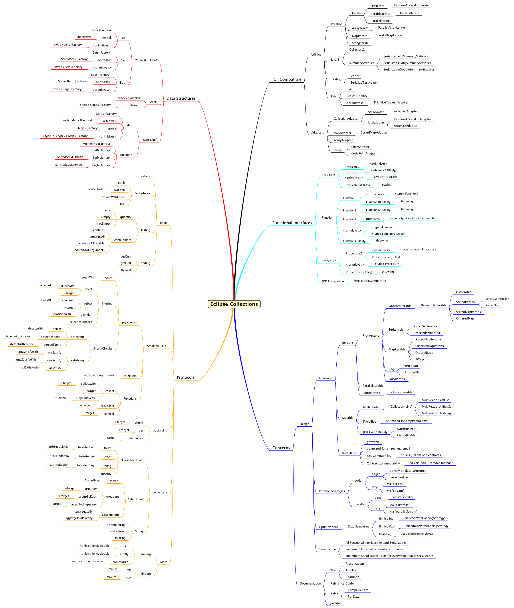

////
  Copyright (c) 2022 Goldman Sachs and others. All rights reserved. 
  This program and the accompanying materials   are made available 
  under the terms of the Eclipse Public License v1.0 and 
  Eclipse Distribution License v. 1.0 which accompany this distribution.
  The Eclipse Public License is available at 
  http://www.eclipse.org/legal/epl-v10.html.
  The Eclipse Distribution License is available at 
  http://www.eclipse.org/org/documents/edl-v10.php.
////
== Eclipse Collections Quick Reference
:sectanchors:
// Javadoc links
:api-url:         https://www.eclipse.org/collections/javadoc/11.1.0/org/eclipse/collections
:rich-url:        https://www.eclipse.org/collections/javadoc/11.1.0/org/eclipse/collections/api/RichIterable.html
// Interfaces
:Bag:                 {api-url}/api/bag/Bag.html[Bag]
:Multimap:            {api-url}/api/multimap/Multimap.html[Multimap]
:MutableList:         {api-url}/api/list/MutableList.html[MutableList]
:MutableMap:          {api-url}/api/map/MutableMap.html[MutableMap]
:MutableSet:          {api-url}/api/set/MutableSet.html[MutableSet]
:Pair:                {api-url}/api/tuple/Pair.html[Pair]
:RichIterable:        {api-url}/api/RichIterable.html[RichIterable]
:Function:            {api-url}/api/block/function/Function.html[Function]
:Function0:           {api-url}/api/block/function/Function0.html[Function0]
:Function2:           {api-url}/api/block/function/Function2.html[Function2]
:Function3:           {api-url}/api/block/function/Function3.html[Function3]
:Predicate:           {api-url}/api/block/predicate/Predicate.html[Predicate]
:Predicate2:          {api-url}/api/block/predicate/Predicate2.html[Predicate2]
:Procedure:           {api-url}/api/block/procedure/Procedure.html[Procedure]
:Procedure2:          {api-url}/api/block/procedure/Procedure2.html[Procedure2]
:ObjectIntProcedure:  {api-url}/api/block/procedure/ObjectIntProcedure.html[ObjectIntProcedure]
//Static classes
:ArrayIterate:           {api-url}/impl/utility/ArrayIterate.html[ArrayIterate]
:Iterate:                {api-url}/impl/utility/Iterate.html[Iterate]
:LazyIterate:            {api-url}/impl/utility/LazyIterate.html[LazyIterate]
:ListIterate:            {api-url}/impl/utility/ListIterate.html[ListIterate]
:MapIterate:             {api-url}/impl/utility/MapIterate.html[MapIterate]
:ParallelArrayIterate:   {api-url}/impl/utility/ParallelArrayIterate.html[ParallelArrayIterate]
:ParallelIterate:        {api-url}/impl/utility/ParallelIterate.html[ParallelIterate]
:ParallelMapIterate:     {api-url}/impl/utility/ParallelMapIterate.html[ParallelMapIterate]
:StringIterate:          {api-url}/impl/utility/StringIterate.html[StringIterate]
//
// - RichIterable methods
:allSatisfy:     {rich-url}#allSatisfy(org.eclipse.collections.api.block.predicate.Predicate)[allSatisfy]
:anySatisfy:     {rich-url}#anySatisfy(org.eclipse.collections.api.block.predicate.Predicate)[anySatisfy]
:appendString:   {rich-url}#appendString(java.lang.Appendable)[appendString]
:chunk:          {rich-url}#chunk(int)[chunk]
:collect:        {rich-url}#collect(org.eclipse.collections.api.block.function.Function)[collect]
:count:          {rich-url}#count(org.eclipse.collections.api.block.predicate.Predicate)[count]
:detect:         {rich-url}#detect(org.eclipse.collections.api.block.predicate.Predicate)[detect]
:flatCollect:    {rich-url}#flatCollect(org.eclipse.collections.api.block.function.Function)[flatCollect]
:forEach:        {rich-url}#forEach(org.eclipse.collections.api.block.procedure.Procedure)[forEach]
:groupBy:        {rich-url}#groupBy(org.eclipse.collections.api.block.function.Function)[groupBy]
:groupByEach:    {rich-url}#groupByEach(org.eclipse.collections.api.block.function.Function)[groupByEach]
:injectInto:     {rich-url}#injectInto(double,org.eclipse.collections.api.block.function.primitive.DoubleObjectToDoubleFunction)[injectInto]
:makeString():   {rich-url}#makeString()[makeString()]
:max:            {rich-url}#max(java.util.Comparator)[max]
:maxBy:          {rich-url}#maxBy(org.eclipse.collections.api.block.function.Function)[maxBy]
:min:            {rich-url}#min(java.util.Comparator)[min]
:minBy:          {rich-url}#minBy(org.eclipse.collections.api.block.function.Function)[minBy]
:reject:         {rich-url}#reject(org.eclipse.collections.api.block.predicate.Predicate)[reject]
:select:         {rich-url}#select(org.eclipse.collections.api.block.predicate.Predicate)[select]
:toBag:          {rich-url}#toBag()[toBag()]
:toList:         {rich-url}#toList()[toList()]
:toMap:          {rich-url}#toMap(org.eclipse.collections.api.block.function.Function,org.eclipse.collections.api.block.function.Function)[toMap]
:toSet:          {rich-url}#toSet()[toSet()]
:toSortedList:   {rich-url}#toSortedList(java.util.Comparator)[toSortedList]
:toSortedListBy: {rich-url}#toSortedListBy(org.eclipse.collections.api.block.function.Function)[toSortedListBy]
:zip:            {rich-url}#zip(java.lang.Iterable)[zip]
:zipWithIndex:   {rich-url}#zipWithIndex(R)[zipWithIndex]
:toSortedSet:    {rich-url}#toSortedSet(java.util.Comparator)[toSortedSet]
:toSortedSetBy:  {rich-url}#toSortedSetBy(org.eclipse.collections.api.block.function.Function)[toSortedSetBy]
// Other methods
:asSynchronized: {api-url}/api/collection/MutableCollection.html#asSynchronized()[asSynchronized]
:asUnmodifiable: {api-url}/api/collection/MutableCollection.html#asUnmodifiable()[asUnmodifiable]
:sortThis:       {api-url}/api/list/MutableList.html#sortThis()[sortThis]
:sortThisBy:     {api-url}/api/list/MutableList.html#sortThisBy(org.eclipse.collections.api.block.function.Function)[sortThisBy]            
:toImmutable:    {api-url}/api/collection/MutableCollection.html#toImmutable()[toImmutable]
//

[cols="1,4",options="header",]
|===
|{RichIterable} API +
(except as noted)    |Description
|*{allSatisfy}*      |Returns true if all elements satisfy a *Predicate*; short-circuits execution.
|*{anySatisfy}*      |Returns true if any element satisfies a *Predicate*; short circuits execution.
|*{appendString}*    |Prints a string representation of this collection onto the given Appendable; prints the string returned by *makeString*.
|*{asSynchronized}** |Returns a synchronized collection.
|*{asUnmodifiable}** |Returns an unmodifiable collection.
|*{chunk}*           |Splits a collection into fixed-size chunks; the final chunk will be smaller if the collection doesn't divide evenly.
|*{collect}*         |Transforms elements using a *Function* into a new collection; n.
|*{count}*           |Returns the number of elements that satisfy a *Predicate*.
|*{detect}*          |Finds the first element that satisfies a *Predicate*; short circuits execution
|*{flatCollect}*     |Transforms and flattens elements using a *Function*.
|*{forEach}*         |Executes a *Procedure* on each element, doesn't return anything
|*{groupBy}*         |Gets a key for each element using a *Function* and puts the key and element into a *Multimap*.
|*{groupByEach}*     |Special case of *groupBy* used were the *Function* returns a collection; analogous to the difference between collect and *flatCollect*.
|*{injectInto}*      |Returns the final result of all evaluations using as the arguments each element of the collection, and the result of the previous iteration's evaluation.
|*{makeString}*      |Converts the collection to a string using optional start, end, and separator strings.
|*{max}*             |Returns the maximum element using either the natural order or a Comparator.
|*{maxBy}*           |Gets some attribute from each element and returns the element whose attribute is maximal.
|*{min}*             |Returns the minimum element using either the natural order or a Comparator.
|*{minBy}*           |Gets some attribute from each element and returns the element whose attribute is minimal.
|*{reject}*          |Returns the elements of a collection that do not satisfy a *Predicate*.
|*{select}*          |Returns the elements of a collection that satisfy a *Predicate*.
|*{sortThis}***      |Sorts the internal data structure of a *MutableList* using the natural order of the elements or a Comparator.
|*{sortThisBy}***    |Gets some attribute from each element using a *Function* and sorts the list by the natural order of that attribute.
|*{toBag}*           |Converts the collection to the default *MutableBag* implementation.
|*{toImmutable}**    |Returns an immutable collection.
|*{toList}*          |Converts the collection to a *MutableList* implementation.
|*{toMap}*           |Converts collection to a *MutableMap* implementation using specified key and value functions.
|*{toSet}*           |Converts the collection to a *MutableSet* implementation.
|*{toSortedList}*    |Converts the collection to a *MutableList* implementation and sorts it using the natural order of the elements.
|*{toSortedListBy}*  |Gets some attribute from each element using a *Function* and returns a new list sorted by the natural order of that attribute.
|*{toSortedSet}*     |Converts the collection to a *MutableSortedSet* implementation and sorts it using the natural order of the elements.
|*{toSortedSetBy}*   |Converts the collection to a *MutableSortedSet* implementation and sorts it based on the natural order of the attributes returned by the *Function*.
|*{zip}*             |Takes a second *RichIterable* and pairs up all the elements; if one of the two **RichIterable**s is longer, its remaining elements are ignored.
|*{zipWithIndex}*    |Zips the collection with the Integer indexes 0 to n-1.
|===
+++*+++ on *MutableCollection* +
+++**+++ on *MutableList*

[cols=",",options="header",]
[%autowidth]
|===
|*Interfaces*    |*Description*
|*{Bag}*         |Analogous to JCF _Map_ <K, Integer>.
|*{Multimap}*    |Analogous to JCF _Map_ <K, Iterable<V>>.
|*{MutableList}* |Analogous to JCF _List_ .
|*{MutableMap}*  |Analogous to JCF _Map_ .
|*{MutableSet}*  |Analogous to JCF _Set_ .
|*{Pair}*        |Container that holds two related objects.
|===

[cols=",",options="header",]
[%autowidth]
|===
|*Blocks*               |*Description*
|*{Function}*             |Transforms one type (T) to another (V).
|*{Function0}*            |A zero-argument lambda (Java 8) that returns some type; a factory.
|*{Function2}*            |Used by *injectInto* methods; takes the accumulator argument as the first argument, and the current item of the collection as the second argument.
|*{ObjectIntProcedure}*   |Takes an int as a second argument; this is usually the index of the current element of a collection; doesn't return anything.
|*{Predicate}*            |Takes an object of some type (T) and returns a boolean.
|*{Predicate2}*           |Primarily used in methods like *selectWith*, *detectWith*, *rejectWith*. The first argument is the element of the collection being iterated over, and the second argument is a parameter passed into the *Predicate2* from the calling method.
|*{Procedure}*            |Takes an object of some type (T) and doesn't return anything.
|*{Procedure2}*           |Takes two objects of types (T1, T2) and doesn't return anything.
|===

[cols=",",options="header",]
[%autowidth]
|===
|*Static utility Classes* |*Interoperate with*
|*{ArrayIterate}*         |Arrays
|*{Iterate}*              |All iterables
|*{LazyIterate}*          |All iterables for lazy evaluation
|*{ListIterate}*          |Lists
|*{MapIterate}*           |Maps
|*{ParallelArrayIterate}* |Arrays for parallel iteration
|*{ParallelIterate}*      |Iterables for parallel iteration
|*{ParallelMapIterate}*   |Maps for parallel iteration
|*{StringIterate}*        |strings
|===

== Eclipse Collections mindmap

[link=EclipseCollectionsMindMap.png]

[cols="3,^1",]
[%autowidth]
|===
|xref:4-Testing_Utilities.adoc[previous: Unit testing]  |xref:0-RefGuide.adoc[top]
|===
