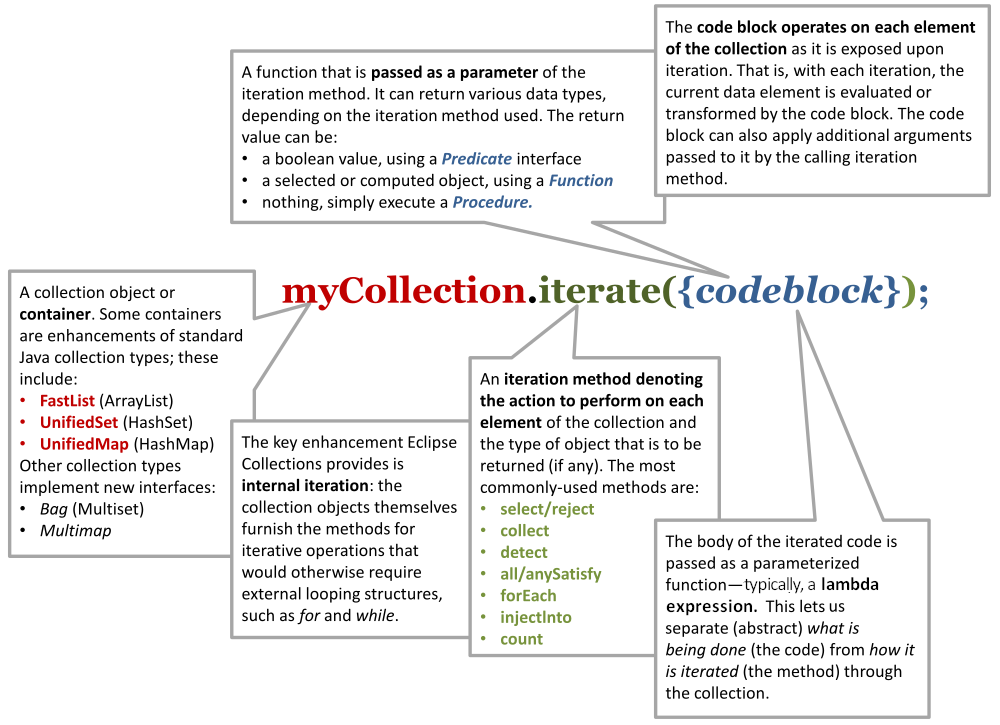

# Reference Guide
- [About Eclipse Collections](#-about-eclipse-collections)
- [About this guide](#-about-this-guide)
- [Getting Started With Eclipse Collections](#-getting-started-with-eclipse-collections)
- [Iteration patterns](#-iteration-patterns)
- [Common iteration patterns](#-common-iteration-patterns)
    - [Select/Reject pattern](#-selectreject-pattern)
    - [Collect pattern](#-collect-pattern)
    - [Short-circuit patterns](#-short-circuit-patterns)
    - [ForEach pattern](#-foreach-pattern)
    - [InjectInto pattern](#-injectinto-pattern)
- [RichIterable](#-richiterable)
    - [Lazy iteration](#-lazy-iteration)
    - [Parallel-lazy iteration](#-parallel-lazy-iteration)
    - [RichIterable methods](#-richiterable-methods)
- [Map iteration methods](#-map-iteration-methods)
    - [Creating iterable views of maps](#-creating-iterable-views-of-maps)
    - [Collecting entries](#-collecting-entries)
    - [Finding, testing and putting values](#-finding-testing-and-putting-values)
    - [Flipping maps](#-flipping-maps)
- [Basic collection types](#-basic-collection-types)
    - [ListIterable](#-listiterable)
    - [SetIterable](#-setiterable)
    - [MapIterable](#-mapiterable)
    - [BiMap](#-bimap)
    - [Bag](#-bag)
    - [StackIterable](#-stackiterable)
    - [Multimap](#-multimap)
- [Primitive collections](#-primitive-collections)
    - [Primitive Lists](#primitive-lists)
    - [IntInterval](#intinterval)
    - [Primitive Sets](#primitive-sets)
    - [Primitive Stacks](#primitive-stacks)
    - [Primitive Bags](#primitive-bags)
    - [Primitive Maps](#primitive-maps)
- [Immutable collections](#-immutable-collections)
    - [Immutable Collection Factory Classes](#-immutable-collection-factory-classes)
- [Creating collections containers](#-creating-collections-containers)
    - [Creating mutable collections](#-creating-mutable-collections)
    - [Creating immutable collections](#-creating-immutable-collections)
    - [Creating primitive collections](#-creating-primitive-collections)
- [Converting collections](#converting-collections)
- [Protective wrappers](#-protective-wrappers)
    - [Unmodifiable Collections](#-unmodifiable-collections)
    - [Synchronized Collections](#-synchronized-collections)
- [Code blocks](#-code-blocks)
    - [Predicate](#-predicate)
        - [Predicate Factories](#predicate-factories)
    - [Function](#-function)
        - [Function Factories](#function-factories)
    - [Procedure](#-procedure)
        - [Count and calculate](#-count-and-calculate)
        - [Control execution](#-control-execution)
        - [Modify collections and maps](#-modify-collections-and-maps)
        - [Procedure Factories](#procedure-factories)
- [Verify](#-verify)
- [Eclipse Collections Cheat Sheet](#-eclipse-collections-cheat-sheet)
- [Eclipse Collections Mind Map](#-eclipse-collections-mind-map)

[]() About Eclipse Collections
-----------------------------

> A collections framework for Java based on Smalltalk patterns.

Eclipse Collections is a library of collection-management utilities that work with the Java Collections Framework (JCF). Eclipse Collections offers JCF-compatible implementation alternatives for List, Set and Map. It also introduces a host of new features including Multimaps, BiMaps and Bags, lazy evaluation, immutable containers, parallel processing and a full complement of primitive containers.

Eclipse Collections implements the idea of *internal iteration* - putting collection-handling methods on the collection classes, a concept derived from the Smalltalk language. Internal iteration affords a more consistent and intuitive approach to using collections by encapsulating the details of how various iteration patterns are implemented. Hiding this complexity lets you write more readable code with less duplication.




[]() About this guide
--------------------

This Guide is an introduction to basic Eclipse Collections concepts and its commonly-used features. It provides a high-level survey of the Eclipse Collections library and its capabilities. The topics covered are:

-   **Iteration patterns**: the logic underlying Eclipse Collections methods.
-   **Collections & containers**: the JCF compatible collection types and new containers introduced in Eclipse Collections.
-   **Code blocks**: a function that can be passed around as data.
-   **Utilities**: factory classes, static methods, and other features of the library.

[]() Getting Started With Eclipse Collections
---------------------------------------------

It is recommended that first time users go through the [Eclipse Collections Kata](https://github.com/eclipse/eclipse-collections-kata). The Kata is a fun way to help you learn idiomatic Eclipse Collections usage through coding exercises.

[]() Iteration patterns
----------------------

Eclipse Collections extends the Java Collections Framework with new interfaces and classes and provides additional methods. These new methods implement *iteration patterns* derived from the collection protocol of the Smalltalk language (e.g., *select*, *reject*, *collect*, *detect*, *injectInto*).

In idiomatic (imperative) Java code, iteration is performed by external **for** and **while** loops that enclose a block of business logic to be performed on each element of a collection. This is an approach that often leads to a lot duplication of code.

In Eclipse Collections, business logic is reified as a *code block*: a class that is passed as a parameter to an iteration method. Each implementation of an iteration method iterates over the collection, passing each element to the code block for processing.  In Java 8, these code blocks can be specified using the lambda and method reference syntax.

The most important advantage of internal iteration patterns is that they increase readability by giving names to the structural iteration patterns and by reducing code duplication. Moreover, by encapsulating implementation within specialized collection types (e.g., list, sets, maps), iteration can be optimized for the particular type.

[]() Common iteration patterns
-----------------------------

The most commonly-used iteration patterns in Eclipse Collections are:

##### Filtering patterns:

-   Select
-   Reject
-   Partition

##### Transforming patterns:

-   Collect
-   FlatCollect
-   GroupBy

##### Fused patterns:

-   CollectIf

##### "Short-circuit" patterns:

-   Detect
-   AnySatisfy
-   AllSatisfy
-   NoneSatisfy

##### Generic action patterns:

-   ForEach
-   InjectInto

### []() Select/Reject pattern

> Filter a collection to create a new collection: includes **select**, **reject**, and **partition**.

Methods using the *Select* pattern return a new collection comprising those elements from the source collection that satisfy some logical condition. *Reject* is the inverse pattern, returning a new collection of elements that do *not* satisfy the condition. The condition is a boolean expression in the form of single-argument code block that implements the [**Predicate**](http://www.eclipse.org/collections/javadoc/9.2.0/org/eclipse/collections/api/block/predicate/Predicate.html) interface.

#### Select pattern examples:

###### Pseudocode

```java
create <newCollection>
 for each <element> of <collection>
     if condition(<element>)
         add <element> to <newCollection>
```

###### EC (w/lambda)

```java
MutableList<Integer> greaterThanFifty = list.select(each -> each > 50);
```

Select, using an anonymous inner class as a code block:

###### EC (w/anonymous inner class)

```java
MutableList<Integer> greaterThanFifty =
    list.select(new Predicate<Integer>()
    {
        public boolean accept(Integer each)
        {
            return each > 50;
        }
    });
```

Here, a [**Predicate**](http://www.eclipse.org/collections/javadoc/9.2.0/org/eclipse/collections/api/block/predicate/Predicate.html) is created using the [**Predicates**](http://www.eclipse.org/collections/javadoc/9.2.0/org/eclipse/collections/impl/block/factory/Predicates.html) factory:

```java
MutableList<Integer> greaterThanFifty = list.select(Predicates.greaterThan(50));
```

###### Java 8 Streams w/[Collectors2](http://www.eclipse.org/collections/javadoc/9.2.0/org/eclipse/collections/impl/collector/Collectors2.html)

```java
MutableList<Integer> greaterThanFifty = list.stream()
    .filter(each -> each.intValue() > 50)
    .collect(Collectors2.toList());
```

###### Imperative Java

```java
List<Integer> greaterThanFifty = Lists.mutable.empty();
for (Integer each : list)
{
    if (each.intValue() > 50)
    {
        greaterThanFifty.add(each);
    }
}
```

#### Reject pattern examples:

###### Pseudocode

```java
create <newCollection>
 for each <element> of <collection>
     if not condition(<element>)
         add <element> to <newCollection>
```

###### EC (w/lambda)

```java
List<Integer> notGreaterThanFifty =
    list.reject(each -> each > 50);
```

###### EC (w/[Predicates](http://www.eclipse.org/collections/javadoc/9.2.0/org/eclipse/collections/impl/block/factory/Predicates.html) Factory)

```java
list.reject(Predicates.greaterThan(50));
```

###### Java 8 Streams

```java
MutableList<Integer> notGreaterThanFifty = list.stream()
    .filter(each -> each.intValue() <= 50)
    .collect(Collectors2.toList());
```

###### Imperative Java

```java
List<Integer> notGreaterThanFifty = Lists.mutable.empty();
for (Integer each : list)
{
    if (each <= 50)
    {
        notGreaterThanFifty.add(each);
    }
}
```

#### []() Select and Reject methods

These Eclipse Collections methods implement the Select and Reject pattern:

##### select(Predicate): RichIterable

##### reject(Predicate): RichIterable

The [**Predicate**](http://www.eclipse.org/collections/javadoc/9.2.0/org/eclipse/collections/api/block/predicate/Predicate.html) is evaluated for each element of the collection. The selected elements are those where the Predicate returned true (false for rejected). The selected (or rejected) elements are returned in a new collection of the same type.

##### select(Predicate, *targetCollection*): *targetCollection*

##### reject(Predicate, *targetCollection*): *targetCollection*

Same as the **select**/**reject** methods with one argument, but results are added to the specified *targetCollection*.

##### selectWith(Predicate2, *argument*): RichIterable

##### rejectWith(Predicate2, *argument*): RichIterable

For each element of the collection, [**Predicate2**](http://www.eclipse.org/collections/javadoc/9.2.0/org/eclipse/collections/api/block/predicate/Predicate2.html) is evaluated with the element as one argument, plus one additional argument; selected or rejected elements are returned in a new collection of the same type. See [Reusing a code block](#performance-optimized-methods-reusing-two-argument-code-blocks "Using selectWith, rejectWith, and collectWith inside other iteration patterns (or loops) where code blocks can be created outside of the outer iteration patterns or made static.") for more information.

##### selectWith(Predicate2, *argument*, *targetCollection*): *targetCollection*

##### rejectWith(Predicate2, *argument*, *targetCollection*): *targetCollection*

Same as the **selectWith**/**rejectWith** methods, but results are added to the specified *targetCollection*.

#### []() Partition pattern

> Create two collections using **Select** and **Reject**.

The *Partition* pattern allocates each element of a collection into one of two new collections depending on whether the element satisfies the condition expressed by the **Predicate**. In effect, it combines the [*Select* and *Reject* patterns](#selectreject-pattern "Filter a collection to create a new collection: includes select, reject, and partition."). The collections are returned in a [**PartitionIterable**](http://www.eclipse.org/collections/javadoc/9.2.0/org/eclipse/collections/api/partition/PartitionIterable.html) specialized for the type of the source collection. You can retrieve the selected and rejected elements from the **PartitionIterable**. In this example, the list of people is partitioned into lists of adults and children.

###### EC (w/lambda)

```java
PartitionMutableList<Person> partitionedFolks = 
    people.partition(person -> person.getAge() >= 18);
MutableList<Person> adults = partitionedFolks.getSelected();
MutableList<Person> children = partitionedFolks.getRejected();
```

###### EC (w/anonymous inner class)

```java
MutableList<Person> people =...
PartitionMutableList<Person> partitionedFolks = people.partition(
    new Predicate<Person>()
    {
        public boolean accept(Person each)
        {
            return each.getAge() >= 18;
        }
    });
MutableList<Person> adults = partitionedFolks.getSelected();
MutableList<Person> children = partitionedFolks.getRejected();
```

###### Java 8 Streams

```java
List<Person> people =...
Map<Boolean, List<Person>> partitionedFolks = people.stream()
    .collect(Collectors.partitioningBy(person -> person.getAge() >= 18)
List<Person> adults = partitionedFolks.get(Boolean.TRUE);
List<Person> children = partitionedFolks.get(Boolean.FALSE);
```

#### []() Partitioning methods

These Eclipse Collections methods implement the partition pattern:

##### partition(Predicate): PartitionIterable

Returns a **PartitionIterable**, a logical pair of containers. The first container consists of all elements that satisfy the **Predicate**. The second container consists of all elements that do not satisfy the **Predicate**. The subtypes of **PartitionIterable** correspond with the subtypes of [**RichIterable**](http://www.eclipse.org/collections/javadoc/9.2.0/org/eclipse/collections/api/RichIterable.html).

##### partitionWith(Predicate2, *argument*): PartitionIterable

For each element of the collection, **Predicate2** is evaluated with the element as one argument, plus one additional argument; partitioned elements are returned in a new collection of type **PartitionIterable**.

### []() Collect pattern

> Transform a collection's elements, creating a new collection: includes **collect**, **flatCollect**, and **groupBy**.

The *Collect* pattern methods return a new collection whose data elements are the results of an evaluation performed by the code block; that is, each element of the original collection is mapped to a new object, which is usually a different type. The code block used as the **collect** method's parameter implements the [**Function**](http://www.eclipse.org/collections/javadoc/9.2.0/org/eclipse/collections/api/block/function/Function.html) interface.

###### Pseudocode

```java
create <newCollection>
 for each <element> of <collection>
     <result> = transform(<element>)
     add <result> to <newCollection>
```

###### EC (w/lambda and method reference)

```java
MutableList<Address> addresses = 
    people.collect(person -> person.getAddress());

//or

MutableList<Address> addresses = 
    people.collect(Person::getAddress);
```

###### EC (w/anonymous inner class)

```java
MutableList<Person> people =...;
Function<Person, Address> addressFunction =
    new Function<Person, Address>()
    {
        public Address valueOf(Person person)
        {
            return person.getAddress();
        }
    };
MutableList<Address> addresses = people.collect(addressFunction);
```

Notice that this assumes each person in the **people** collection has just one address. If, instead, a person has multiple addresses, the [**Function**](http://www.eclipse.org/collections/javadoc/9.2.0/org/eclipse/collections/api/block/function/Function.html) returns a list of addresses for each person (a list that has only one element if the person has just one address); the result is a List of Lists:

###### EC (w/lambda and method reference)

```java
MutableList<MutableList<Address>> addresses = 
    people.collect(person -> person.getAddresses());

//or

MutableList<MutableList<Address>> addresses = 
    people.collect(Person::getAddresses);
```

###### EC (w/anonymous inner class)

```java
MutableList<Person> people =...;
Function<Person, MutableList<Address>> addressFunction =
    new Function<Person, MutableList<Address>>()
    {
        public MutableList<Address> valueOf(Person person)
        {
            return person.getAddresses();
        }
    };
MutableList<MutableList<Address>> addresses =
    people.collect(addressFunction);
```

###### Java 8 Streams

```java
MutableList<MutableList<Address>> addresses = people.stream()
    .map(person -> person.getAddresses())
    .collect(Collectors2.toList());

//or

MutableList<MutableList<Address>> addresses = people.stream()
    .map(Person::getAdddresses)
    .collect(Collectors2.toList());
```

###### Imperative Java

```java
List<Address> addresses = Lists.mutable.empty();
for (Person person : people)
{
    addresses.add(person.getAddress());
}

//or

List<List<Address>> addresses = Lists.mutable.empty();
for (Person person : people)
{
    addresses.add(person.getAddresses());
}

```

#### []() Other Collect-style patterns

Eclipse Collections provides two specialized variations on the *Collect* pattern: [Flatten](#flatten-pattern "Create a single, linear collection from selected values of a collection's elements.") and [GroupBy](#groupby-pattern "Create a Multimap from a collection by grouping on a selected or generated key value."). Like *Collect*, both methods take a single **Function** as a parameter.

#### []() Collect methods

These Eclipse Collections methods implement the Collect pattern:

##### collect(Function): RichIterable

For each element of the collection, the [**Function**](http://www.eclipse.org/collections/javadoc/9.2.0/org/eclipse/collections/api/block/function/Function.html) is evaluated with the current element as the argument; returns a new collection with the transformed type.

##### collectInt(IntFunction): IntIterable

Similar to **collect**, but it takes an [**IntFunction**](http://www.eclipse.org/collections/javadoc/9.2.0/org/eclipse/collections/api/block/function/primitive/IntFunction.html) and returns a primitive collection which extends from [**IntIterable**](http://www.eclipse.org/collections/javadoc/9.2.0/org/eclipse/collections/api/IntIterable.html). There are variants for all eight primitives: **collectBoolean**, **collectFloat** etc.

##### collect(Function, *targetCollection*): *targetCollection*

Same as **collect**, except that the results are added to the specified *targetCollection*, which extends java.util.Collection.

##### collectInt(IntFunction, *targetCollection*): *targetCollection*

Same as **collectInt**, except that the results are added to the specified *targetCollection*, which extends [**MutableIntCollection**](http://www.eclipse.org/collections/javadoc/9.2.0/org/eclipse/collections/api/collection/primitive/MutableIntCollection.html). There are variants for all eight primitives.

##### collectIf(Predicate, Function): RichIterable

Same as **collect**, except that the **Predicate** is first evaluated with the element as the argument to filter the collection.

##### collectIf(Predicate, Function, *targetCollection*): *targetCollection*

Same as **collectIf**, except that the results are added to the specified *targetCollection*.

##### collectWith(Function2, *argument2*): RichIterable

Same as **collect**, but the [**Function2**](http://www.eclipse.org/collections/javadoc/9.2.0/org/eclipse/collections/api/block/function/Function2.html) is evaluated with the element as one argument, plus one additional argument; returns a new collection of the same size and the transformed type.

##### collectWith(Function2, *argument2*, *targetCollection*): *targetCollection*

Same as **collectWith**, except that the results are added to a specified *targetCollection*. (On all **RichIterable**s since version 1.0)

#### []() FlatCollect pattern

Create a single, linear collection from selected values of a collection's elements.

The *FlatCollect* pattern is a specialized form of the the *Collect* pattern. It returns a single-level, or "flattened," collection of attribute values from a source collection's elements.

##### flatCollect(Function): RichIterable

Applies the **Function** to each element. The **Function** must return an Iterable type. Returns the intermediate Iterables in a single, flattened collection.

Given a list of **people** (as in the [collect method example](#collect-pattern "Transform a collection's elements, creating a new collection: includes collect, flatCollect, and groupBy.")), here is how **flatCollect** could be used to create a flat list from the address fields of the **person** objects in that list, using the same **Function** (**addressFunction**):

###### Pseudocode

```java
create <newCollection>
 for each <element> of <collection>
     <results> = transform(<element>)
     Add all <results> to <newCollection>
```

###### EC (w/lambda and method reference)

```java
MutableList<Address> flatAddress = 
    people.flatCollect(person -> person.getAddresses());

// or 

MutableList<Address> flatAddress = 
    people.flatCollect(Person::getAddresses);
```

Note the **flatCollect** method's similarity to a **collect** method having the same signature: each method's **Function** parameter maps to an Iterable type. This is optional for **collect**, but required of **flatCollect.** Both methods return a new collection. The difference is that **collect** in this form creates a *collection of collections* from a simple List, Set or Bag, while **flatCollect** performs a different (and in this instance, somewhat more useful) action, returning a flat list of addresses.

###### EC (w/anonymous inner class)

```java
MutableList<Address> addresses = 
    people.flatCollect(
       new Function<Person, MutableList<Address>>()
       {
           public MutableList<Address> valueOf(Person person)
           {
               return person.getAddresses();
           }
       });
```

###### Java 8 Streams w/[Collectors2](http://www.eclipse.org/collections/javadoc/9.2.0/org/eclipse/collections/impl/collector/Collectors2.html)

```java
MutableList<Address> flatAddress = people.stream()
    .flatMap(person -> person.getAddresses().stream())
    .collect(Collectors2.toList());
    
// or
    
MutableList<Address> flatAddresses = people.stream()
    .map(Person::getAddresses)
    .flatMap(List::stream)
    .collect(Collectors2.toList());   
```

###### Imperative Java

```java
List<Address> addresses = Lists.mutable.empty();
for (Person person : people)
{
    addresses.addAll(person.getAddresses());
}
```

#### []() GroupBy pattern

Create a Multimap from a collection by grouping on a selected or generated key value.

The *GroupBy* pattern gathers the elements on the collection into a map-like container called a [**Multimap**](#multimap "A map-like container that can have multiple values for each key"), which associates multiple values for each key. The **Function** is applied to each element and the result is used as the key into the [**Multimap**](http://www.eclipse.org/collections/javadoc/9.2.0/org/eclipse/collections/api/multimap/Multimap.html) where the element should appear as the value.

##### groupBy(Function): Multimap

Group the elements into a new [**Multimap**](http://www.eclipse.org/collections/javadoc/9.2.0/org/eclipse/collections/api/multimap/Multimap.html); uses the **Function** to get the key for each element.

##### groupBy(Function, *targetMultimap*) : targetMultimap

Same as **groupBy** except that results are added to the specified *targetMultimap*.

##### groupByEach(Function): Multimap

Same as **groupBy** except that the **Function** transforms each value into multiple keys, returning a new **Multimap** containing all the key/value pairs.

**Related links**
[Multimap](#multimap "A map-like container that can have multiple values for each key") [ForEach pattern](#forEach-pattern "Perform a calculation on each element of the current collection.")

### []() Short-circuit patterns

Methods that control processing by testing a collection for a logical condition: includes **detect**, **anySatisfy**, and **allSatisfy**.

The "short-circuit" patterns - [*Detect*](#detect-pattern "Finds and returns the first element that satisfies a given logical expression."), [*AnySatisfy*](#anysatisfy-pattern "Determine if any collection element satisfies a given logical expression.") and [*AllSatisfy*](#allsatisfy-pattern "Determine if all collection elements satisfy a given logical expression.") - are so called because they describe methods that cease execution when a specific condition is met. With each iteration, the **Predicate** is evaluated. If the evaluation resolves as a specified boolean (*true*/*false*) value, then iteration halts and returns the appropriate value.

#### []() Detect pattern

Finds and returns the *first* element that satisfies a given logical expression.

*Detect* returns the first element that satisfies a **Predicate**. If every element in the collection is tested and the **Predicate** never returns *true*, then the method returns *null*.

###### Pseudocode

```java
for each <element> of <collection>
  if condition(<element>)
    return <element>
```

###### EC (w/lambda)

```java
Integer result = 
    list.detect(each -> each > 50);
```

###### EC (w/Predicates factory)

```java
Integer result = 
    list.detect(Predicates.greaterThan(50));
```

###### Java 8 Streams

```java
Integer result = 
    list.stream().findAny(each -> each > 50).get();
```

###### Imperative Java

```java
for (int i = 0; i < list.size(); i++)
{
    Integer v = list.get(i);
    if (v.intValue() > 50)
    {
        return v;
    }
}
return null;
```

#### []() Detect methods

##### detect(Predicate): element

Return the first element which satisfies the **Predicate** or null if no element satisfies the **Predicate**.

##### detectIfNone(Predicate, Function0): element (or Function0 result)

Same as **detect**, but if no element causes **Predicate** to evaluate as *true*, return the result of evaluating **Function0**.

##### detectWith(Predicate2, *parameter*): element

Returns the first element that evaluates as *true* for the specified **Predicate2** and *parameter*, or null if none evaluate as *true*. See [Reusing a code block](#performance-optimized-methods-reusing-two-argument-code-blocks "Using selectWith, rejectWith, and collectWith inside other iteration patterns (or loops) where code blocks can be created outside of the outer iteration patterns or made static.") for more information.

##### detectWithIfNone(Predicate2, *parameter*, Function0): element (or Function0 result)

Same as **detectWith**, but if no element causes [**Predicate2**](http://www.eclipse.org/collections/javadoc/9.2.0/org/eclipse/collections/api/block/predicate/Predicate2.html) to evaluate as *true*, return the result of evaluating [**Function0**](http://www.eclipse.org/collections/javadoc/9.2.0/org/eclipse/collections/api/block/function/Function0.html).

#### []() AnySatisfy pattern

Determine if *any* collection element satisfies a given logical expression.

The *AnySatisfy* method determines whether *any* element satisfies the **Predicate**. It applies the **Predicate** to each element. If the **Predicate** ever returns true, execution halts and the method returns *true* immediately. Otherwise, every element is checked and the method returns *false*.

###### Pseudocode

```java
for each <element> of <collection>
     if condition(<element>)
         return true
 otherwise return false
```

###### EC (w/lambda)

```java
boolean result = 
    list.anySatisfy(num -> num > 50);
```

###### EC (w/Predicates factory)

```java
boolean result = 
    list.anySatisfy(Predicates.greaterThan(50));
```

###### Java 8 Streams

```java
boolean result = 
    list.stream().anyMatch(num -> num > 50);
```

###### Imperative Java

```java
for (int i = 0; i < list.size(); i++)
{
    Integer v = list.get(i);
    if (v.intValue() > 50)
    {
        return true;
    }
}
return false;
```

##### []() AnySatisfy methods

##### anySatisfy(Predicate): boolean

Return true if the **Predicate** returns *true* for any element of the collection. Otherwise (or if the collection is empty), return false.

##### anySatisfyWith(Predicate2, *parameter*): boolean

Return true if the **Predicate2** returns *true* for any element of the collection. Otherwise (or if the collection is empty), return false.

##### []() AllSatisfy pattern

Determine if *all* collection elements satisfy a given logical expression.

The *AllSatisfy* method determines whether *all* elements satisfy the **Predicate**. It applies the **Predicate** to each element. If the **Predicate** ever returns false, execution halts and the method returns *false* immediately. Otherwise, every element is checked and the method returns *true*.

###### Pseudocode

```java
for each <element> of <collection>
     if not condition(<element>)
         return false
 otherwise return true
                      
```

###### EC (w/lambda)

```java
boolean result = 
    list.allSatisfy(each -> each > 50);
```

###### EC (w/Predicates factory)

```java
boolean result = 
    list.allSatisfy(Predicates.greaterThan(50));
```

###### Java 8 Streams

```java
boolean result = 
    list.stream().allMatch(each -> each > 50);
```

###### Imperative Java

```java
for (int i = 0; i < list.size(); i++)
{
    Integer v = list.get(i);
    if (v.intValue() <= 50)
    {
        return false;
    }
}
return true;
```

*NoneSatisfy* is similar to *AllSatisfy*, but negates the **Predicate**. It returns *true* only if *no* element satisfies the **Predicate**. If the container is empty it also returns true.

##### []() AllSatisfy methods

##### allSatisfy(Predicate): boolean

Return true if the **Predicate** returns *true* for all elements of the collection. Otherwise (or if the collection is empty), return *false*.

##### allSatisfyWith(Predicate2, *parameter*): boolean

Return true if the **Predicate2** returns *true* for all elements of the collection. Otherwise (or if the collection is empty), return *false*.

##### noneSatisfy(Predicate):\*\* boolean

Return true if the **Predicate** returns *false* for all elements of the collection or if the collection is empty. Otherwise, return *false*.

##### noneSatisfyWith(Predicate2, *parameter*): boolean

Return true if the **Predicate2** returns *false* for all elements of the collection or if the collection is empty. Otherwise, return *false*.

### []() ForEach pattern

Perform a calculation on each element of the current collection.

The *ForEach* pattern defines the most basic iteration operation that can be used with all collection types. Unlike the other patterns discussed in this topic, the ForEach pattern prescribes methods that operate on each element of the calling collection object, with no value returned by the method itself.

In Eclipse Collections, the **each** and **forEach** methods offer the most straightforward replacement for the Java **for** loop. It executes the code in a Procedure on each element. You can use these methods to perform some action using the values of the source collection - for example, to print a value or to call another method on each element.

###### Pseudocode

```java
for each <element> of <collection>
     evaluate(<element>)
```

###### EC (w/lambda)

```java
list.each(each -> doSomething(each));

// or

list.forEach(each -> doSomething(each));
```

###### EC (w/anonymous inner class)

```java
list.each(new Procedure()
{
    public void value(Object each)
    {
        doSomething(each);
    }
});
```

###### Imperative Java

```java
for (int i = 0; i < list.size(); i++)
{
    this.doSomething(list.get(i));
}
```

#### []() Each / ForEach methods

##### each(Procedure): void

For each element, the [**Procedure**](http://www.eclipse.org/collections/javadoc/9.2.0/org/eclipse/collections/api/block/procedure/Procedure.html) is evaluated with the element as the argument.

##### forEach(Procedure): void

For each element, the [**Procedure**](http://www.eclipse.org/collections/javadoc/9.2.0/org/eclipse/collections/api/block/procedure/Procedure.html) is evaluated with the element as the argument.

##### forEachIf(Predicate, Procedure): void

For each element that satisfies the **Predicate**, executes the **Procedure** on that element.

##### forEach(*fromIndex*, *toindex*, Procedure): void

Iterates over the section of a [**ListIterable**](http://www.eclipse.org/collections/javadoc/9.2.0/org/eclipse/collections/api/list/ListIterable.html) covered by the specified indexes (inclusive).

##### forEachWith(Procedure2, *parameter*): void

For each element of the collection, the [**Procedure2**](http://www.eclipse.org/collections/javadoc/9.2.0/org/eclipse/collections/api/block/procedure/Procedure2.html) is evaluated with the element as the first argument, and the specified *parameter* as the second argument.

##### forEachWithIndex(ObjectIntProcedure): void

Iterates over a collection passing each element and the current relative int index to the specified instance of [**ObjectIntProcedure**](http://www.eclipse.org/collections/javadoc/9.2.0/org/eclipse/collections/api/block/procedure/primitive/ObjectIntProcedure.html).

##### forEachWithIndex(*fromIndex*, *toIndex*, ObjectIntProcedure): void

Iterates over the section of the list covered by the specified indexes (inclusive).

### []() InjectInto pattern

Calculate and maintain a *running value* during iteration; use each evaluated result as an argument in the next iteration.

The *InjectInto* pattern is used to carry a computed result from one iteration as input to the next. In this pattern, the **injectInto** method takes an initial *injected* *value* as a parameter. This value is used as the first argument to a two-argument code block; the current element (for each iteration of the collection) is taken as the second argument.

For each iteration, the code block's evaluation result is passed to the next iteration as the first argument (the injected value) of the code block, with the (new) current element as the second argument. The injectInto() method returns the code block's cumulative result upon the final iteration.

###### Pseudocode

```java
set <result> to <initialvalue>
 for each <element> of <collection>
     <result> = apply(<result>, <element>)
 return <result>
```

###### EC (w/lambda and method reference)

```java
Integer result = 
    Lists.mutable.of(1, 2).injectInto(3, (result, each) -> result + each);

// or

Integer result = 
    Lists.mutable.of(1, 2).injectInto(3, Integer::sum);
```

###### EC (w/static class)

```java
Integer result = 
    Lists.mutable.of(1, 2).injectInto(3, AddFunction.INTEGER);
```

###### Java 8 Streams (w/lambda and method reference)

```java
Integer result = 
    Lists.mutable.of(1, 2).stream().reduce(3, (result, each) -> result + each);

// or

Integer result = 
    Lists.mutable.of(1, 2).stream().reduce(3, Integer::sum);
```

###### Imperative Java

```java
List<Integer> list = Lists.mutable.of(1, 2);
int result = 3;
for (int i = 0; i < list.size(); i++)
{
    Integer v = list.get(i);
    result = result + v.intValue();
}
```

#### []() InjectInto methods

##### injectInto(*injectedValue*, Function2): *(final result)*

Return the final result of all evaluations using as the arguments each element of the collection, and the result of the previous iteration's evaluation.

##### injectInto(*floatValue*, FloatObjectToFloatFunction): float

Return the final result of all evaluations using as the arguments each element of the collection, and the result of the previous iteration's evaluation. The injected value and result are both primitive floats.

##### injectInto(*intValue*, IntObjectToIntFunction): int

Return the final result of all evaluations using as the arguments each element of the collection, and the result of the previous iteration's evaluation. The injected value and final result are both primitive ints.

##### injectInto(*longValue*, LongObjectToLongFunction): long

Return the final result of all evaluations using as the arguments each element of the collection, and the result of the previous iteration's evaluation. The injected value and result are both primitive longs.

##### injectInto(*doubleValue*, DoubleObjectToDoubleFunction): double

Return the final result of all evaluations using as the arguments each element of the collection, and the result of the previous iteration's evaluation. The injected value and result are both primitive doubles.

[]() RichIterable
----------------

[**RichIterable**](http://www.eclipse.org/collections/javadoc/9.2.0/org/eclipse/collections/api/RichIterable.html) is the most important interface in Eclipse Collections. It provides the blueprint for all non-mutating iteration patterns. It represents an object made up of elements that can be individually and consecutively viewed or evaluated (an *iterable*), and it prescribes the actions that can be performed with each evaluation (the patterns). The most commonly used implementations include [**FastList**](http://www.eclipse.org/collections/javadoc/9.2.0/org/eclipse/collections/impl/list/mutable/FastList.html) and [**UnifiedSet**](http://www.eclipse.org/collections/javadoc/9.2.0/org/eclipse/collections/impl/set/mutable/UnifiedSet.html).

[**RichIterable**](http://www.eclipse.org/collections/javadoc/9.2.0/org/eclipse/collections/api/RichIterable.html) is extended by [**ListIterable**](http://www.eclipse.org/collections/javadoc/9.2.0/org/eclipse/collections/api/list/ListIterable.html), [**SetIterable**](http://www.eclipse.org/collections/javadoc/9.2.0/org/eclipse/collections/api/set/SetIterable.html), [**Bag**](http://www.eclipse.org/collections/javadoc/9.2.0/org/eclipse/collections/api/bag/Bag.html), [**StackIterable**](http://www.eclipse.org/collections/javadoc/9.2.0/org/eclipse/collections/api/stack/StackIterable.html), and [**MapIterable**](http://www.eclipse.org/collections/javadoc/9.2.0/org/eclipse/collections/api/map/MapIterable.html). A **MapIterable** of keys and values is also a **RichIterable** of values.

**RichIterable** is also extended by [**MutableCollection**](http://www.eclipse.org/collections/javadoc/9.2.0/org/eclipse/collections/api/collection/MutableCollection.html), and indirectly by [**MutableList**](http://www.eclipse.org/collections/javadoc/9.2.0/org/eclipse/collections/api/list/MutableList.html) and [**MutableSet**](http://www.eclipse.org/collections/javadoc/9.2.0/org/eclipse/collections/api/set/MutableSet.html) (which also extend the mutable Java Collection types **List** and **Set**). Another subinterface defines a non-JDK container, [**MutableBag**](#mutablebag "A mutable unordered collection allowing duplicates; the most common implementation is HashBag.") (or multiset); yet another, [**ImmutableCollection**](#immutable-collections "A read-only snapshot of a collection; once created, it can never be modified."), delineates the immutable forms of these Eclipse Collections containers. These latter two interfaces are detailed in the [Collections and containers](#collections-and-containers) topic.

The subinterface [**LazyIterable**](#lazy-iteration "Deferring evaluation until necessary.") for the most part replicates **RichIterable**, but overrides some specific collection-returning methods - **collect**, **collectIf**, **select**, **reject**, and **flatCollect** - so that they delay their actual execution until the returned collection is needed, a technique called "lazy iteration."

### []() Lazy iteration

> Deferring evaluation until necessary.

*Lazy iteration* is an optimization pattern in which an iteration method is invoked, but its actual execution is deferred until its action or return values are required by another, subsequent method. In practical terms, the objective is typically to forestall unnecessary processing, memory use, and temporary-object creation unless and until they are needed. Lazy iteration is implemented as an adapter on the current **RichIterable** collection by this method:

##### *richIterable*.asLazy()

Returns a deferred-evaluation iterable of type [**LazyIterable**](http://www.eclipse.org/collections/javadoc/9.2.0/org/eclipse/collections/api/LazyIterable.html). (Note the list below of other Eclipse Collections methods that return lazy Iterables.)

In a way, lazy iteration is a companion to the [short-circuit iteration pattern](#concept648 "Methods that control processing by testing a collection for a logical condition: includes detect, anySatisfy, and allSatisfy."), in which iteration ceases as soon the method's purpose is achieved. In the last line of the example below, the **anySatisfy** method quits execution when it detects the "address2" element in the **addresses** list created by **collect**. The third element ("address 3") is never examined by **anySatisfy** - although it was present in **addresses**.

###### EC (w/anonymous inner class)

```java
Person person1 = new Person(address1);
Person person2 = new Person(address2);
Person person3 = new Person(address3);
MutableList<Person> people =
    Lists.mutable.with(person1, person2, person3);
MutableList<MutableList<Address>> addresses =
    people.collect(addressFunction);
Assert.assertTrue(addresses.anySatisfy(Predicates.equal(address2)));
```

One excess element out of three may be trivial, but if **people** were to be a very long list (or a stream), **anySatisfy** will still have to wait for the **collect** method to finish aggregating an equally-large temporary collection - one that will have only its first two elements inspected. By applying a lazy-iteration adapter to **people**, the **collect** iteration defers to that of **anySatisfy**: only the elements **anySatisfy** requires are "collected."

###### EC (w/Predicates factory)

```java
MutableList<Person> people = Lists.mutable.with(person1, person2, person3);
LazyIterable<Person> lazyPeople = people.asLazy();
LazyIterable<Address> addresses = lazyPeople.collect(addressFunction);
Assert.assertTrue(addresses.anySatisfy(Predicates.equal(address2)));
```

This example demonstrates lazy iteration using both Java 8 lambdas and method references:

###### EC (w/lambda and method reference)

```java
LazyIterable<Person> lazyPeople = people.asLazy();
LazyIterable<Address> addresses =
    lazyPeople.flatCollect(person -> person.getAddresses());

//or

LazyIterable<Address> addresses = 
    lazyPeople.flatCollect(Person::getAddresses);
```

Finally, note these Eclipse Collections methods that implicitly return a lazy-iterable type.

[**MutableMap**](#mutablemap "A mutable MapIterable that implements java.util.Map; the most common implementation is UnifiedMap.") interface and its implementations

------------------------------------------------------------------------

##### valuesView() : RichIterable

An unmodifiable view of the map's values.

##### keysView() : RichIterable

An unmodifiable view of the map's keyset.

##### keyValuesView() : RichIterable

An unmodifiable view of the map's entryset.

------------------------------------------------------------------------

[**Multimap**](#multimap "A map-like container that can have multiple values for each key") interface and its implementations

------------------------------------------------------------------------

##### keyMultiValuePairsView() : RichIterable

An unmodifiable view of key and multi-value pairs.

##### keysView() : RichIterable

An unmodifiable view of unique keys.

##### keyValuePairsView() : RichIterable

An unmodifiable view of key/value pairs.

##### multiValuesView() : RichIterable

An unmodifiable view of each key's values, without the key.

------------------------------------------------------------------------

### []() Parallel-lazy iteration

An API that combines parallel iteration with lazy evaluation.

Parallel-eager utility is available through the [**ParallelIterate**](http://www.eclipse.org/collections/javadoc/9.2.0/org/eclipse/collections/impl/parallel/ParallelIterate.html) utility class. Serial-lazy evaluation is available through **LazyIterable**, the view returned by **RichIterable**.**asLazy()**. The [**ParallelIterable**](http://www.eclipse.org/collections/javadoc/9.2.0/org/eclipse/collections/api/ParallelIterable.html) interface defines a view where iteration is both parallel and lazy. Sub-interfaces of **ParallelIterable** are returned from the various implementations of **asParallel(** **ExecutorService** **executorService**, **int** **batchSize** **)**. The **ParallelIterable** API is new in 5.0 and considered experimental, as indicated by the **@Beta** annotation. API tagged as **@Beta** may be altered in ways that are not backward-compatible, even in minor versions of Eclipse Collections. The method **asParallel** is not on interfaces like **RichIterable** in version 5.0, but rather on a few supported collections, including **FastList** and **UnifiedSet**.

```java
FastList integers = Lists.mutable.with(1, 2, 3, 4, 5, 6, 7, 8, 9);
ExecutorService threadPool =
  Executors.newFixedThreadPool(Runtime.getRuntime().availableProcessors());
int batchSize = 2;
ParallelListIterable parallelListIterable =
  integers.asParallel(threadPool, batchSize);
// deferred evaluation
ParallelListIterable evenNumbers =
  parallelListIterable.select(each -> each % 2 == 0);
// deferred evaluation
ParallelListIterable evenStrings =
  evenNumbers.collect(Object::toString);
// forced evaluation
MutableList strings = evenStrings.toList();
threadPool.shutdown();
Assert.assertEquals(Lists.mutable.with("2", "4", "6", "8"), strings);
```

In this code example, the calls to **select** and **collect** are lazy, as indicated by the fact that they return subclasses of [**ParallelIterable**](http://www.eclipse.org/collections/javadoc/9.2.0/org/eclipse/collections/api/ParallelIterable.html). The call to **toList()** forces evaluation.

The two parameters to **asParallel(ExecutorService** *executorService*, **int** *batchSize***)** are used to configure parallelism.

|                   |                                                                                                                                                                                                                                                                                                                                                            |
|-------------------|------------------------------------------------------------------------------------------------------------------------------------------------------------------------------------------------------------------------------------------------------------------------------------------------------------------------------------------------------------|
| *executorService* | This code example set up a thread pool with one thread per core, which is appropriate for CPU bound tasks. A thread pool used for IO bound tasks should be infinite or should have one thread per IO-bound resource, for example, one thread per database connection. It often makes sense to share thread pools between multiple calls to **asParallel**. |
| *batchSize*       | The batch size determines the number of elements from the backing collection (**FastList** or **UnifiedSet**) that get processed by each task submitted to the thread pool. Appropriate batch sizes for CPU-bound tasks are usually larger, in the 10,000 to 100,000 range.                                                                                |

#### []() Performance

As with lazy evaluation, there is no guarantee that using parallel-lazy evaluation will yield better performance than simple serial-eager evaluation. Performance testing is required, using an appropriate thread pool and trying various batch sizes.

#### []() Cancelability

It's possible to cancel a parallel-lazy computation in progress. It requires a thread pool that can be shut down, which means it usually won't be a thread pool shared between multiple computations. Cancelling also requires a runnable thread with access to the thread pool. Building on the previous example, we just need to change **evenStrings**.**toList()** to execute in a background thread. Then the main thread could call **threadPool.shutdownNow()** which would cause **toList()** to terminate relatively quickly by throwing an exception. Shutting down the thread pool won't stop any batches in progress. However, no new batches will be started.

### []() RichIterable methods

These methods are available on all implementations of [**RichIterable**](http://www.eclipse.org/collections/javadoc/9.2.0/org/eclipse/collections/api/RichIterable.html).

#### []() Building strings

Methods that convert collection elements to a string that can be appended to a stream or buffer.

The **makeString** method returns a representation of the calling **RichIterable** collection as a **String** object. Elements are converted to strings as they would be by **String.valueOf(Object)**. You can specify start and end strings as delimiters (the default is an empty string for both) and the separator string for the between-values delimiter (defaults to comma and space).

##### makeString(*startString*, *separatorString*, *endString*): String

Returns a string representation of the calling collection that is a list of elements in the order they are returned by the iterator, enclosed in the *startString* and *endString*. Elements are delimited by the *separatorString*.

##### makeString(*separatorString*): String

Same result with no starting and ending strings.

##### makeString(): String

Same result with the default delimiter ", " (comma space) and no starting and ending strings.

###### EC 

```java
MutableList<Integer> list = Lists.mutable.with(1, 2, 3);
String myDelim = list.makeString("[", "/", "]"); // "[1/2/3]"
String mySeper = list.makeString("/"); // "1/2/3"
String defaultString = list.makeString(); //"1, 2, 3"
```

###### Java 8 Streams 

```java
MutableList<Integer> list = Lists.mutable.with(1, 2, 3);
String myDelim = 
    list.stream().map(Object::toString).collect(Collectors.joining("/", "[", "]")); // "[1/2/3]"
String mySeper = 
    list.stream().map(Object::toString).collect(Collectors.joining("/")); // "1/2/3"
String defaultString = 
    list.stream().map(Object::toString).collect(Collectors.joining()); // "1/2/3"
```

###### Java 8 Streams w/[Collectors2](http://www.eclipse.org/collections/javadoc/9.2.0/org/eclipse/collections/impl/collector/Collectors2.html)

```java
MutableList<Integer> list = Lists.mutable.with(1, 2, 3);
String myDelim = 
    list.stream().collect(Collectors2.makeString("[", "/", "]")); // "[1/2/3]"
String mySeper = 
    list.stream().collect(Collectors2.makeString("/")); // "1/2/3"
String defaultString = 
    list.stream().collect(Collectors2.makeString()); // "1/2/3"
```

The **appendString** method uses forms similar to **makeString**, but the string representation of the collection is written to a Java **Appendable** object, such as a **PrintStream**, **StringBuilder** or **StringBuffer**; the method itself is void.

##### appendString(Appendable, *startString*, *separatorString*, *endString*): void

Appends a string representation of this collection onto the given **Appendable** using the specified start, end, and separator strings

##### appendString(Appendable, *separatorString*): void

Appends with specified separator, but no starting or ending strings.

##### appendString(Appendable): void

Appends with the default delimiter ", " (comma space) and no starting and ending strings.

###### EC 

```java
MutableList<Integer> list = Lists.mutable.with(1, 2, 3);
Appendable myStringBuilder = new StringBuilder();
list.appendString(myStringBuilder, "[", "/", "]"); //"[1/2/3]");
```

#### []() Counting elements

Get the total number of elements that satisfy a condition.

The **count** and **countWith** methods calculate the number of collection elements that satisfy a given predicate. The **countWith** method takes a second parameter that is used as an additional argument in evaluating the current element.

##### count(Predicate): int

Returns the number of elements that satisfy the **Predicate**. For example:

Here is a Java 8 lambda example:

###### EC (w/lambda)

```java
int count =
    people.count(person -> person.getAddress().getState().getName().equals("New York"));
```

###### EC (w/anonymous inner class)

```java
int count = 
    people.count(new Predicate<Person>() 
    {
      public boolean value(Person person) 
      {
        return person.getAddress().getState().getName().equals("New York");
      }
    });
```

##### countWith(Predicate2, *parameter*): int

Returns the number of elements that satisfy the **Predicate2**. The second parameter to **countWith** is passed as the second parameter to the **Predicate2**.

###### EC (w/[Predicates2](http://www.eclipse.org/collections/javadoc/9.2.0/org/eclipse/collections/impl/block/factory/Predicates2.html) factory)

```java
int count = 
    lastNames.countWith(Predicates2.equal(), "Smith");
```

Use these methods to get the total number of collection items or to determine whether the collection is empty.

##### size() : int

Returns the number of items in the collection.

##### isEmpty() : boolean

Returns *true* if this iterable has zero items.

##### notEmpty() : boolean

Returns *true* if this iterable has greater than zero items.

#### []() Finding elements

Locate elements by iteration position or highest/lowest value.

The **getFirst** and **getLast** methods return the first and last elements, respectively of a **RichIterable** collection. In the case of a List, these are the elements at the first and last index. For all any other collections, **getFirst** and **getLast** return the first and last elements that would be returned by an iterator. Note that the first or last element of a hash-based Set could be any element, because element order in a hashed structure is not defined. Both methods return *null* if the collection is empty. If null is a valid element, use the **isEmpty** method to determine if the container is in fact empty.

##### getFirst(): element

Returns the first element of an iterable collection.

##### getLast(): element

Returns the last element of an iterable collection.

The **min** and **max** methods, without parameters, return an element from an iterable based on its natural order, that is, by calling the compareTo() method on each element.

##### max(): element

Returns the maximum value based on the natural ordering.

##### min(): element

Returns the minimum value based on the natural ordering.

###### EC 

```java
RichIterable<Integer> iterable = Lists.mutable.with(5, 4, 8, 9, 1);
Assert.assertEquals(Integer.valueOf(9), iterable.max());
Assert.assertEquals(Integer.valueOf(1), iterable.min());
```

If any element in the iterable is not Comparable, then a ClassCastException is thrown.

###### EC 

```java
RichIterable<Object> iterable = Lists.mutable.with(5, 4, 8, 9, 1, new Foo());
iterable.max(); // throws ClassCastException
```

The **min** and **max** methods each have an overload that takes a Comparator that determines the natural order.

##### max(*Comparator*): element

Returns the maximum element out of this collection based on the comparator.

##### min(*Comparator*): element

Returns the minimum element out of this collection based on the comparator.

###### EC (Java 5+)

```java
public class SillyWalk 
{
  public final int wiggles;
  
  public SillyWalk(int wiggles) 
  {
    this.wiggles = wiggles;
  }
}
```

```java
private static final Comparator<SillyWalk> SILLY_WALK_COMPARATOR =
    new Comparator<SillyWalk>() 
    {
      public int compare(SillyWalk o1, SillyWalk o2) 
      {
        return o1.wiggles - o2.wiggles;
      }
    };
SillyWalk sillyWalk2 = new SillyWalk(2);
SillyWalk sillyWalk3 = new SillyWalk(3);
RichIterable<SillyWalk> walks = Lists.mutable.with(sillyWalk2, sillyWalk3);
Assert.assertEquals(sillyWalk3,walks.max(SILLY_WALK_COMPARATOR));
Assert.assertEquals(sillyWalk2,walks.min(SILLY_WALK_COMPARATOR));
```

The related methods **minBy** and **maxBy** take a **Function** and return the minimum or maximum element in the **RichIterable** based on the natural order of the attribute returned by the **Function**.

##### maxBy(Function): element

Returns the maximum element out of this collection based on the result of applying the **Function** to each element.

##### minBy(Function): element

Returns the minimum element out of this collection based on the result of applying the **Function** to each element.

Here, we find the youngest person (the minimum person by age).

###### EC (w/method reference)

```java
Person alice = new Person("Alice", 40);
Person bob = new Person("Bob", 30);
Person charlie = new Person("Charlie", 50);
MutableList<Person> people = Lists.mutable.with(alice, bob, charlie);
Assert.assertEquals(bob, people.minBy(Person::getAge));
```

In the code example we already had a **Function**, so calling **minBy** was more concise than calling **min()**. These two forms are equivalent though.

###### EC (w/method reference)

```java
people.minBy(Person::getAge);
people.min(Comparators.byFunction(Person::getAge));
```

#### []() Aggregating elements

Methods that create maps of aggregated values by grouping them on a calculated key.

**aggregateBy** groups the elements in the **RichIterable** by the [**Function**](http://www.eclipse.org/collections/javadoc/9.2.0/org/eclipse/collections/api/block/function/Function.html). Then all the elements that map to the same key are aggregated together using the [**Function2**](http://www.eclipse.org/collections/javadoc/9.2.0/org/eclipse/collections/api/block/function/Function2.html). The third parameter, a [**Function0**](http://www.eclipse.org/collections/javadoc/9.2.0/org/eclipse/collections/api/block/function/Function0.html), creates the initial value in each aggregation. Aggregate results are allowed to be immutable as they will be replaced in the map.

**aggregateBy** is conceptually analogous to calling a **groupBy** method on a **RichIterable** to create a **Multimap**,and then calling **injectInto** on each collection of the **Multimap** values to create a [**MapIterable**](http://www.eclipse.org/collections/javadoc/9.2.0/org/eclipse/collections/api/map/MapIterable.html).

**aggregateInPlaceBy** is similar to **aggregateBy**, but it mutates values in the output map instead of replacing them. Thus in this case, the aggregate results must be mutable.

##### aggregateBy(Function, Function0, Function2): MapIterable

Returns a [**MapIterable**](http://www.eclipse.org/collections/javadoc/9.2.0/org/eclipse/collections/api/map/MapIterable.html) by grouping results by keys supplied by evaluating a **Function**.

###### EC (w/lambda and method reference)

```java
FastList<Integer> integers = FastList.newListWith(1, 1, 1, 2, 2, 3);
MutableMap<Integer, Integer> aggregation =
integers.aggregateBy(
        integer -> integer % 2,
        () -> 0,
        Integer::sum);
Assert.assertEquals(4, aggregation.get(0).intValue());
Assert.assertEquals(6, aggregation.get(1).intValue());
```

###### EC (w/anonymous inner classes)

```java
Function0<Integer> factory = new Function0<Integer>()
{
    public Integer value()
    {
        return Integer.valueOf(0);
    }
};
Function2<Integer, Integer, Integer> sumAggregator =
new Function2<Integer,
        Integer, Integer>()
{
    public Integer value(Integer aggregate, Integer value)
    {
        return aggregate + value;
    }
};
Function<Integer, Integer> groupBy =
new Function<Integer, Integer>()
{
    public Integer valueOf(Integer integer)
    {
        return integer % 2;
    }
};
FastList<Integer> integers = FastList.newListWith(1, 1, 1, 2, 2, 3);
MutableMap<Integer, Integer> aggregation = integers.aggregateBy(groupBy, factory, sumAggregator);
Assert.assertEquals(4, aggregation.get(0).intValue());
Assert.assertEquals(6, aggregation.get(1).intValue());
                  
```

##### aggregateInPlaceBy(Function, Function0, Function2): MapIterable

Same result with no starting and ending strings. 

###### EC (w/lambda and method reference)

```java
FastList<Integer> integers = FastList.newListWith(1, 1, 1, 2, 2, 3);
MutableMap<Integer, AtomicInteger> aggregation =
integers.aggregateInPlaceBy(
        integer -> integer % 2,
        () -> new AtomicInteger(0),
        AtomicInteger::addAndGet)
Assert.assertEquals(4, aggregation.get(0).intValue());
Assert.assertEquals(6, aggregation.get(1).intValue());
```

##### EC (w/anonymous inner classes)

```java
Function0<AtomicInteger> factory = new Function0<AtomicInteger>()
{
    public AtomicInteger value()
    {
        return new AtomicInteger(0);
    }
};
Procedure2<AtomicInteger, Integer> sumAggregator = new Procedure2<AtomicInteger, Integer>()
{
    public void value(AtomicInteger aggregate, Integer value)
    {
        aggregate.addAndGet(value);
    }
};
Function<Integer, Integer> groupBy =
new Function<Integer, Integer>()
{
    public Integer valueOf(Integer integer)
    {
        return integer % 2;
    }
};
FastList<Integer> integers = FastList.newListWith(1, 1, 1, 2, 2, 3);
MutableMap<Integer, AtomicInteger> aggregation = integers.aggregateInPlaceBy(groupBy, factory, sumAggregator);
Assert.assertEquals(4, aggregation.get(0).intValue());
Assert.assertEquals(6, aggregation.get(1).intValue());
```

#### []() Using chunk and zip to create collections

Grouping and pairing elements of one or more collections.

The **chunk** method can be used to gather the elements of a collection into *chunks*; that is, it creates a collection made up of collections of a specified fixed *size* (an integer). If the *size* doesn't divide evenly into the total of collection elements, then the final chunk is smaller.

##### chunk(*size*): RichIterable

Returns a new collection with the source collection's elements grouped in "chunks," with *size* elements in each chunk, and the last chunk containing the remaining elements, if any.

###### EC 

```java
MutableList<Integer> list =
    Lists.mutable.with(1, 2, 3, 4, 5, 6, 7, 8, 9, 10);
RichIterable<RichIterable<Integer>> chunks = list.chunk(4);
System.out.println(chunks);
       
```

This example prints out:

```java
[[1, 2, 3, 4], [5, 6, 7, 8], [9, 10]]
              
```

The **zip** method pairs up the elements of one **RichIterable** with those of second. If one of the two collections has more elements than the other, those remaining elements are dropped. The **zipWithIndex** method is a special case of **zip** that pairs the elements in a collection with their index positions.

##### zip(RichIterable): RichIterable

Returns a new **RichIterable** by combining, into pairs, corresponding elements from the calling RichIterable collection and the RichIterable collection named in the parameter. If one of the two collections is longer, its remaining elements are ignored..

###### EC 

```java
MutableList<String> list1 = Lists.mutable.with("One", "Two", "Three", "Truncated");
MutableList<String> list2 = Lists.mutable.with("Four", "Five", "Six");
MutableList<Pair<String, String>> pairs = list1.zip(list2);
System.out.println(pairs);
```

This example prints out:

```java
[One:Four, Two:Five, Three:Six]
```

##### zipWithIndex(): RichIterable

Returns a new **RichIterable** consisting of the calling collection's elements, each paired with its index (beginning with index 0).

###### EC 

```java
MutableList<String> list = Lists.mutable.with("One", "Two", "Three");
MutableList<Pair<String, Integer>> pairs = list.zipWithIndex();
System.out.println(pairs);
```

This example prints out:

```java
[One:0, Two:1, Three:2]
```

#### []()Performance optimized methods: reusing two-argument code blocks

Using **selectWith**, **rejectWith**, and **collectWith** inside other iteration patterns (or loops) where code blocks can be created outside of the outer iteration patterns or made static.

The collection-returning iteration methods - **collect**, **select**, and **reject** - each take a single parameter: a code block that itself takes a single argument. These patterns have alternate forms, methods named **collectWith**, **selectWith**, and**rejectWith** respectively. The same is true of the boolean-returning ["short-circuit"](#short-circuit-patterns "Methods that control processing by testing a collection for a logical condition: includes detect, anySatisfy, and allSatisfy.") methods, **detect**, **anySatisfy**, **allSatisfy**, and **noneSatisfy**; each has a counterpart having the suffix "With." All of these are available on **RichIterable** and its subinterfaces.

In each case, the "...With" form of the method takes two parameters:

-   The first method parameter is a code block that itself takes *two* arguments; the first argument of the code block is the current element with each iteration.
-   The second method parameter is an object that is then passed to the code block as its second argument.

##### selectWith(Predicate2, *argument*): RichIterable

##### rejectWith(Predicate2, *argument*): RichIterable

For each element of the collection, **Predicate2** is evaluated with the element as one argument, plus one additional argument; selected or rejected elements are returned in a new collection of the same type.

##### collectWith(Predicate2, *argument*): RichIterable

Same as the **collect** method, but two arguments are passed to the code block; returns a new collection of the same type and size.

These " **...With**" forms accomplish exactly the same actions as their basic counterparts. Although slightly more verbose, they allow for a specific performance optimization, that is re-use of the code block with different arguments. Here is an example of **select** that finds the adults in a list of people. First, the JDK version, and then rewritten in Eclipse Collections form:

###### EC (w/lambda)

```java
MutableList<Person> people =...;
MutableList<Person> adults = 
    people.select(each -> each.getAge() >= 18);
```

###### EC (w/anonymous inner class)

```java
MutableList<Person> people =...;
MutableList<Person> adults = people.select(
    new Predicate<Person>()
    {
      public boolean accept(Person each)
      {
        return each.getAge() >= 18;
      }
    });
```

###### Imperative Java

```java
List<Person> people =...;
List<Person> adults = Lists.mutable.empty();
for (Person person : people)
{
  if (person.getAge() >= 18)
  {
    adults.add(person);
  }
}
```

Here's the same algorithm, again in Eclipse Collections, this time using **selectWith()**:

###### EC (w/lambda and method reference)

```java
MutableList<Person> people =...;
MutableList<Person> adults = 
    people.selectWith((eachPerson, age) -> eachPerson.getAge() > age, 18);

// or

MutableList<Person> adults = 
    people.selectWith(Person::isOlderThan, 18);
```

###### EC (w/anonymous inner class)

```java
MutableList<Person> people =...;
MutableList<Person> adults = people.selectWith(
    new Predicate2<Person, Integer>()
    {
      @Override
      public boolean accept(Person eachPerson, Integer age)
      {
        return eachPerson.getAge() > age;
      }
    }, 18);
```

In this single instance, there is no reason to write it out this longer way; the extra generality - making *age* the second argument to the **Predicate2** - is unnecessary.

It does make sense, however, if you wanted to filter on multiple ages: you could hold onto and re-use the **Predicate2**, thereby creating less garbage.

###### EC (w/anonymous inner class)

```java
MutableList<Person> people =...;
Predicate2<Person, Integer> agePredicate =
    new Predicate2<Person, Integer>()
    {
      @Override
      public boolean accept(Person eachPerson, Integer age)
      {
        return eachPerson.getAge() > age;
      }
    };
MutableList<Person> drivers = people.selectWith(agePredicate, 17);
MutableList<Person> voters = people.selectWith(agePredicate, 18);
MutableList<Person> drinkers = people.selectWith(agePredicate, 21);
```

**collectWith**, **selectWith**, and **rejectWith** work well with method references.

###### EC (w/method reference)

```java
MutableList<Person> drivers = people.selectWith(Person::isOlderThan, 17);
MutableList<Person> voters = people.selectWith(Person::isOlderThan, 18);
MutableList<Person> drinkers = people.selectWith(Person::isOlderThan, 21);
```

This style encourages adding more behavior to the classes held in the containers. This style works with any "**...With**" method in Java 8 or higher.

[]() Map iteration methods
-------------------------

Methods for iterating over Maps and Multimaps.

The [**MapIterable**](http://www.eclipse.org/collections/javadoc/9.2.0/org/eclipse/collections/api/map/MapIterable.html) and [**Multimap**](http://www.eclipse.org/collections/javadoc/9.2.0/org/eclipse/collections/api/multimap/Multimap.html) interfaces are *associative arrays*, meaning they contain key-value pairs. All of the keys in a Map are unique; a **Multimap** can have multiple values associated with each key.

The **Multimap** interface does not extend MapIterable. **Multimap** has a number of subinterfaces, such as [**ListMultimap**](http://www.eclipse.org/collections/javadoc/9.2.0/org/eclipse/collections/api/multimap/list/ListMultimap.html), [**SetMultimap**](http://www.eclipse.org/collections/javadoc/9.2.0/org/eclipse/collections/api/multimap/set/SetMultimap.html), and [**BagMultimap**](http://www.eclipse.org/collections/javadoc/9.2.0/org/eclipse/collections/api/multimap/bag/BagMultimap.html), each with custom behavior for how to handle the collection of values associated with each key.

### []() Creating iterable views of maps

Wrapper classes that return an iterable view of a map; ForEach patterns for Map containers.

These three methods each return an unmodifiable RichIterable view of a Map. They are essentially wrappers over the modifiable, non-lazy objects returned by the corresponding Java Collections Framework methods.

##### valuesView(): RichIterable

*(Maps and Multimaps)* Returns an unmodifiable **RichIterable** wrapper over the values of the Map.

##### keysView(): RichIterable

*(Maps and Multimaps)* Returns an unmodifiable **RichIterable** wrapper over the keySet of the Map.

##### keyValuesView(): RichIterable

*(Maps only)* Returns an unmodifiable lazy iterable of key/value pairs.

#### []() ForEach Iteration

These three methods call a code block for each element on a Map (all return void).

##### forEachKey(Procedure): void

Calls the **Procedure** on each key of the Map.

##### forEachValue(Procedure): void

Calls the **Procedure** on each value of the Map.

##### forEachKeyValue(Procedure2): void

Calls the **Procedure** on each key-value pair of the Map.

### []() Collecting entries

Gather entries from another collection into a Map

Use the **collectKeysAndValues** method to add all the entries derived from another collection into the current Map.

##### collectKeysAndValues(*collection*, *keyFunction*, *valueFunction*): MutableMap

*(Mutable maps only)* The key and value for each entry is determined by applying the *keyFunction* and *valueFunction* (in each case, a **Function**) to each item in *collection*. Each is converted into a key-value entry and inserted into the Map. If a new entry has the same key as an existing entry in the calling map, the new entry's value replaces that of the existing entry.

### []() Finding, testing and putting values

Detect a value by its key and, optionally, insert or return other values.

The **updateValue**, **getIfAbsent** and **ifPresentApply** methods locate a specified key and return a map value that corresponds to that key. Depending on whether a value is found at the given key, each method performs a specific action.

##### add(Pair&lt;K, V&gt;): value

Adds the given key-value pair to the map. It's a convenience method for working with [**Pair**](http://www.eclipse.org/collections/javadoc/9.2.0/org/eclipse/collections/api/tuple/Pair.html)s, similar to **put(**K, V**)**.

##### updateValue(*key*, Function0, Function): value

If there is a value in the Map that corresponds to the specified *key*, applies the specified **Function** to the value and replaces the value, otherwise applies the **Function** to the value supplied by the **Function0** and puts the result as a value in the map at the specified key.

##### updateValueWith(*key*, Function0, Function2, *parameter*): value

If there is a value in the Map that corresponds to the specified *key*, applies the specified **Function2** to the value and the specified *parameter* and replaces the value with the result, otherwise applies the **Function2** to the value supplied by the **Function0** and the *parameter* and puts the result as a value in the map at the specified key.

##### getIfAbsent(*key*, Function0): element (or Function0 result)

Returns the value in the Map that corresponds to the specified *key*; if there is no value at the key, returns the result of evaluating the specified **Function0** (here, specifically, a code block without parameters that returns some object).

##### getIfAbsentPut(*key*, *value*): element

Returns the value in the Map that corresponds to the specified *key*; if there is no value at the key, returns specified *value*, and puts that value in the map at the specified key.

##### getIfAbsentPut(*key*, Function0): element (or Function0 result)

Returns the value in the Map that corresponds to the specified *key*; if there is no value at the key, returns the result of evaluating the specified **Function0**, and puts that value in the map at the specified key

##### getIfAbsentPutWith(*key*, Function,*parameter*): element (or Function result)

Returns the value in the Map that corresponds to the specified *key*; if there is no value at the key, returns the result of evaluating the specified one-argument Function using the specified *parameter*, and put that value in the map at the specified key.

##### **getIfAbsentWith**(*key*, **Function**, *parameter*) **:** **element** (or **Function** result)

Returns the value in the Map that corresponds to the specified *key*; if there is no value at the key, returns the result of evaluating the specified **Function** and parameter.

##### **ifPresentApply**(*key*, **Function**) **:** (**Function** result)

If there is a value in the Map that corresponds to the specified *key*, returns the result of evaluating the specified **Function** with the value, otherwise returns null.

### []() Flipping maps

Return a new associative array where the position of the keys and values have been flipped

##### flip(): Multimap

Since the values in the **MapIterable** are not necessarily unique, **flip()** returns a **Multimap** instead of a **MapIterable**.

##### flipUniqueValues(): MapIterable

Similar to **MapIterable**.**flip()** but asserts that the values in the **MapIterable** are unique and thus returns **MapIterable** instead of **Multimap**. Throws **IllegalArgumentException** if the **MapIterable** contains duplicate values.

[]() Collections and containers
==============================

What is perhaps most distinctive about the Eclipse Collections collection classes is what (quite properly) is hidden: their implementation of iteration patterns. Through this encapsulation, Eclipse Collections is able to provide optimized versions of each method on each container. For example, the first of the classes we'll discuss here, **FastList**, is array-based; it iterates using indexed access directly against its internal array.

We'll begin with the Eclipse Collections implementations of types having analogs in the Java Collections Framework (JCF). We'll then discuss the new types **Bag** and **Multimap**, the Immutable collections, and protective wrappers.

[]() Basic collection types
--------------------------

The most commonly-used Eclipse Collections classes are [**FastList**](http://www.eclipse.org/collections/javadoc/9.2.0/org/eclipse/collections/impl/list/mutable/FastList.html), [**UnifiedSet**](http://www.eclipse.org/collections/javadoc/9.2.0/org/eclipse/collections/impl/set/mutable/UnifiedSet.html), and [**UnifiedMap**](http://www.eclipse.org/collections/javadoc/9.2.0/org/eclipse/collections/impl/map/mutable/UnifiedMap.html). These collections serve as drop-in replacements for their corresponding types in the Java Collections Framework (JCF). Note that these Eclipse Collections classes do not extend the JCF implementations; they are instead new implementations of both JCF and Eclipse Collections interfaces, as this (highly-simplified) diagram summarizes:


The methods of the JCF types are primarily focused on adding or removing elements and similar, non-iterative operations. Eclipse Collections interfaces provide methods for iteration patterns that for the most part, do not modify (mutate) the source collection, but rather return a new collection or information about the source collection.

### []() ListIterable

> An ordered collection that allows duplicate elements.

A **ListIterable** is a **RichIterable** which maintains its elements in insertion order and allows duplicate elements.

**ListIterable** has two mutable subinterfaces **MutableList** and [**FixedSizeList**](http://www.eclipse.org/collections/javadoc/9.2.0/org/eclipse/collections/api/list/FixedSizeList.html) and one [immutable](#immutable-collections "A read-only snapshot of a collection; once created, it can never be modified.") subinterface [**ImmutableList**](http://www.eclipse.org/collections/javadoc/9.2.0/org/eclipse/collections/api/list/ImmutableList.html).

The **ListIterable** interface includes the **binarySearch** method, which is similar to the static method **binarySearch** on **java.util.Collections**, but available from the object-oriented API.

#### []() MutableList

> A mutable **ListIterable** that implements java.util.List; the most common implementation is **FastList**.

**MutableList** extends the JCF **List** interface and has the same contract. It also extends **[RichIterable](#richiterable "The interface that defines all non-mutating iteration patterns")**, which provides the iteration methods common to all collections.

The most common implementation of **MutableList** is **FastList**, which can be used to replace the familiar **java.util.ArrayList**. Here is a comparison of how the two types can be created.

###### **ArrayList** (JCF)

```java
List<String> comparison = new ArrayList<String>();
comparison.add("Comcast");
comparison.add("IBM");
comparison.add("Microsoft");
comparison.add("Microsoft");
```

###### **FastList** (EC)

```java
MutableList<String> comparison = 
    FastList.newListWith("Comcast", "IBM", "Microsoft", "Microsoft");
```

The **MutableList** interface includes the **sortThis** and **reverse** methods, which are similar to the static methods **sort** and **reverse** on **java.util.Collections**. Both are mutating methods. Here is an example of **sort** using the JDK API and then Eclipse Collections.

###### **ArrayList** (w/anonymous inner class for Comparator)

```java
Collections.sort(people, new Comparator<Person>()
{
    public int compare(Person o1, Person o2)
    {
        int lastName = o1.getLastName().compareTo(o2.getLastName());
        if (lastName != 0)
        {
            return lastName;
        }
        return o1.getFirstName().compareTo(o2.getFirstName());
    }
});
```

###### **FastList** (w/anonymous inner class for Comparator)

```java
people.sortThis(new Comparator<Person>()
{
    public int compare(Person o1, Person o2)
    {
        int lastName = o1.getLastName().compareTo(o2.getLastName());
        if (lastName != 0)
        {
            return lastName;
        }
        return o1.getFirstName().compareTo(o2.getFirstName());
    }
 });
```

###### **FastList** (w/lambda)

```java
people.sortThis((o1, o2) ->
        {
            int lastName = o1.getLastName().compareTo(o2.getLastName());
            if (lastName != 0)
            {
                return lastName;
            }
            return o1.getFirstName().compareTo(o2.getFirstName());
        });
```

**MutableList** adds a new method called **sortThisBy**, which takes an attribute from each element using a **Function** and then sorts the list by the natural order of that attribute.

###### **ArrayList** (JCF w/static function)

```java
Collections.sort(people, Functions.toComparator(Person.TO_AGE));
```

###### **FastList** (w/static function)

```java
people.sortThisBy(Person.TO_AGE);
```

###### **FastList** (w/method reference and lambda)

```java
// Using a method reference
people.sortThisBy(Person::getAge);

// Using a lambda expression
people.sortThisBy(person -> person.getAge());
```

Here is an example comparing **reverse** using the JCF and using Eclipse Collections; both are mutating methods.

###### **ArrayList** (JCF)

```java
Collections.reverse(people);
```

###### **FastList** (EC)

```java
people.reverseThis();
```

The **toReversed** method on **MutableList** lets you reverse a list *without* mutating it; that is, it returns a new **MutableList**. Here is an example of how to accomplish that in the JCF and in Eclipse Collections.

###### **ArrayList** (JCF)

```java
List<Person> reversed = new ArrayList<Person>(people)
Collections.reverse(reversed);
```

###### **FastList** (EC)

```java
MutableList<Person> reversed = people.toReversed();
```

The **asReversed** method returns a reverse-order *view* of the **MutableList** - a [lazy iterable](#lazy-iteration "Deferring evaluation until necessary."), like that returned by **asLazy** - that defers each element's evaluation until it is called for by a subsequent method.

###### **FastList** (EC)

```java
ListIterable<Integer> integers = FastList.newListWith(1, 2, 3);
// deferred evaluation
LazyIterable<Integer> reversed = integers.asReversed();
// deferred evaluation
LazyIterable<String> strings = reversed.collect(String::valueOf);
// forces evaluation
MutableList<String> stringsList = strings.toList();
 Assert.assertEquals(FastList.newListWith("3", "2", "1"), stringsList);
```

#### []() Migrating ArrayList to FastList

Here are some additional JCF to Eclipse Collections refactoring examples.

Here is a Java Collections' **ArrayList**:

###### JCF

```java
List<Integer> integers = new ArrayList<Integer>();
integers.add(1);
integers.add(2);
integers.add(3);
```

And, here is the identical construction in Eclipse Collections:

###### EC 

```java
List<Integer> integers = new FastList<Integer>();
integers.add(1);
integers.add(2);
integers.add(3);
```

In Eclipse Collections, the static factory method **newList** can infer generic types

###### EC

```java
List<Integer> integers = FastList.newList();
integers.add(1);
integers.add(2);
integers.add(3);
```

The Eclipse Collections **newListWith()** method also provides varargs support, allowing any number of arguments

###### EC 

```java
List<Integer> integers = FastList.newListWith(1, 2, 3);
```

There are also factory classes in Eclipse Collections named for each type (e.g. [Lists](http://www.eclipse.org/collections/javadoc/9.2.0/org/eclipse/collections/impl/factory/Lists.html), [Sets](http://www.eclipse.org/collections/javadoc/9.2.0/org/eclipse/collections/impl/factory/Sets.html), [Maps](http://www.eclipse.org/collections/javadoc/9.2.0/org/eclipse/collections/impl/factory/Sets.html), [Bags](http://www.eclipse.org/collections/javadoc/9.2.0/org/eclipse/collections/impl/factory/Bags.html), [Stacks](http://www.eclipse.org/collections/javadoc/9.2.0/org/eclipse/collections/impl/factory/Stacks.html), [BiMaps](http://www.eclipse.org/collections/javadoc/9.2.0/org/eclipse/collections/impl/factory/BiMaps.html), [Multimaps](http://www.eclipse.org/collections/javadoc/9.2.0/org/eclipse/collections/impl/factory/Multimaps.html), etc.)

###### EC 

```java
List<Integer> integers = 
    Lists.mutable.with(1, 2, 3);
```

You can also use the richer interface:

###### EC (Java 5+)

```java
MutableList<Integer> integers = 
    FastList.newListWith(1, 2, 3);

// or

MutableList<Integer> integers = 
    Lists.mutable.with(1, 2, 3);
```

The list is never mutated; it can be made unmodifiable:

```java
MutableList<Integer> integers =
    FastList.newListWith(1, 2, 3).asUnmodifiable();
```

There is also a form of **newList** that takes another iterable

###### EC

```java
MutableList<Integer> integers =
    FastList.newList(listOfIntegers); 
```

These refactorings are analogous for **UnifiedSet** and **UnifiedMap**.

### []() SetIterable

> A collection that allows no duplicate elements.

A **SetIterable** is a **RichIterable** that allows no duplicate elements. It can be sorted or unsorted.

-   A [**SortedSetIterable**](http://www.eclipse.org/collections/javadoc/9.2.0/org/eclipse/collections/api/set/sorted/SortedSetIterable.html) is a **SetIterable** that maintains its elements in sorted order.
-   An [**UnsortedSetIterable**](http://www.eclipse.org/collections/javadoc/9.2.0/org/eclipse/collections/api/set/UnsortedSetIterable.html) is a **SetIterable** that maintains its elements in a hash table in an unpredictable order.

**UnsortedSetIterable** has two mutable subinterfaces (**MutableSet** and **FixedSizeSet**) and one [immutable](#immutable-collections "A read-only snapshot of a collection; once created, it can never be modified.") subinterface (**ImmutableSet**).

#### []() MutableSet

> A mutable **SetIterable** that implements **java.util.Set**; the most common implementation is **UnifiedSet**.

**MutableSet** extends the JCF **Set** interface and has the same contract. It also extends [**RichIterable**](#richiterable "The interface that defines all non-mutating iteration patterns"), which provides the iteration methods common to all collections. An attempt to add duplicate elements to a **MutableSet** container is ignored without throwing an exception. The order in which the elements are processed during iteration is not specified.

The most common implementation is **UnifiedSet**, which can be used to replace the familiar **java.util.HashSet**.

###### **HashSet** (JDK)

```java
Set<String> comparison = new HashSet<String>();
comparison.add("IBM");
comparison.add("Microsoft");
comparison.add("Oracle");
comparison.add("Comcast");
```

###### **UnifiedSet** (EC)

```java
Set<String> comparison = UnifiedSet.newSetWith("IBM", "Microsoft", "Verizon", "Comcast");
```

#### []() MutableSortedSet

> Contains unique items that are sorted by some comparator or their natural ordering.

A [**MutableSortedSet**](http://www.eclipse.org/collections/javadoc/9.2.0/org/eclipse/collections/api/set/sorted/MutableSortedSet.html) follows the same contract as a **MutableSet**, but sorts its elements by their natural order, or through a comparator parameter set by the user. The implementation for **MutableSortedSet** is **TreeSortedSet**.

Here is an example of a MutableSortedSet containing numbers in reverse order:

###### EC (Java 5+)

```java
MutableSortedSet<Integer> sortedSetA = 
    TreeSortedSet.newSet(Collections.<Integer>reverseOrder());
MutableSortedSet<Integer> sortedSetB = 
    TreeSortedSet.newSet(sortedSetA.with(1).with(2, 3).with(4, 5, 6));
```

### []() MapIterable

> A collection of key/value pairs.

The **MapIterable** interface (extending **RichIterable**) is the top-level interface for collections of key/value pairs.

**MapIterable** has two mutable subinterfaces (**MutableMap** and **FixedSizeMap**), one [immutable](#immutable-collections "A read-only snapshot of a collection; once created, it can never be modified.") subinterface (**ImmutableMap**). It is also is extended in mutable and immutable versions of maps with sorted elements (**SortedMapIterable**) and maps that allow lookup keys by (unique) values as well as the reverse (**BiMap**).

#### []() MutableMap

> A mutable **MapIterable** that implements java.util.Map; the most common implementation is **UnifiedMap**.

The [**MutableMap**](http://www.eclipse.org/collections/javadoc/9.2.0/org/eclipse/collections/api/map/MutableMap.html) interface defines an association of key/value pairs. It extends the **MapIterable** interface, which furnishes a set of iteration methods especially for the key/value structure of a Map collection. These include unmodifiable views of keys, values or pair-entries using the **keysView**, **valuesView** and **entriesView** methods, respectively.

The mutable subinterfaces of **MapIterable** also extend the JCF Map interface.

###### **HashMap** (JDK)

```java
Map<Integer, String> map = new HashMap<Integer, String>();
map.put(1, "1");
map.put(2, "2");
map.put(3, "3");
```

###### **UnifiedMap** (EC)

```java
MutableMap<Integer, String> map = UnifiedMap.newWithKeysValues(1, "1", 2, "2", 3, "3");
```

#### []() MutableSortedMap

> A sorted Map.

A [**MutableSortedMap**](http://www.eclipse.org/collections/javadoc/9.2.0/org/eclipse/collections/api/map/sorted/MutableSortedMap.html) follows the same contract as a **MutableMap**, but sorts its elements by their natural order, or through a comparator parameter set by the user. The implementation for **MutableSortedMap** is [**TreeSortedMap**](http://www.eclipse.org/collections/javadoc/9.2.0/org/eclipse/collections/impl/map/sorted/mutable/TreeSortedMap.html).

This code block creates a TreeSortedMap which sorts in reverse order:

###### EC 

```java
MutableSortedMap<String, Integer> sortedMap = TreeSortedMap.newMapWith(Comparators.<String>reverseNaturalOrder(),
                "1", 1, "2", 3, "3", 2, "4", 1);
```

### []() BiMap

> A map that allows users to add key-value pairs and look up from either direction

[**BiMap**](http://www.eclipse.org/collections/javadoc/9.2.0/org/eclipse/collections/api/bimap/BiMap.html) is an interface that defines a bi-directional map, i.e, a map that allows users to look up from both directions. Both the keys and the values in a **BiMap** are unique.

**BiMap** extends **MapIterable** and [**MutableBiMap**](http://www.eclipse.org/collections/javadoc/9.2.0/org/eclipse/collections/api/bimap/MutableBiMap.html) extends **MutableMap**. The standard implementation is [**HashBiMap**](http://www.eclipse.org/collections/javadoc/9.2.0/org/eclipse/collections/impl/bimap/mutable/HashBiMap.html).

###### EC

```java
MutableBiMap<Integer, String> biMap = 
    HashBiMap.newWithKeysValues(1, "1", 2, "2", 3, "3");
```

The distinctive methods on **MutableBiMap** are **put**, **forcePut** and **inverse**.

#### **put()**

**MutableBiMap.put** behaves like **put** on a regular map, except that it throws an exception when you try to add a duplicate value.

```java
MutableBiMap<Integer, String> biMap = HashBiMap.newMap();
biMap.put(1, "1"); // behaves like a regular put()
biMap.put(1, "1"); // no effect
biMap.put(2, "1"); // throws IllegalArgumentException since value "1" is already present
```

#### **forcePut()**

**MutableBiMap.forcePut** behaves like **MutableBiMap.put**, except that it silently removes the map entry with the same value before putting the key-value pair in the map.

```java
MutableBiMap<Integer, String> biMap = HashBiMap.newMap();
biMap.forcePut(1, "1"); // behaves like a regular put()
biMap.forcePut(1, "1"); // no effect
biMap.put(1, "2"); // replaces the [1, "1"] pair with [1, "2"]
biMap.forcePut(2, "2"); // removes the [1, "2"] pair before putting
Assert.assertFalse(biMap.containsKey(1));
Assert.assertEquals(HashBiMap.newWithKeysValues(2, "2"), biMap);
```

#### **inverse()**

**MutableBiMap.inverse** returns a reversed view of the **BiMap**.

```java
MutableBiMap<Integer, String> biMap =
HashBiMap.newWithKeysValues(1, "1", 2, "2", 3, "3");
MutableBiMap<String, Integer> inverse = biMap.inverse();
Assert.assertEquals("1", biMap.get(1));
Assert.assertEquals(Integer.valueOf(1), inverse.get("1"));
Assert.assertTrue(inverse.containsKey("3"));
Assert.assertEquals(Integer.valueOf(2), inverse.put("2", 4));
```

### []() Bag

> An unordered collection that allows duplicates.

A [**Bag**](http://www.eclipse.org/collections/javadoc/9.2.0/org/eclipse/collections/api/bag/Bag.html) is a **RichIterable** that allows duplicate elements and efficient querying of the number of occurrences of each element. It can be sorted or unsorted.

-   A [**SortedBag**](http://www.eclipse.org/collections/javadoc/9.2.0/org/eclipse/collections/api/bag/sorted/SortedBag.html) is a **Bag** that maintains its elements in sorted order.
-   An [**UnsortedBag**](http://www.eclipse.org/collections/javadoc/9.2.0/org/eclipse/collections/api/bag/UnsortedBag.html) is a **Bag** that maintains its elements in a hash table in an unpredictable order.

**UnsortedBag** has two subinterfaces, [**MutableBag**](http://www.eclipse.org/collections/javadoc/9.2.0/org/eclipse/collections/api/bag/MutableBag.html) and [**ImmutableBag**](http://www.eclipse.org/collections/javadoc/9.2.0/org/eclipse/collections/api/bag/ImmutableBag.html). **SortedBag** has two subinterfaces, [**MutableSortedBag**](http://www.eclipse.org/collections/javadoc/9.2.0/org/eclipse/collections/api/bag/sorted/MutableSortedBag.html) and [**ImmutableSortedBag**](http://www.eclipse.org/collections/javadoc/9.2.0/org/eclipse/collections/api/bag/sorted/ImmutableSortedBag.html).

A **Bag** is conceptually like a **Map** from elements to the number of occurrences of that element.

For example, this list:

`Apple`

`Pear`

`Orange`

`Orange`

`Apple`

`Orange`

|                        |          |     |
|------------------------|----------|-----|
| could create this bag: | `Pear`   | `1` |
|                        | `Orange` | `3` |
|                        | `Apple`  | `2` |

###### EC 

```java
MutableBag<String> bag = 
    HashBag.newBagWith("Apple", "Pear", "Orange", "Apple", "Apple", "Orange");

// or

MutableBag<String> bag = 
    Bags.mutable.with("Apple", "Pear", "Orange", "Apple", "Apple", "Orange");
```

The distinctive methods on **Bag** are:

|                            |                                                                                           |
|----------------------------|-------------------------------------------------------------------------------------------|
| **occurrencesOf**          | Returns the occurrences of a distinct item in the bag.                                    |
| **forEachWithOccurrences** | For each distinct item, with the number of occurrences, executes the specified procedure. |
| **toMapOfItemToCount**     | Returns a map with the item type to its count as an Integer.                              |

#### []() MutableBag

> A mutable unordered collection allowing duplicates; the most common implementation is [**HashBag**](http://www.eclipse.org/collections/javadoc/9.2.0/org/eclipse/collections/impl/bag/mutable/HashBag.html).

The [**MutableBag**](http://www.eclipse.org/collections/javadoc/9.2.0/org/eclipse/collections/api/bag/MutableBag.html) interface includes methods for manipulating the number of occurrences of an item. For example, to determine the number of unique elements in a MutableBag, use the **sizeDistinct** method. The most common implementation of **MutableBag** is [**HashBag**](http://www.eclipse.org/collections/javadoc/9.2.0/org/eclipse/collections/impl/bag/mutable/HashBag.html).

###### EC 

```java
MutableBag<String> bag = HashBag.newBagWith("Apple", "Pear", "Orange", "Apple", "Apple", "Orange");

// or

MutableBag<String> bag = Bags.mutable.with("Apple", "Pear", "Orange", "Apple", "Apple", "Orange");
```

The distinctive methods on **MutableBag** are:

|                                                         |                                                                                  |
|---------------------------------------------------------|----------------------------------------------------------------------------------|
| **addOccurrences(**T item, int occurrences**)**         | Increments the count of the item in the bag by a count specified by occurrences. |
| **removeOccurrences(**Object item, int occurrences**)** | Decrements the count of the item in the bag by a count specified by occurrences. |
| **setOccurrences(**T item, int occurrences**)**         | Mutates the bag to contain the specified number of occurrences of the item.      |

#### []() MutableSortedBag

> A sorted collection that allows duplicates.

A [**MutableSortedBag**](http://www.eclipse.org/collections/javadoc/9.2.0/org/eclipse/collections/api/bag/sorted/MutableSortedBag.html) is a **Bag**that maintains order. It defaults to natural order, but can take a comparator to sort. The most common implementation of **MutableSortedBag** is [**TreeBag**](http://www.eclipse.org/collections/javadoc/9.2.0/org/eclipse/collections/impl/bag/sorted/mutable/TreeBag.html) which uses a **SortedMap** as its underlying data store.

For example, this **MutableSortedBag** would contain integers sorted in reverse order:

###### EC 

```java
MutableSortedBag<Integer> revIntegers = 
    TreeBag.newBagWith(Collections.reverseOrder(), 4, 3, 3, 2, 2, 2, 1, 1);

// or

MutableSortedBag<Integer> revIntegers = 
    SortedBags.mutable.with(Collections.reverseOrder(), 4, 3, 3, 2, 2, 2, 1, 1);
```

### []() StackIterable

> A collection that maintains "last-in, first-out" order, iterating over elements in reverse insertion order.

A [**StackIterable**](http://www.eclipse.org/collections/javadoc/9.2.0/org/eclipse/collections/api/stack/StackIterable.html) is a **RichIterable** enforcing a "last-in, first-out" order; its methods always iterate over elements in reverse insertion order, (beginning with the most-recently added element). For example the **getFirst** method returns the the last element to have been added - the "top" of the stack.

**StackIterable** has a mutable and an [immutable](#immutable-collections "A read-only snapshot of a collection; once created, it can never be modified.") subinterface [**MutableStack**](http://www.eclipse.org/collections/javadoc/9.2.0/org/eclipse/collections/api/stack/MutableStack.html) and [**ImmutableStack**](http://www.eclipse.org/collections/javadoc/9.2.0/org/eclipse/collections/api/stack/ImmutableStack.html), respectively.

#### []() MutableStack

> A mutable collection that maintains "last-in, first-out" order, iterating over elements in reverse insertion order.

The most common implementation of **MutableStack** is [**ArrayStack**](http://www.eclipse.org/collections/javadoc/9.2.0/org/eclipse/collections/impl/stack/mutable/ArrayStack.html). The closest JCF equivalent to **ArrayStack** is **java.util.Stack**, which extends **Vector** but does not enforce strict LIFO iteration.

The distinctive methods on **MutableStack** are **push**, **pop**, and **peek**.

|                           |                                                                                                                                                                |
|---------------------------|----------------------------------------------------------------------------------------------------------------------------------------------------------------|
| **push**                  | Adds a new element to the top of the stack                                                                                                                     |
| **pop**                   | Returns the top (most recently-added) element and removes it from the collection.                                                                              |
| **pop(**int count**)**    | Returns a **ListIterable** of the number of elements specified by the count, beginning with the top of the stack.                                              |
| **peek**                  | Returns but does not remove the top element. Note that, on a stack, **getFirst** likewise returns the top element, and that **getLast** throws an exception.   |
| **peek(**int count**)**   | Returns a **ListIterable** of the number of elements specified by the count, beginning with the top of the stack; does not remove the elements from the stack. |
| **peekAt(**int index**)** | Returns the element at index.                                                                                                                                  |

**ArrayStack** can replace **java.util.Stack**.

###### **Stack** (JCF)

```java
Stack stack = new Stack();
stack.push(1);
stack.push(2);
stack.push(3);
```

###### **ArrayStack** (EC)

```java
MutableStack mutableStack = 
    ArrayStack.newStackWith(1, 2, 3);

// or

MutableStack mutableStack = 
    Stacks.mutable.with(1, 2, 3);
```

### []() Multimap

> A map-like container that can have multiple values for each key

In a [**Multimap**](http://www.eclipse.org/collections/javadoc/9.2.0/org/eclipse/collections/api/multimap/Multimap.html) container, each key can be associated with multiple values. It is, in this sense, similar to a Map, but one whose values consist of individual collections of a specified type, called the *backing collection*. A **Multimap** is useful in situations where you would otherwise use **Map**&lt;K, Collection&lt;V&gt;&gt;.

Unlike the other basic Eclipse Collections containers, **Multimap** does not extend **RichIterable**, but resides along with its subinterfaces in a separate API. The **RichIterable** methods are extended by the backing collection types.

Depending on the implementation, the "values" in a Multimap can be stored in Lists, Sets or Bags. For example, the [**FastListMultimap**](http://www.eclipse.org/collections/javadoc/9.2.0/org/eclipse/collections/impl/multimap/list/FastListMultimap.html) class is backed by a **UnifiedMap** that associates each key with a **FastList** that preserves the order in which the values are added and allows duplicate to be added.

A **Multimap** is the type returned by the [**groupBy**](#groupby-pattern "Create a Multimap from a collection by grouping on a selected or generated key value.") method. Here is an example in which we group a list of words by their length, obtaining a **Multimap** with integer (word=length) keys and lists of words having that length for values.

|                   |         |                                      |       |                               |
|-------------------|---------|--------------------------------------|-------|-------------------------------|
| This simple list: | `here`  | produces a List-backed **Multimap**: | *key* | *value&lt;list&gt;*           |
|                   | `are`   |                                      | `1`   | `a`                           |
|                   | `a`     |                                      | `3`   | `are`,`few`,`are`,`not`,`too` |
|                   | `few`   |                                      | `4`   | `here`,`that`,`long`          |
|                   | `words` |                                      | `5`   | `words`                       |
|                   | `that`  |                                      |       |                               |
|                   | `are`   |                                      |       |                               |
|                   | `not`   |                                      |       |                               |
|                   | `too`   |                                      |       |                               |
|                   | `long`  |                                      |       |                               |

The code that performs this action uses the [**groupBy**](#groupby-pattern "Create a Multimap from a collection by grouping on a selected or generated key value.") method.

###### EC (w/[StringFunctions](http://www.eclipse.org/collections/javadoc/9.2.0/org/eclipse/collections/impl/block/factory/StringFunctions.html))

```java
MutableList<String> words = Lists.mutable.with("here", "are", "a", "few",
     "words", "that", "are", "not", "too", "long");
MutableListMultimap<Integer, String> multimap = 
    words.groupBy(StringFunctions.length());
```

###### EC (w/method reference)

```java
MutableList<String> words = Lists.mutable.with("here", "are", "a", "few",
     "words", "that", "are", "not", "too", "long");
MutableListMultimap<Integer, String> multimap = 
    words.groupBy(String::length);
```

The interface [**MutableListMultimap**](http://www.eclipse.org/collections/javadoc/9.2.0/org/eclipse/collections/api/multimap/list/MutableListMultimap.html) extends the **Multimap** interface and tells us the type of its backing collections. Since **words** is a **MutableList**, the output is a **MutableListMultimap**. The word "are" is allowed to occur twice in the list at key 3.

If we change **words** to a **MutableSet**, the result will be a [**MutableSetMultimap**](http://www.eclipse.org/collections/javadoc/9.2.0/org/eclipse/collections/api/multimap/set/MutableSetMultimap.html), which will eliminate duplicate entries.

###### EC (w/StringFunctions)

```java
MutableSet<String> words = Sets.mutable.with("here", "are", "a", "few",
     "words", "that", "are", "not", "too", "long");
MutableSetMultimap<Integer, String> multimap = 
    words.groupBy(StringFunctions.length());
```

###### EC (w/method reference)

```java
MutableSet<String> words = Sets.mutable.with("here", "are", "a", "few",
     "words", "that", "are", "not", "too", "long");
MutableSetMultimap<Integer, String> multimap = 
    words.groupBy(String::length);
```

|                                                           |       |                          |
|-----------------------------------------------------------|-------|--------------------------|
| With duplicates removed, only four 3-letter words remain. | *key* | *value &lt;list&gt;*     |
|                                                           | `1`   | `a`                      |
|                                                           | `3`   | `too`,`are`,`few`,`not`, |
|                                                           | `4`   | `long`,`here`,`that`     |
|                                                           | `5`   | `words`                  |

**Related links**
[groupBy()](#groupby-pattern "Create a Multimap from a collection by grouping on a selected or generated key value.")

[]() Primitive collections
-------------------------

> Containers for iterating over collections of Java primitives.

Eclipse Collections has memory-optimized lists, sets, stacks, maps, and bags for all the primitive types: **int**, **long**, **float**, **char**, **byte**, **boolean**, **short**, and **double**.

The interface hierarchies for primitive types correspond closely with the interface hierarchy for regular **Object** collections. For example, the collection interfaces for **int** include the following:

|                          |                       |
|--------------------------|-----------------------|
| **interface**            | **analogous to**      |
| **IntIterable**          | **RichIterable**      |
| **MutableIntCollection** | **MutableCollection** |
| **IntList**              | **ListIterable**      |
| **MutableIntList**       | **MutableList**       |

### Primitive Lists

The primitive list implementations are backed by an array like **FastList**, but with a primitive array instead of an **Object\[\]**. They are named [**IntArrayList**](http://www.eclipse.org/collections/javadoc/9.2.0/org/eclipse/collections/impl/list/mutable/primitive/IntArrayList.html), [**FloatArrayList**](http://www.eclipse.org/collections/javadoc/9.2.0/org/eclipse/collections/impl/list/mutable/primitive/FloatArrayList.html) etc.

[**BooleanArrayList**](http://www.eclipse.org/collections/javadoc/9.2.0/org/eclipse/collections/impl/list/mutable/primitive/BooleanArrayList.html) is a special case. Current JVMs use one byte per boolean in a **boolean\[\]** (instead of one bit per boolean). Thus the **BooleanArrayList** is backed by a **java.util.BitSet** as an optimization.

To create an **IntArrayList**, use one of the following:

```java
IntArrayList emptyList = new IntArrayList();
IntArrayList intList = IntArrayList.newListWith(1, 2, 3);
IntArrayList alternate = IntLists.mutable.with(1, 2, 3);
IntArrayList listFromIntIterable = IntArrayList.newListWith(IntHashSet.newSetWith(1, 2, 3));              
```

### IntInterval

An **IntInterval** is a range of **int**s that may be iterated over using a step value. (Similar to **Interval**, but uses primitive ints instead of the wrapper **Integers**.)

```java
Assert.assertEquals(IntLists.mutable.with(1, 2, 3), IntInterval.oneTo(3));
Assert.assertEquals(IntLists.mutable.with(1, 3, 5), IntInterval.oneToBy(5, 2));             
```

### Primitive Sets

The primitive set implementations are hash-table backed. They are named [**IntHashSet**](http://www.eclipse.org/collections/javadoc/9.2.0/org/eclipse/collections/impl/set/mutable/primitive/IntHashSet.html), [**FloatHashSet**](http://www.eclipse.org/collections/javadoc/9.2.0/org/eclipse/collections/impl/set/mutable/primitive/FloatHashSet.html) etc. [**BooleanHashSet**](http://www.eclipse.org/collections/javadoc/9.2.0/org/eclipse/collections/impl/set/mutable/primitive/BooleanHashSet.html) is implemented using a single integer to hold one of four possible states: (\[\], \[F\], \[T\], or \[T, F\]). All other sets use open addressing and quadratic probing.

### Primitive Stacks

Similar to **ArrayStack** but optimized for primitives.

### Primitive Bags

Similar to **HashBag**, but both item and count are primitives.

### Primitive Maps

There are three types of primitive maps:

-   Object To Primitive ([**ObjectIntHashMap**](http://www.eclipse.org/collections/javadoc/9.2.0/org/eclipse/collections/impl/map/mutable/primitive/ObjectIntHashMap.html), ObjectFloatHashMap etc.)
-   Primitive To Object ([**IntObjectHashMap**](http://www.eclipse.org/collections/javadoc/9.2.0/org/eclipse/collections/impl/map/mutable/primitive/IntObjectHashMap.html), FloatObjectHashMap etc.)
-   Primitive To Primitive ([**IntIntHashMap**](http://www.eclipse.org/collections/javadoc/9.2.0/org/eclipse/collections/impl/map/mutable/primitive/IntIntHashMap.html), IntLongHashMap etc.)

All the maps use open addressing and quadratic probing.

There are some common arithmetic operations that can be performed on all primitive collections (except boolean collections).

```java
MutableIntList intList = IntLists.mutable.with(1, 2, 3);
Assert.assertEquals(6, intList.sum());
Assert.assertEquals(1, intList.min());
Assert.assertEquals(3, intList.max());
Assert.assertEquals(2.0d, intList.average(), 0.0);
Assert.assertEquals(2, intList.median());

// IntList.summaryStatistics() returns IntSummaryStatistics
Assert.assertEquals(6, intList.summaryStatistics().getSum());
Assert.assertEquals(1, intList.summaryStatistics().getMin());
Assert.assertEquals(3, intList.summaryStatistics().getMax());
Assert.assertEquals(2.0d, intList.summaryStatistics().getAverage(), 0.0);
```

Primitive maps with numeric value types (not boolean or Object) have a method **addToValue** that adds the given amount to the value at the given key and returns the updated value.

```java
MutableByteIntMap map =
new ByteIntHashMap();
Assert.assertEquals(1, map.addToValue((byte) 0, 1));
Assert.assertEquals(ByteIntHashMap.newWithKeysValues((byte) 0, 1), map);
Assert.assertEquals(11, map.addToValue((
byte) 0, 10));
Assert.assertEquals(ByteIntHashMap.newWithKeysValues((byte) 0, 11), map);
```

All primitive collections have immutable counterparts, and unmodifiable and synchronized wrappers. See the [Protecting collections](#protective-wrappers) topic for more information.

[]() Immutable collections
-------------------------

> A read-only snapshot of a collection; once created, it can never be modified.

All of the basic containers in Eclipse Collections have interfaces for both *mutable* and *immutable* (unchangeable) forms. This departs somewhat from the JCF model, in which most containers are mutable.

An *immutable collection* is just that - once created, it can never be modified, retaining the same internal references and data throughout its lifespan. An immutable collection is equal to a corresponding mutable collection with the same contents; a **MutableList** and an ImmutableList can be equal.

Because its state does not change over time, an immutable collection is *always* thread-safe. Using immutable collections where feasible can serve to make your code easier to read and understand.

All of the interfaces and implementations discussed so far in this topic have been *mutable* versions of their respective types. Each of these containers has an immutable counterpart. These are the corresponding interfaces:

|                     |                       |
|---------------------|-----------------------|
| **Mutable types**   | **Immutable types**   |
| **MutableList**     | **ImmutableList**     |
| **MutableSet**      | **ImmutableSet**      |
| **MutableBag**      | **ImmutableBag**      |
| **MutableMap**      | **ImmutableMap**      |
| **MutableMultimap** | **ImmutableMultimap** |
| **MutableStack**    | **ImmutableStack**    |

The method that returns an immutable collection for all container types is **toImmutable()**:

##### **MutableCollection**. **toImmutable():** **ImmutableCollection**

Returns an immutable copy of a type corresponding to the source **MutableCollection**.

##### **StackIterable**. **toImmutable():** **ImmutableStack**

Returns an immutable copy of a **MutableStack**, returns the same iterable for an **ImmutableStack**.

##### **ListIterable**. **toImmutable():** **ImmutableList**

Returns an immutable copy of a **MutableList**, returns the same iterable for an **ImmutableList**.

##### **SortedMapIterable**. **toImmutable():** **ImmutableSortedMap**

Returns an immutable copy of a **MutableSortedMap**, returns the same iterable for an **ImmutableSortedMap**.

##### **UnsortedMapIterable**. **toImmutable():** **ImmutableMap**

Returns an immutable copy of a **MutableMap**, returns the same iterable for an **ImmutableMap**.

An immutable-collection interface lacks mutating methods, such as **add** and **remove**. Instead, immutable collections have methods that return new, immutable copies with or without specified elements:

##### **ImmutableCollection**. **newWith(***element***):** **ImmutableCollection**

Returns a new immutable copy of **ImmutableCollection** with *element* added.

##### **ImmutableCollection**. **newWithAll(Iterable):** **ImmutableCollection**

Returns a new immutable copy of **ImmutableCollection** with the elements of **Iterable** added.

##### **ImmutableCollection**. **newWithout(***element***):** **ImmutableCollection**

Returns a new immutable copy of **ImmutableCollection** with *element* removed.

##### **ImmutableCollection**. **newWithoutAll(Iterable):** **ImmutableCollection**

Returns a new immutable copy of **ImmutableCollection** with the elements of **Iterable** removed.

Note that the iteration methods of an immutable container - such as **select**, **reject**, and **collect** - also produce new immutable collections.

### []() Immutable Collection Factory Classes

The factory classes **Lists**, **Sets**, **Bags**, and **Maps** create immutable collections. These factories also provide methods for creating fixed-size collections, which have been superseded by immutable collections.

###### EC (Java 5+)

```java
ImmutableList<Integer> immutableList = Lists.immutable.of(1, 2, 3);
ImmutableSet<Integer> immutableSet = Sets.immutable.of(1, 2, 3);
Bag<Integer> immutableBag = Bags.immutable.of(1, 2, 2, 3);
ImmutableMap<Integer, String> immutableMap =
    Maps.immutable.of(1, "one", 2, "two", 3, "three");
```

These factories highlight yet another benefit of immutable collections: they let you create efficient containers that are sized according to their contents. In cases where there are many, even millions of collections, each with a size less than 10, this is an important advantage.

[]() Creating collections containers
-----------------------------------

Eclipse Collections has many **iteration methods** that return new collection containers from existing ones. These include the **select** and **collect** methods, along with their specialized variants, such as **partition** and **groupBy**. There are also multiple ways to instantiate new containers, from scratch or **by conversion** from other container types.

### []() Creating mutable collections

If you know the implementation class of the container (for example, **FastList** or **UnifiedSet**), you can use either of these two techniques:

-   Call the class constructor; for example, **FastList**&lt;String&gt; names = new **FastList**;
-   Call a factory method on the collection class, such as **newList** or **newListWith**; for example, **MutableList**&lt;V&gt; result = **FastList.newList**(this.size);

If, however, the specific collection class to implement is unknown, you can call a factory class to create the container. Eclipse Collections container-factory classes are named for the plural of the respective container name. For example, for a **List**, the factory class is [**Lists**](http://www.eclipse.org/collections/javadoc/9.2.0/org/eclipse/collections/impl/factory/Lists.html); a **Set** is created by the class [**Sets**](http://www.eclipse.org/collections/javadoc/9.2.0/org/eclipse/collections/impl/factory/Sets.html).

You can specify the content and mutable state of the container in parameters. This approach to container creation, when used consistently, has the added benefit of being more readable.

```java
MutableList<String> emptyList = Lists.mutable.empty();  // creates an empty list
MutableList<String> list = Lists.mutable.with("a", "b", "c"); // creates a list of elements a,b,c
MutableList<String> list_a = Lists.mutable.of("a", "b", "c"); // creates a list of elements a,b,c
MutableSet<String> emptySet = Sets.mutable.empty();
// creates an empty set
MutableSet<String> set = Sets.mutable.with("a", "b", "c"); // creates a set of elements a,b,c
MutableSet<String> set_a = Sets.mutable.of("a", "b", "c"); // creates a set of elements a,b,c
MutableBag<String> emptyBag= Bags.mutable.empty();
// creates an empty bag
MutableBag<String> bag = Bags.mutable.with("a", "b", "c"); // creates a bag of elements a,b,c
MutableBag<String> bag_a = Bags.mutable.of("a", "b", "c"); // creates a bag of elements a,b,c
```

| Container | Factory                   |
|-----------|---------------------------|
| List      | Lists                     |
| Set       | Sets, HashingStrategySets |
| Bag       | Bags                      |
| Stack     | Stacks                    |
| SortedBag | SortedBags                |
| SortedSet | SortedSets                |
| Map       | Maps, HashingStrategyMaps |
| SortedMap | SortedMaps                |
| BiMap     | BiMaps                    |
| Multimap  | Multimaps                 |

You can also create a mutable container from a instance of the same type:

##### **newEmpty() :** **MutableCollection**

Creates a new, empty, and mutable container of the same collection type. For example, if this instance is a **FastList**, this method will return a new empty **FastList**. If the class of this instance is **immutable** or fixed size (for example, a singleton **List**) then a mutable alternative to the class is returned.

### []() Creating immutable collections

There are two ways to create an immutable **List**, **Set**, **Bag**, **Stack** or **Map**.

-   Create a mutable version of a container type (as described in the previous section), and then call **toImmutable()** on the result to create an immutable copy.
-   Use factory classes to create *immutable* versions of classes.

<!-- -->

```java
ImmutableList<String> emptyList_i = 
    Lists.immutable.empty();  // creates an empty list
ImmutableList<String> list_b = 
    Lists.immutable.with("a", "b", "c"); // creates a list of elements a,b,c
ImmutableList<String> list_c = 
    Lists.immutable.of("a", "b", "c");  // creates a list of elements a,b,c
```

### []() Creating primitive collections

The techniques for creating mutable or immutable primitive containers are the same as those for object collections.

-   If you know the implementation class, you can call its constructor or its factory method.
-   Otherwise use the applicable factory class named for the plural of the type, that is, with the pattern: &lt;PrimitiveType&gt;&lt;ContainerType&gt;s. For example to create an **IntList**, you would use the [**IntLists**](http://www.eclipse.org/collections/javadoc/9.2.0/org/eclipse/collections/impl/factory/primitive/IntLists.html) factory for the appropriate methods; for a **DoubleSet**, you would call in methods in [**DoubleSets**](http://www.eclipse.org/collections/javadoc/9.2.0/org/eclipse/collections/impl/factory/primitive/DoubleSets.html).

<!-- -->

```java
MutableIntList emptyList_pm = 
    IntLists.mutable.empty();       // creates an empty list
MutableIntList list_d = 
    IntLists.mutable.with(1, 2, 3); // creates a list of elements a,b,c
MutableIntList list_e = 
    IntLists.mutable.of(1, 2, 3);   // creates a list of elements a,b,c
ImmutableIntList emptyList_pi = 
    IntLists.immutable.empty();     // creates an empty list
ImmutableIntList list_f = 
    IntLists.immutable.with(1, 2, 3); // creates a list of elements a,b,c
ImmutableIntList list_g = 
    IntLists.immutable.of(1, 2, 3); // creates a list of elements a,b,c
```

| Container | boolean      |byte      | char      | short      | int      | float      | long      | double      |
|-----------|--------------|----------|-----------|------------|----------|------------|-----------|-------------|
| List      | BooleanLists |ByteLists | CharLists | ShortLists | IntLists | FloatLists | LongLists | DoubleLists |
| Set       | BooleanSets  |ByteSets  | CharSets  | ShortSets  | IntSets  | FloatSets  | LongSets  | DoubleSets  |
| Bag       | BooleanBags  |ByteBags  | CharBags  | ShortBags  | IntBags  | FloatBags  | LongBags  | DoubleBags  |
| Stack     | BooleanStacks|ByteStacks| CharStacks| ShortStacks| IntStacks| FloatStacks| LongStacks| DoubleStacks|

[]()Converting collections
--------------------------

The following methods can be used to convert one container type to another. All of these methods are on **RichIterable**. To create immutable and fixed-size collections, refer to Immutable collections.

##### **toList()** **:** **MutableList**

Converts the collection to the default **MutableList** implementation (**FastList**).

##### **toSet()** **:** **MutableSet**

Converts the collection to the default **MutableSet** implementation (**UnifiedSet**).

##### **toBag()** **:** **MutableBag**

Converts the collection to the default **MutableBag** implementation (**HashBag**).

##### **toMap(***keyFunction*, *valueFunction***):** **MutableMap**

Converts the collection to the default **MutableMap** implementation (**UnifiedMap**) using the specified keyFunctions and *valueFunctions*.

##### **toSortedList()** **:** **MutableList**

Converts the collection to the default **MutableList** implementation (**FastList**) and sorts it using the natural order of the elements.

##### **toSortedList(**Comparator**)** **:** **MutableList**

Converts the collection to the default **MutableList** implementation (**FastList**) and sorts it using the specified **Comparator**.

These methods always return new *mutable* copies: for example, calling **toList** on a **FastList**, returns a new **FastList**.

[]() Protective wrappers
-----------------------

> Wrapper classes providing read-only or thread-safe views of a collection.

### []() Unmodifiable Collections

In both the JCF and Eclipse Collections, a collection may be rendered *unmodifiable*. In Eclipse Collections, this is done by means of the **asUnmodifiable** method, which returns a read-only view of the calling collection. This means that the mutating methods of the collection (e.g., **add**, **remove**) are still present, but throw exceptions if called.

##### **MutableCollection**. **asUnmodifiable():** **MutableCollection** *(read-only)*

Returns a read-only view of the source collection.

##### **MutableIntCollection.asUnmodifiable():** **MutableIntCollection.***(read-only)*

Returns a read-only view of the source primitive collection. There are similar methods for each primitive type (**MutableFloatCollection**.**asUnmodifiable()** etc.)

### []() Synchronized Collections

Eclipse Collections provides a wrapper for rendering a modifiable but thread-safe view that holds a lock when a method is called and releases the lock upon completion.

##### **MutableCollection**. **asSynchronized():** **MutableCollection**

Returns a synchronized copy of the source collection.

##### **MutableIntCollection**. **asSynchronized():** **MutableIntCollection.**

Returns a synchronized copy of the source primitive collection. There are similar methods for each primitive type (**MutableFloatCollection**.**asSynchronized()** etc.)

[]() Code blocks
----------------

A *code block*, in Eclipse Collections terms, is a single-abstract-method object that is passed as a parameter to an iteration method. It is an abstraction that represents the evaluation of each element in the course of iteration. It helps us to further separate *what* is being done from *how* it is done. This topic enumerates the basic code block types - the Eclipse Collections interfaces and classes - and the relevant methods to which they apply.

What we call a "code block" in Eclipse Collections is roughly analogous to a *lambda expression*. The closest analog to a lambda in Java in versions prior to Java 8 is the *anonymous inner class*.

Here are two examples, one implementing **Predicate** using an anonymous inner class, and the other using a Java 8 lambda expression.

###### EC (w/lambda)

```java
MutableList<Person> texans =
  this.people.select( each -> each.getAddress().getState().equals("TX"));
Verify.assertSize(1, texans);
```

###### EC (w/anonymous inner class)

```java
MutableList<Person> texans = this.people.select(
  new Predicate<Person>() 
  {
    public boolean accept(Person each) 
    {
      return each.getAddress().getState().equals("TX");
    }
  });
Verify.assertSize(1, texans);
```

In each case, if the value of *state* field for any element in **people** equals "TX" then the **select** method includes that element in the result list, **texans**.

This chapter introduces the most commonly-used code blocks and the Eclipse Collections methods that use them. Along with the code block types described here, the current version of Eclipse Collections offers a full suite of primitive code blocks (and corresponding code block factories like [**IntFunction**](http://www.eclipse.org/collections/javadoc/9.2.0/org/eclipse/collections/api/block/function/primitive/IntFunction.html), [**IntPredicate**](http://www.eclipse.org/collections/javadoc/9.2.0/org/eclipse/collections/api/block/predicate/primitive/IntPredicate.html), [**IntProcedure**](http://www.eclipse.org/collections/javadoc/9.2.0/org/eclipse/collections/api/block/procedure/primitive/IntProcedure.html) etc.) These code blocks are used by methods on primitive collections.

##### []() About *parameter* and *argument*:

These terms are often (if inaccurately) used interchangeably to refer to method or function inputs. (The usual distinction holds that *parameter* refers to a formal definition of the input, while argument denotes the actual values.) For the limited purposes of this guide - and in particular the scope of this topic - we use *parameter* to specify the input to an iteration method - in this example, **select**. These parameters can take the form of the code block (as described in this topic), which itself is an object with methods. The input for a code block we refer to here as the *argument* - in this example, the argument is **each** (the "current element" upon each iteration).

[]() Predicate
--------------

A **Predicate** is a single-argument code block that evaluates an element and returns a boolean value. Also known as a *discriminator* or *filter,* it is used with the filtering methods **select**, **reject**, **detect**, **anySatisfy**, **allSatisfy**, and **count**.

|                | Description                                                                                                                                             | Arguments | Returns | Used By                                                                                              |
|----------------|---------------------------------------------------------------------------------------------------------------------------------------------------------|-----------|---------|------------------------------------------------------------------------------------------------------|
| **Predicate**  | Evaluates each element of a collection (the argument), and returns a boolean value.                                                                     | One (T)   | boolean | **select**, **reject**, **detect**, **anySatisfy**, **allSatisfy**, **count**                        |
| **Predicate2** | Evaluates each element of a collection (the first argument); the second argument is a parameter passed into the **Predicate2** from the calling method. | Two (T,P) | boolean | **selectWith**,**rejectWith**, **detectWith**, **anySatisfyWith**, **allSatisfyWith**, **countWith** |

The **accept** method is implemented to indicate the object passed to the method meets the criteria of this **Predicate**. Here is a **Predicate** implemented in a **select** method as an anonymous inner class:

###### EC (w/anonymous inner class)

```java
MutableList<Integer> greaterThanFifty =
    list.select(new Predicate<Integer>()
    {
        public boolean accept(Integer each)
        {
            return each > 50;
        }
    });
```

The **Predicates** class can be used to build common filters. **Predicates** supports equals, not equals, less than, greater than, less than or equal to, greater than or equal to, in, not in, and, or, and numerous other predicate-type operations.

Examples with **select**:

###### EC (w/Predicates factory)

```java
MutableList<Integer> myList =...
MutableList<Integer> selected1 = myList.select(Predicates.greaterThan(50));
```

### Predicate Factories

#### **Predicates**

Supports equal, greaterThan, lessThan, in, notIn, and, or, instanceOf, null, notNull, anySatisfy, allSatisfy, etc.

#### **Predicates2**

For **Predicate2**s that work with methods suffixed with "With," such as **selectWith**.

#### **StringPredicates**

Supports empty, notEmpty, contains, isAlpha, isNumeric, isBlank, startsWith, endsWith, matches, etc.

#### **IntegerPredicates**

Supports isEven, isOdd, isPositive, isNegative, isZero.

#### **LongPredicates**

Supports isEven, isOdd, isPositive, isNegative, isZero.

[]() Function
-------------

The **Function** code block in its most common usage takes each element of a collection as the argument to the code-block logic. It selects an attribute from the element via a "getter" €“ its **valueOf** method. It then returns a computed value or, if no evaluation logic is performed, the attribute itself.

**Function** code blocks are used as a parameter in a variety of common Eclipse Collections methods:

-   With the **collect** method to calculate a new value for each element of a given collection, and then return a transformed collection of the same type.
-   With the **groupBy** method to generate keys for each nested collection (values) of a new Multimap.
-   With the **flatCollect** method, where it must return an **Iterable** that gets "flattened" with other iterables, into a single collection.
-   With the **Predicates** factory's **attributeOperator** methods - such as **attributeLessThanOrEqualTo** - to build **Predicate** (boolean) objects.

|                              | Description                                                                                                                                                                                                                                                               | Arguments     | Returns    | Used By                                                 |
|------------------------------|---------------------------------------------------------------------------------------------------------------------------------------------------------------------------------------------------------------------------------------------------------------------------|---------------|------------|---------------------------------------------------------|
| **Function** *(transformer)* | Evaluates each element of a collection as the argument to the code block logic and returns a computed value                                                                                                                                                               | One (T)       | Object (V) | **collect**,**flatCollect**, **groupBy**                |
| **Function0**                | Executes and returns a value (like Callable); represents deferred evaluation.                                                                                                                                                                                             | Zero          | Object (V) | **getIfAbsent**, **getIfAbsentPut**, **ifPresentApply** |
| **Function2**                | Used by **injectInto** methods; takes the accumulator argument as the first argument, and the current item of the collection as the second argument.                                                                                                                      | Two (T,P)     | Object (V) | **forEachEntry** **injectInto** **collectWith**         |
| **Function3**                | Used by **injectIntoWith**; takes the injected argument as the first argument, the current item of the collection as the second argument, and the specified parameter for the third argument. The result of each subsequent iteration is passed in as the first argument. | Three (T,P,?) | Object (V) | **injectIntoWith**                                      |

### Function Factories

#### **Functions**

|                 |                 |
|-----------------|-----------------|
| **getToClass**  | **getToString** |
| **getPassThru** |                 |

#### **Functions0**

|                   |                   |
|-------------------|-------------------|
| **newFastList**   | **newHashBag**    |
| **newUnifiedMap** | **newUnifiedSet** |
| **nullValue**     | **value**         |

#### **Functions2**

**fromFunction**

#### **StringFunctions**

|                            |                 |
|----------------------------|-----------------|
| **firstLetter**            | **length**      |
| **subString**              | **toFirstChar** |
| **toInteger**              | **toLowerCase** |
| **toPrimitive** *\[type\]* | **toUpperCase** |
| **trim**                   | **firstLetter** |

#### Other Functions

##### **IfFunction**

Supports if and else using a discriminator with Function.

##### **CaseFunction**

This allows for multi-conditional or rule based selector using **Predicate**s (use this with guidance).

[]() Procedure
-------------

A **Procedure** is a code block that performs an evaluation on its single argument and returns nothing. A **Procedure** is most commonly used with *ForEach* -pattern methods.

### []() Count and calculate

|                      |                                                                               |
|----------------------|-------------------------------------------------------------------------------|
| **CountProcedure**   | Apply a **Predicate** to an object and increment a count if it returns true.  |
| **CounterProcedure** | Wrap a specified block and keeps track of the number of times it is executed. |

### []() Control execution

|                        |                                                                                                                                                                                                                                                                                              |
|------------------------|----------------------------------------------------------------------------------------------------------------------------------------------------------------------------------------------------------------------------------------------------------------------------------------------|
| **ChainedProcedure**   | Chain together blocks of code to be executed in sequence; **ChainedProcedure** can chain **Procedure**s, **Function**s or **Function2s**.                                                                                                                                                    |
| **CaseProcedure**      | Create an object form of a case statement, which instead of being based on a single switch value is based on a list of discriminator or block combinations. For the first discriminator that returns true for a given value in the case statement, the corresponding block will be executed. |
| **IfProcedure**        | Evaluate the specified block only when a **Predicate** returns true. If the result of evaluating the **Predicate** is false, and the developer has specified that there is an **elseProcedure**, then the elseProcedure is evaluated.                                                        |
| **IfProcedureWith**    | Same as **IfProcedure**, but with a second argument passed from the calling iteration method.                                                                                                                                                                                                |
| **ObjectIntProcedure** | Takes an int as a second argument; this is usually the index of the current element of a collection.                                                                                                                                                                                         |

### []() Modify collections and maps

|                               |                                                                                                                                                   |
|-------------------------------|---------------------------------------------------------------------------------------------------------------------------------------------------|
| **CollectionAddProcedure**    | Add elements to the specified collection when block methods are called.                                                                           |
| **CollectionRemoveProcedure** | Remove element from the specified collection when block methods are called.                                                                       |
| **MapPutProcedure**           | Use a specified **Function** to calculate the key for an object and puts the object into the specified Map at the position of the calculated key. |
| **MultimapPutProcedure**      | Use a specified **Function** to calculate the key for an object and puts the object with the key into the specified **MutableMultimap**.          |

### Procedure Factories

#### **Procedures**

|                 |                            |
|-----------------|----------------------------|
| **append**      | **bind**                   |
| **caseDefault** | **fromObjectIntProcedure** |
| **ifElse**      | **ifTrue**                 |
| **println**     | **synchronizedEach**       |

#### **Procedures2**

|                     |                   |
|---------------------|-------------------|
| **addToCollection** | **fromProcedure** |

[]() Help
========

Additional reference pages.

[]() Verify
----------

A testing utility.

Eclipse Collections includes a jar file called **eclipse-collections-testutils**. This utility helps with writing unit tests. There are many collection-specific assertions, such as

```java
MutableList<Integer> list = Lists.mutable.with(1, 2, 3);
Verify.assertListsEqual(Lists.mutable.with(1, 2, 3), list);
```

to test that two lists are equal. It is implemented as an extension of JUnit. The most important class is **Verify**. Here are some examples:

```java
Verify.assertSize(2, customersFromLondon);
//instead of
Assert.assertEquals(2, customersFromLondon.size());
Verify.assertEmpty(Lists.mutable.empty());
Verify.assertNotEmpty(Lists.mutable.with(1));
Verify.assertContains(1, Lists.mutable.with(1));
```

[]() Eclipse Collections Cheat Sheet
------------------------------------

| RichIterable API   | Description                                                                                                                                               |
|--------------------|-----------------------------------------------------------------------------------------------------------------------------------------------------------|
| **allSatisfy**     | Returns true if all elements satisfy a **Predicate**; short-circuits execution.                                                                           |
| **anySatisfy**     | Returns true if any element satisfies a **Predicate**; short circuits execution.                                                                          |
| **appendString**   | Prints a string representation of this collection onto the given Appendable; prints the string returned by **makeString**.                                |
| **asSynchronized** | Returns a synchronized collection.                                                                                                                        |
| **asUnmodifiable** | Returns an unmodifiable collection.                                                                                                                       |
| **chunk**          | Splits a collection into fixed-size chunks; the final chunk will be smaller if the collection doesn't divide evenly.                                      |
| **collect**        | Transforms elements using a **Function** into a new collection; n.                                                                                        |
| **count**          | Returns the number of elements that satisfy a **Predicate**.                                                                                              |
| **detect**         | Finds the first element that satisfies a **Predicate**; short circuits execution                                                                          |
| **flatCollect**    | Transforms and flattens elements using a **Function**.                                                                                                    |
| **forEach**        | Executes a **Procedure** on each element, doesn't return anything                                                                                         |
| **groupBy**        | Gets a key for each element using a **Function** and puts the key and element into a **Multimap**.                                                        |
| **groupByEach**    | Special case of **groupBy** used were the **Function** returns a collection; analogous to the difference between collect and **flatCollect**.             |
| **injectInto**     | Returns the final result of all evaluations using as the arguments each element of the collection, and the result of the previous iteration's evaluation. |
| **makeString**     | Converts the collection to a string using optional start, end, and separator strings.                                                                     |
| **max**            | Returns the maximum element using either the natural order or a Comparator.                                                                               |
| **maxBy**          | Gets some attribute from each element and returns the element whose attribute is maximal.                                                                 |
| **min**            | Returns the minimum element using either the natural order or a Comparator.                                                                               |
| **minBy**          | Gets some attribute from each element and returns the element whose attribute is minimal.                                                                 |
| **reject**         | Returns the elements of a collection that do not satisfy a **Predicate**.                                                                                 |
| **select**         | Returns the elements of a collection that satisfy a **Predicate**.                                                                                        |
| **sortThis**       | Sorts the internal data structure of a **MutableList** using the natural order of the elements or a Comparator.                                           |
| **sortThisBy**     | Gets some attribute from each element using a **Function** and sorts the list by the natural order of that attribute.                                     |
| **toBag**          | Converts the collection to the default **MutableBag** implementation.                                                                                     |
| **toImmutable**    | Returns an immutable collection.                                                                                                                          |
| **toList**         | Converts the collection to a **MutableList** implementation.                                                                                              |
| **toMap**          | Converts collection to a **MutableMap** implementation using specified key and value functions.                                                           |
| **toSet**          | Converts the collection to a **MutableSet** implementation.                                                                                               |
| **toSortedList**   | Converts the collection to a **MutableList** implementation and sorts it using the natural order of the elements.                                         |
| **toSortedListBy** | Gets some attribute from each element using a **Function** and returns a new list sorted by the natural order of that attribute.                          |
| **toSortedSet**    | Converts the collection to a **MutableSortedSet** implementation and sorts it using the natural order of the elements.                                    |
| **toSortedSetBy**  | Converts the collection to a **MutableSortedSet** implementation and sorts it based on the natural order of the attributes returned by the **Function**.  |
| **zip**            | Takes a second **RichIterable** and pairs up all the elements; if one of the two **RichIterable**s is longer, its remaining elements are ignored.         |
| **zipWithIndex**   | Zips the collection with the Integer indexes 0 to n-1.                                                                                                    |

| **Interfaces**  | **Description**                                      |
|-----------------|------------------------------------------------------|
| **Bag**         | Analogous to JCF *Map* &lt;K, Integer&gt;.           |
| **Multimap**    | Analogous to JCF *Map* &lt;K, Iterable&lt;V&gt;&gt;. |
| **MutableList** | Analogous to JCF *List* .                            |
| **MutableMap**  | Analogous to JCF *Map* .                             |
| **MutableSet**  | Analogous to JCF *Set* .                             |
| **Pair**        | Container that holds two related objects.            |

| **Blocks**             | **Description**                                                                                                                                                                                                                                        |
|------------------------|--------------------------------------------------------------------------------------------------------------------------------------------------------------------------------------------------------------------------------------------------------|
| **Function**           | Transforms one type (T) to another (V).                                                                                                                                                                                                                |
| **Function0**          | A zero-argument lambda (Java 8) that returns some type; a factory.                                                                                                                                                                                     |
| **Function2**          | Used by **injectInto** methods; takes the accumulator argument as the first argument, and the current item of the collection as the second argument.                                                                                                   |
| **ObjectIntProcedure** | Takes an int as a second argument; this is usually the index of the current element of a collection; doesn't return anything.                                                                                                                          |
| **Predicate**          | Takes an object of some type (T) and returns a boolean.                                                                                                                                                                                                |
| **Predicate2**         | Primarily used in methods like **selectWith**, **detectWith**, **rejectWith**. The first argument is the element of the collection being iterated over, and the second argument is a parameter passed into the **Predicate2** from the calling method. |
| **Procedure**          | Takes an object of some type (T) and doesn't return anything.                                                                                                                                                                                          |
| **Procedure2**         | Takes two objects of types (T1, T2) and doesn't return anything.                                                                                                                                                                                       |

| **Static utility Classes** | **To interoperate with**          |
|----------------------------|-----------------------------------|
| **ArrayIterate**           | Arrays                            |
| **Iterate**                | All iterables                     |
| **LazyIterate**            | All iterables for lazy evaluation |
| **ListIterate**            | Lists                             |
| **MapIterate**             | Maps                              |
| **ParallelArrayIterate**   | Arrays for parallel iteration     |
| **ParallelIterate**        | Iterables for parallel iteration  |
| **ParallelMapIterate**     | Maps for parallel iteration       |
| **StringIterate**          | strings                           |

[]() Eclipse Collections Mind Map
------------------------------------

